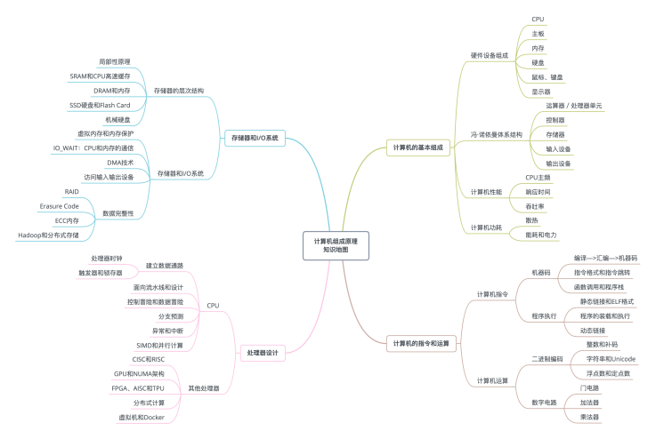
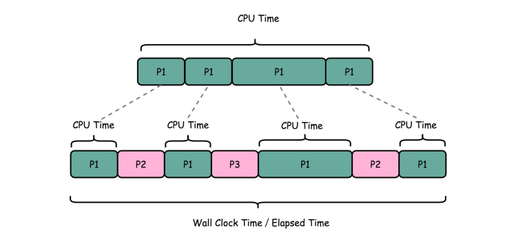
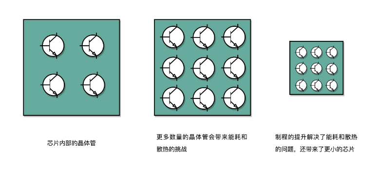

## 冯·诺依曼体系结构

冯·诺依曼体系结构，也叫存储程序计算机。即程序本身是存储在计算机的内存里的，可以通过加载不同的程序来解决不同的问题。

代计算机组成的五大部分 —— 控制器，处理器，存储器，输入和输出设备。

**处理单元（Processing Unit，PU）**：又称数据通路（Datapath）或运算器，包含了算术逻辑单元（Arithmetic Logic Unit，ALU）和处理器寄存器（Processor Register）。用于完成各种算术和逻辑运算。

**控制器单元（Control Unit，CU）**：包含了指令寄存器（Instruction Register）和程序计数器（Program Counter）。用于控制程序的流程（程序流），通常是条件判断和跳转。

**储存器**：包括用于存储数据（Data）和指令（Instruction）的主存储器和容量更大但速度却慢的外部存储器。

**输入/输出设备**：键盘、鼠标属于输入设备，显示器是输出设备，网卡即是输入设备又是输出设备。


PU 和 CU 就组成了 CPU（Central Processing Unit，中央处理器）。

### 冯·诺依曼机与图灵机之间的关系

图灵机是一个抽象的思想模型（计算机的基本理论基础），是一种有穷的、构造性的问题的问题求解思路。背后对应着可计算性理论，告诉我们什么样的问题是计算机解决得了的，什么样的问题是解决不了的。图灵认为凡是能用算法解决的问题也一定能用图灵机解决。

冯诺依曼提出了 “存储程序” 的计算机设计思想，并“ 参照” 图灵模型设计了历史上第一台电子计算机，即冯诺依曼机。

## 计算机组成原理的知识图谱

 

## 通过CPU主频，谈谈“性能”究竟是什么？

衡量性能的指标：

- 响应时间或者叫执行时间: 计算机跑的速度
- 吞吐率或者叫带宽: 计算机搬的更多

我们一般把性能，定义成响应时间的倒数，也就是：**性能 = 1/ 响应时间**

### 计算机的计时单位：CPU 时钟

```
$ time seq 1000000 | wc -l
1000000

real  0m0.101s  # Wall Clock Time 也就是运行程序整个过程中流失的时间
user  0m0.031s  # CPU 在运行你的程序，在用户态运行指令的时间
sys   0m0.016s  # CPU在运行你的程序，在操作系统内核里运行指令的时间
```



即使我们已经拿到了 CPU 时间，我们也不一定可以直接“比较”出两个程序的性能差异。

- 计算机同时运行着多个程序，CPU 在不同的程序之间进行切换，这个过程中消耗的时间是不确定的
- 程序的执行依赖于网络，硬件等等因素

即使在同一台计算机上，CPU 可能满载运行也可能降频运行，降频运行的时候自然花的时间会多一些。

拆分 CPU 执行时间：

**程序的 CPU 执行时间  = CPU 时钟周期数 × 时钟周期时间(Clock Cycle Time)**

拆分 CPU 时钟周期数：

**指令数 × 每条指令的平均时钟周期数(Cycles Per Instruction，简称 CPI)**

所以：

**程序的 CPU 执行时间  =  指令数 × CPI × Clock Cycle Time**

## 我们该从哪些方面提升“性能”？

### 功耗：CPU 的“人体极限”

**功耗 ~= 1/2 ×负载电容×电压的平方×开关频率×晶体管数量**



为了提高性能，我们需要不断地增加晶体管数量，同样的面积下，我们想要多放一点晶体管，就要把晶体管造得小一点

这个就是平时我们所说的提升“制程序”，从从 28nm 到 7nm，相当于晶体管本身变成了原来的 1/4大小。

功耗增加大太多，就会导致CPU散热跟不上，这时，我们就需要降低电压，这里有一点非常关键，在整个功耗的 公式里面，功耗和电压的平方是成比的，这以为着电压下降到原来的1/5，整个的功耗会变成原来的 1/25。

### 并行优化

阿姆达尔定律（Amdahl’s Law）。这个定律说的就是，对于一个程序进行优化之后，处理器并行运算之后效率提升的情况。具体可以用这样一个公式来表示：

**优化后的执行时间 = 受优化影响的执行时间 / 加速倍数 + 不受影响的执行时间**

例如我们一个计算，原来需要的时间为 120ns(step1:100ns,step2:20ns)，并行优化后step1 加速4倍，那么最终优化后就有了：

```
100/4 + 20 = 45ns
```

即使我们增加更多的并行度来提高加速倍数，比如100个cpu，整个事件也需要：

```
100/100 + 20 = 21ns
```

### 其他提升性能的手段

- 加速大概率事件
- 通过流水线提高性能
- 通过预测提高性能


