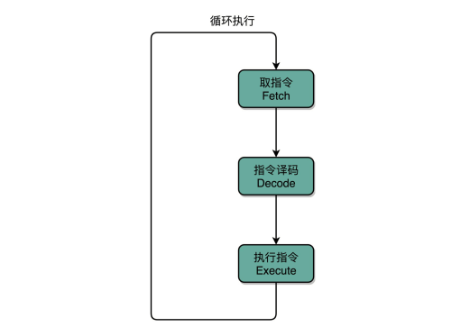
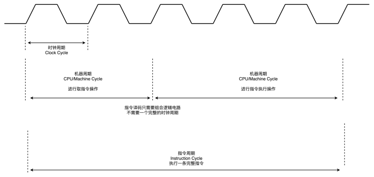
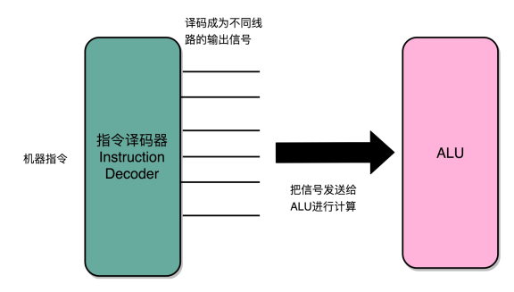

## CPU 如何运转

### 指令周期（Instruction Cycle）

计算机每执行一条指令的过程，可以分解成这样几个步骤 ： 

- Fetch（取得指令），也就是从 PC 寄存器里找到对应的指令地址，根据指令地址从内存里把具体的指令，加载到指令寄存器中，然后把 PC 寄存器自增，好在未来执行下一条指令。
- Decode（指令译码），也就是根据指令寄存器里面的指令，解析成要进行什么样的操作，是 R、I、J 中的哪一种指令，具体要操作哪些寄存器、数据或者内存地址。
- Execute（执行指令），也就是实际运行对应的 R、I、J 这些特定的指令，进行算术逻辑操作、数据传输或者直接的地址跳转。
- 重复进行 1～3 的步骤。

在这个循环过程中，不同部分其实是由计算机中的不同组件完成的：

- 在取指令的阶段，我们的指令是放在存储器里的，实际上，通过 PC 寄存器和指令寄存器取出指令的过程，是由控制器（Control Unit）操作的。
- 指令的解码过程，也是由控制器进行的。
- 一旦到了执行指令阶段，无论是进行算术操作、逻辑操作的 R 型指令，还是进行数据传输、条件分支的 I 型指令，都是由算术逻辑单元（ALU）操作的，也就是由运算器处理的。不过，如果是一个简单的无条件地址跳转，那么我们可以直接在控制器里面完成，不需要用到运算器。

Machine Cycle：机器周期或者 CPU 周期。CPU 内部的操作速度很快，但是访问内存的速度却要慢很多。每一条指令都需要从内存里面加载而来，所以我们一般把从内存里面读取一条指令的最短时间，称为 CPU 周期。

Clock Cycle：就是时钟周期以及我们机器的主频。一个 CPU 周期，通常会由几个时钟周期累积起来。一个 CPU 周期的时间，就是这几个 Clock Cycle 的总和。

## 建立数据通路
一般来说，我们可以认为，数据通路就是我们的处理器单元。它通常由两类原件组成：

- 第一类叫操作元件，也叫组合逻辑元件（Combinational Element），其实就是我们的 ALU。在前面讲 ALU 的过程中可以看到，它们的功能就是在特定的输入下，根据下面的组合电路的逻辑，生成特定的输出。
- 第二类叫存储元件，也有叫状态元件（State Element）的。比如我们在计算过程中需要用到的寄存器，无论是通用寄存器还是状态寄存器，其实都是存储元件。

我们通过数据总线的方式，把它们连接起来，就可以完成数据的存储、处理和传输了，这就是所谓的建立数据通路了。
控制器。它的逻辑就没那么复杂了。我们可以把它看成只是机械地重复“Fetch -  Decode - Execute“循环中的前两个步骤，然后把最后一个步骤，通过控制器产生的控制信号，交给 ALU 去处理。

所有 CPU 支持的指令，都会在控制器里面，被解析成不同的输出信号 ：

## CPU所需要的硬件电路

- ALU：实际上是一个没有状态，根据输入计算输出结果的一个电路
- 寄存器：常见的能够进行状态读写的电路
- 自动数数的电路：我们看似写了各种复杂的高级程序进行各种函数调用、条件跳转。其实只是修改PC寄存器里面的地址。PC寄存器里面的地址一修改，计算机就可以加载一条指令新指令往下运行。实际上，PC寄存器还有一个名字，就叫作程序计数器。顾名思义，就是随着时间变化，不断去数数。数的数字变大了就去执行一条新指令。所以，我们需要的就是一个自动数数的电路。
- 译码器：无论对于指令译码还是根据内存地址获取对应的指令或者数据，都需要通过一个电路找到对应的数据，这个对应的电路就是译码器电路。

