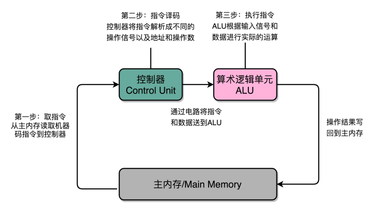
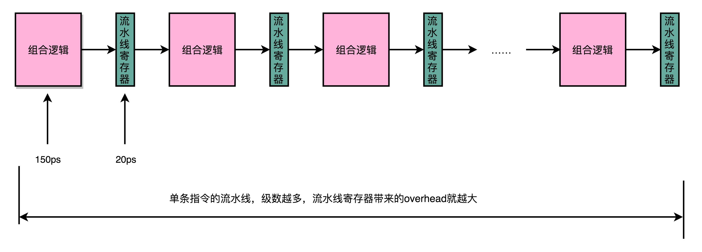

## CPU 如何运转

### 指令周期（Instruction Cycle）

计算机每执行一条指令的过程，可以分解成这样几个步骤 ： 

- Fetch（取得指令），也就是从 PC 寄存器里找到对应的指令地址，根据指令地址从内存里把具体的指令，加载到指令寄存器中，然后把 PC 寄存器自增，好在未来执行下一条指令。
- Decode（指令译码），也就是根据指令寄存器里面的指令，解析成要进行什么样的操作，是 R、I、J 中的哪一种指令，具体要操作哪些寄存器、数据或者内存地址。
- Execute（执行指令），也就是实际运行对应的 R、I、J 这些特定的指令，进行算术逻辑操作、数据传输或者直接的地址跳转。
- 重复进行 1～3 的步骤。


在这个循环过程中，不同部分其实是由计算机中的不同组件完成的：

- 在取指令的阶段，我们的指令是放在存储器里的，实际上，通过 PC 寄存器和指令寄存器取出指令的过程，是由控制器（Control Unit）操作的。
- 指令的解码过程，也是由控制器进行的。
- 一旦到了执行指令阶段，无论是进行算术操作、逻辑操作的 R 型指令，还是进行数据传输、条件分支的 I 型指令，都是由算术逻辑单元（ALU）操作的，也就是由运算器处理的。不过，如果是一个简单的无条件地址跳转，那么我们可以直接在控制器里面完成，不需要用到运算器。



Machine Cycle：机器周期或者 CPU 周期。CPU 内部的操作速度很快，但是访问内存的速度却要慢很多。每一条指令都需要从内存里面加载而来，所以我们一般把从内存里面读取一条指令的最短时间，称为 CPU 周期。

Clock Cycle：就是时钟周期以及我们机器的主频。一个 CPU 周期，通常会由几个时钟周期累积起来。一个 CPU 周期的时间，就是这几个 Clock Cycle 的总和。


### 建立数据通路

一般来说，我们可以认为，数据通路就是我们的处理器单元。它通常由两类原件组成：

- 第一类叫操作元件，也叫组合逻辑元件（Combinational Element），其实就是我们的 ALU。在前面讲 ALU 的过程中可以看到，它们的功能就是在特定的输入下，根据下面的组合电路的逻辑，生成特定的输出。
- 第二类叫存储元件，也有叫状态元件（State Element）的。比如我们在计算过程中需要用到的寄存器，无论是通用寄存器还是状态寄存器，其实都是存储元件。

我们通过数据总线的方式，把它们连接起来，就可以完成数据的存储、处理和传输了，这就是所谓的建立数据通路了。
控制器。它的逻辑就没那么复杂了。我们可以把它看成只是机械地重复“Fetch -  Decode - Execute“循环中的前两个步骤，然后把最后一个步骤，通过控制器产生的控制信号，交给 ALU 去处理。

所有 CPU 支持的指令，都会在控制器里面，被解析成不同的输出信号 ：


### CPU所需要的硬件电路

- ALU：实际上是一个没有状态，根据输入计算输出结果的一个电路
- 寄存器：常见的能够进行状态读写的电路
- 自动数数的电路：我们看似写了各种复杂的高级程序进行各种函数调用、条件跳转。其实只是修改PC寄存器里面的地址。PC寄存器里面的地址一修改，计算机就可以加载一条指令新指令往下运行。实际上，PC寄存器还有一个名字，就叫作程序计数器。顾名思义，就是随着时间变化，不断去数数。数的数字变大了就去执行一条新指令。所以，我们需要的就是一个自动数数的电路。
- 译码器：无论对于指令译码还是根据内存地址获取对应的指令或者数据，都需要通过一个电路找到对应的数据，这个对应的电路就是译码器电路。

## 组合逻辑电路与时序逻辑电路

- 组合逻辑电路（Combinational Logic Circuit）(类比: 计算器)

- - 只需要给定输入，就能得到固定的输出

- 时序逻辑电路（Sequential Logic Circuit）

- - 第一个就是自动运行的问题。时序电路接通之后可以不停地开启和关闭开关，进入一个自动运行的状态。这个使得我们上一讲说的，控制器不停地让 PC 寄存器自增读取下一条指令成为可能。
  - 第二个是存储的问题。通过时序电路实现的触发器，能把计算结果存储在特定的电路里面，而不是像组合逻辑电路那样，一旦输入有任何改变，对应的输出也会改变。
  - 第三个本质上解决了各个功能按照时序协调的问题。无论是程序实现的软件指令，还是到硬件层面，各种指令的操作都有先后的顺序要求。时序电路使得不同的事件按照时间顺序发生。

## 时钟信号的硬件实现

CPU的主频是由一个晶体振荡器来实现的，而这个晶体振荡器生成的电路信号，就是我们的时钟信号。实现这样一个电路，和我们之前讲的，通过电的磁效应产生开关信号的方法是一样的。只不过，这里的磁性开关，打开的不再是后续的线路，而是当前的线路。

### 时钟信号


一般只放一个开关的信号输入端，放上了两个开关。一个开关A，一开始是断开的，由我们手工控制；另外一个开关B，
一开始是合上的，磁性线圈对准一开始就合上的开关B。于是，一旦我们合上开关A，磁性线圈就会通电，产生磁性，开关B就会从合上变成断开。一旦这个开关断开了，电路就中断了，磁性线圈就失去了磁性。于是，开关B又会弹回到合上的状态。这样一来，电路接通，线圈又有了磁性。我们的电路就会来回不断地在开启、关闭这两个状态中切换。这个不断切换的过程，对于下游电路来说，就是不断地产生新的0和1这样的信号。如果你在下游的电路上接上一个灯泡，就会发现这个灯泡在亮和暗之间不停切换。这个按照固定的周期不断在0和1之间切换的信号，就是我们的 时钟信号（Clock Signal）。

### 反馈电路

一般这样产生的时钟信号，就像你在各种教科书图例中看到的一样，是一个振荡产生的0、1信号。


这种电路，其实就相当于把电路的输出信号作为输入信号，再回到当前电路。这样的电路构造方式呢，我们叫作反馈电路（Feedback Circuit）。接下来，我们还会看到更多的反馈电路。上面这个反馈电路一般可以用下面这个示意图来表示，其实就是一个输出结果接回输入的 反相器（Inverter），也就是我们之前讲过的非门：


## 通过D触发器实现存储功能

有了时钟信号，我们的系统里就有了一个像“自动门”一样的开关。利用这个开关和相同的反馈电路，我们就可以构造出一个有“记忆”功能的电路。这个有记忆功能的电路，可以实现在CPU中用来存储计算结果的寄存器，也可以用来实现计算机五大组成部分之一的存储器。


我们先来看下面这个RS触发器电路。这个电路由两个或非门电路组成。我在图里面，把它标成了A和B。


- 在这个电路一开始，输入开关都是关闭的，所以或非门（NOR）A的输入是0和0。对应到我列的这个真值表，输出就是1。而或非门B的输入是0和A的输出1，对应输出就是0。B的输出0反馈到A，和之前的输入没有变化，A的输出仍然是1。而整个电路的 输出Q，也就是0。
- 当我们把A前面的开关R合上的时候，A的输入变成了1和0，输出就变成了0，对应B的输入变成0和0，输出就变成了1。B的输出1反馈给到了A，A的输入变成了1和1，输出仍然是0。所以把A的开关合上之后，电路仍然是稳定的，不会像晶振那样振荡，但是整个电路的 输出Q变成了1。
- 这个时候，如果我们再把A前面的开关R打开，A的输入变成和1和0，输出还是0，对应的B的输入没有变化，输出也还是1。B的输出1反馈给到了A，A的输入变成了1和0，输出仍然是0。这个时候，电路仍然稳定。 开关R和S的状态和上面的第一步是一样的，但是最终的输出Q仍然是1，和第1步里Q状态是相反的。我们的输入和刚才第二步的开关状不一样，但是输出结果仍然保留在了第2步时的输出没有发生变化。
- 这个时候，只有我们再去关闭下面的开关S，才可以看到，这个时候，B有一个输入必然是1，所以B的输出必然是0，也就是电路的最终 输出Q必然是0。

这样一个电路，我们称之为触发器（Flip-Flop）。接通开关R，输出变为1，即使断开开关，输出还是1不变。接通开关S，输出变为0，即使断开开关，输出也还是0。也就是，当两个开关都断开的时候，最终的输出结果，取决于之前动作的输出结果，这个也就是我们说的记忆功能。这里的这个电路是最简单的RS触发器，也就是所谓的复位置位触发器（Reset-Set Flip Flop) 。对应的输出结果的真值表，你可以看下面这个表格。可以看到，当两个开关都是0的时候，对应的输出不是1或者0，而是和Q的上一个状态一致。


再往这个电路里加两个与门和一个小小的时钟信号，我们就可以实现一个利用时钟信号来操作一个电路了。这个电路可以帮我们实现什么时候可以往Q里写入数据。

我们看看下面这个电路，这个在我们的上面的R-S触发器基础之上，在R和S开关之后，加入了两个与门，同时给这两个与门加入了一个时钟信号CLK作为电路输入，这样，当时钟信号CLK在低电平的时候，与门的输入里有一个0，两个实际的R和S后的与门的输出必然是0。也就是说，无论我们怎么按R和S的开关，根据R-S触发器的真值表，对应的Q的输出都不会发生变化。

只有当时钟信号CLK在高电平的时候，与门的一个输入是1，输出结果完全取决于R和S的开关。我们可以在这个时候，通过开关R和S，来决定对应Q的输出。


如果这个时候，我们让R和S的开关，也用一个反相器连起来，也就是通过同一个开关控制R和S。只要CLK信号是1，R和S就可以设置输出Q。而当CLK信号是0的时候，无论R和S怎么设置，输出信号Q是不变的。这样，这个电路就成了我们最常用的D型触发器。用来控制R和S这两个开关的信号呢，我们视作一个输入的数据信号D，也就是Data，这就是D型触发器的由来。


一个D型触发器，只能控制1个比特的读写，但是如果我们同时拿出多个D型触发器并列在一起，并且把用同一个CLK信号控制作为所有D型触发器的开关，这就变成了一个N位的D型触发器，也就可以同时控制N位的读写。

CPU里面的寄存器可以直接通过D型触发器来构造。我们可以在D型触发器的基础上，加上更多的开关，来实现清0或者全部置为1这样的快捷操作。

## PC 寄存器所需要的计数器

我们常说的PC寄存器，还有个名字叫程序计数器(Program Counter)。下面我们就来看看，它为什么叫作程序计数器。

有了时钟信号，我们可以提供定时的输入；有了D型触发器，我们可以在时钟信号控制的时间点写入数据。我们把这两个功能组合起来，就可以实现一个自动的计数器了。

加法器的两个输入，一个始终设置成1，另外一个来自于一个D型触发器A。我们把加法器的输出结果，写到这个D型触发器A里面。于是，D型触发器里面的数据就会在固定的时钟信号为1的时候更新一次。


同一个程序的指令应该要顺序地存放在内存里面。这里就和前面对应上了，顺序地存放指令，就是为了让我们通过程序计数器就能定时地不断执行新指令。

加法计数、内存取值，乃至后面的命令执行，最终其实都是由我们一开始讲的时钟信号，来控制执行时间点和先后顺序的，这也是我们需要时序电路最核心的原因。

在最简单的情况下，我们需要让每一条指令，从程序计数，到获取指令、执行指令，都在一个时钟周期内完成。如果PC寄存器自增地太快，程序就会出错。
因为前一次的运算结果还没有写回到对应的寄存器里面的时候，后面一条指令已经开始读取里面的数据来做下一次计算了。这个时候，如果我们的指令使用同样的寄存器，前一条指令的计算就会没有效果，计算结果就错了。

在这种设计下，我们需要在一个时钟周期里，确保执行完一条最复杂的CPU指令，也就是耗时最长的一条CPU指令。这样的CPU设计，我们称之为 单指令周期处理器（Single Cycle Processor）。很显然，这样的设计有点儿浪费。因为即便只调用一条非常简单的指令，我们也需要等待整个时钟周期的时间走完，才能执行下一条指令。

## 读写数据所需要的译码器

我们的数据能够存储在D型触发器里了。如果我们把很多个D型触发器放在一起，就可以形成一块很大的存储空间，甚至可以当成一块内存来用。那我们怎么才能知道，写入和读取的数据，是在这么大的内存的哪几个比特呢？于是，我们就需要有一个电路，来完成“寻址”的工作。这个“寻址”电路，就是译码器。

在现在实际使用的计算机里面，内存所使用的DRAM，并不是通过上面的D型触发器来实现的，而是使用了一种CMOS芯片来实现的。不过，这并不影响我们从基础原理方面来理解译码器。在这里，我们还是可以把内存芯片，当成是很多个连在一起的D型触发器来实现的。

如果把“寻址”这件事情退化到最简单的情况，就是在两个地址中，去选择一个地址。这样的电路，我们叫作 2-1选择器。

通过一个反相器、两个与门和一个或门，就可以实现一个2-1选择器。通过控制反相器的输入是0还是1，能够决定对应的输出信号，是和地址A，还是地址B的输入信号一致。


一个反向器只能有0和1这样两个状态，所以我们只能从两个地址中选择一个。如果输入的信号有三个不同的开关，我们就能从 `2^3`，也就是8个地址中选择一个了。这样的电路，我们就叫 3-8译码器。现代的计算机，如果CPU是64位的，就意味着我们的寻址空间也是$2^{64}$，那么我们就需要一个有64个开关的译码器。


所以说，其实译码器的本质，就是从输入的多个位的信号中，根据一定的开关和电路组合，选择出自己想要的信号。除了能够进行“寻址”之外，我们还可以把对应的需要运行的指令码，同样通过译码器，找出我们期望执行的指令，也就是在之前我们讲到过的opcode，以及后面对应的操作数或者寄存器地址。只是，这样的“译码器”，比起2-1选择器和3-8译码器，要复杂的多。

## 建立数据通路，构造一个最简单的CPU


- 首先，我们有一个自动计数器。这个自动计数器会随着时钟主频不断地自增，来作为我们的PC寄存器。
- 在这个自动计数器的后面，我们连上一个译码器。译码器还要同时连着我们通过大量的D触发器组成的内存。
- 自动计数器会随着时钟主频不断自增，从译码器当中，找到对应的计数器所表示的内存地址，然后读取出里面的CPU指令。
- 读取出来的CPU指令会通过我们的CPU时钟的控制，写入到一个由D触发器组成的寄存器，也就是指令寄存器当中。
- 在指令寄存器后面，我们可以再跟一个译码器。这个译码器不再是用来寻址的了，而是把我们拿到的指令，解析成opcode和对应的操作数。
- 当我们拿到对应的opcode和操作数，对应的输出线路就要连接ALU，开始进行各种算术和逻辑运算。对应的计算结果，则会再写回到D触发器组成的寄存器或者内存当中。

## 面向流水线的指令设计

不同指令的执行时间不同，但是我们需要让所有指令都在一个时钟周期内完成，那就只好把时钟周期和执行时间最长的那个指令设成一样。这就好比学校体育课 1000 米考试，我们要给这场考试预留的时间，肯定得和跑得最慢的那个同学一样。因为就算其他同学先跑完，也要等最慢的同学跑完间，我们才能进行下一项活动。


### 现代处理器的流水线设计

如果我们把一个指令拆分成“取指令-指令译码-执行指令”这样三个部分，那这就是一个三级的流水线。如果我们进一步把“执行指令”拆分成“ALU计算（指令执行）-内存访问-数据写回”，那么它就会变成一个五级的流水线。

五级的流水线，就表示我们在同一个时钟周期里面，同时运行五条指令的不同阶段。这个时候，虽然执行一条指令的时钟周期变成了5，但是我们可以把CPU的主频提得更高了。 我们不需要确保最复杂的那条指令在时钟周期里面执行完成，而只要保障一个最复杂的流水线级的操作，在一个时钟周期内完成就好了。

如果某一个操作步骤的时间太长，我们就可以考虑把这个步骤，拆分成更多的步骤，让所有步骤需要执行的时间尽量都差不多长。这样，也就可以解决我们在单指令周期处理器中遇到的，性能瓶颈来自于最复杂的指令的问题。像我们现代的ARM或者Intel的CPU，流水线级数都已经到了14级。

虽然我们不能通过流水线，来减少单条指令执行的“延时”这个性能指标，但是，通过同时在执行多条指令的不同阶段，我们提升了CPU的“吞吐率”。在外部看来，我们的CPU好像是“一心多用”，
在同一时间，同时执行5条不同指令的不同阶段。在CPU内部，其实它就像生产线一样，不同分工的组件不断处理上游传递下来的内容，而不需要等待单件商品生产完成之后，再启动下一件商品的生产过程。


### 超长流水线的性能瓶颈

既然流水线可以增加我们的吞吐率，为什么我们不把流水线级数做得更深呢？为什么不做成 20 级，乃至 40 级呢？一个最基本的原因，就是增加流水线深度，其实是有性能成本的。

我们用来同步时钟周期的，不再是指令级别的，而是流水线阶段级别的。每一级流水线对应的输出，都要放到流水线寄存器（Pipeline Register）里面，然后在下一个时钟周期，交给下一个流水线级去处理。所以，每增加一级的流水线，就要多一级写入到流水线寄存器的操作。



虽然流水线寄存器非常快，比如只有20皮秒，但是，如果我们不断加深流水线，这些操作占整个指令的执行时间的比例就会不断增加。最后，我们的性能瓶颈就会出现在这些overhead上。如果我们指令的执行有3纳秒，也就是3000皮秒。
我们需要20级的流水线，那流水线寄存器的写入就需要花费400皮秒，占了超过10%。如果我们需要50级流水线，就要多花费1纳秒在流水线寄存器上，占到25%。这也就意味着，单纯地增加流水线级数，不仅不能提升性能，反而会有更多的overhead的开销。所以，设计合理的流水线级数也是现代CPU中非常重要的一点。

流水线技术并不能缩短单条指令的 响应时间这个性能指标，但是可以增加在运行很多条指令时候的 吞吐率。因为不同的指令，实际执行需要的时间是不同的。

我们顺序执行这样三条指令：

- 一条整数的加法，需要200ps
- 一条整数的乘法，需要300ps
- 一条浮点数的乘法，需要600ps

如果我们是在单指令周期的CPU上运行，最复杂的指令是一条浮点数乘法，那就需要600ps。那这三条指令，都需要600ps。三条指令的执行时间，就需要1800ps。

如果我们采用的是6级流水线CPU，每一个Pipeline的Stage都只需要100ps。那么，在这三个指令的执行过程中，在指令1的第一个100ps的Stage结束之后，第二条指令就开始执行了。
在第二条指令的第一个100ps的Stage结束之后，第三条指令就开始执行了。这种情况下，这三条指令顺序执行所需要的总时间，就是800ps。那么在1800ps内，使用流水线的CPU比单指令周期的CPU就可以多执行一倍以上的指令数。虽然每一条指令从开始到结束拿到结果的时间并没有变化，也就是响应时间没有变化。但是同样时间内，完成的指令数增多了，也就是吞吐率上升了。


## 冒险和预测

流水线设计需要解决的三大冒险，分别是:

- 结构冒险（Structural Hazard）
- 数据冒险（Data Hazard）
- 控制冒险（Control Hazard）

### 结构冒险

如下图，可以看到，在第 1 条指令执行到访存（MEM）阶段的时候，流水线里的第 4 条指令，在执行取指令（Fetch）的操作。访存和取指令，都要进行内存数据的读取。我们的内存，只有一个地址译码器的作为地址输入，那就只能在一个时钟周期里面读取一条数据，没办法同时执行第 1 条指令的读取内存数据和第 4 条指令的读取指令代码。


对于访问内存数据和取指令的冲突，一个直观的解决方案就是把我们的内存分成两部分，让它们各有各的地址译码器。这两部分分别是存放指令的程序内存和存放数据内存。

这样把内存拆成两部分的解决方案，在计算机体系结构里叫作哈佛架构，对应的，我们之前说的冯·诺依曼体系结构，
又叫作普林斯顿架构（Princeton Architecture）。

不过，我们今天使用的CPU，仍然是冯·诺依曼体系结构的，并没有把内存拆成程序内存和数据内存这两部分。因为如果那样拆的话，对程序指令和数据需要的内存空间，我们就没有办法根据实际的应用去动态分配了。虽然解决了资源冲突的问题，但是也失去了灵活性。


现代的 CPU 虽然没有在内存层面进行对应的拆分，却在 CPU 内部的高速缓存部分进行了区分，把高速缓存分成了指令缓存（Instruction Cache）和数据缓存（Data Cache）两部分。

### 数据冒险

数据冒险，其实就是同时在执行的多个指令之间，有数据依赖的情况。这些数据依赖，我们可以分成三大类，分别是:

- 先写后读（Read After Write，RAW）
- 先读后写（Write After Read，WAR）
- 写后再写（Write After Write，WAW）

#### 先写后读（Read After Write）

这个先写后读的依赖关系，我们一般被称之为数据依赖，也就是 Data Dependency。

```
int main() {
  int a = 1;
  int b = 2;
  a = a + 2;
  b = a + 3;
}
```

汇编代码：

```
int main() {
   0:   55                      push   rbp
   1:   48 89 e5                mov    rbp,rsp
  int a = 1;
   4:   c7 45 fc 01 00 00 00    mov    DWORD PTR [rbp-0x4],0x1
  int b = 2;
   b:   c7 45 f8 02 00 00 00    mov    DWORD PTR [rbp-0x8],0x2
  a = a + 2;
  12:   83 45 fc 02             add    DWORD PTR [rbp-0x4],0x2
  b = a + 3;
  16:   8b 45 fc                mov    eax,DWORD PTR [rbp-0x4]
  19:   83 c0 03                add    eax,0x3
  1c:   89 45 f8                mov    DWORD PTR [rbp-0x8],eax
}
  1f:   5d                      pop    rbp
  20:   c3                      ret
```

可以看到，在内存地址为12的机器码，我们把0x2添加到 rbp-0x4 对应的内存地址里面。然后，在紧接着的内存地址为16的机器码，我们又要从rbp-0x4这个内存地址里面，把数据写入到eax这个寄存器里面。

所以，我们需要保证，在内存地址为16的指令读取rbp-0x4里面的值之前，内存地址12的指令写入到rbp-0x4的操作必须完成。这就是先写后读所面临的数据依赖。如果这个顺序保证不了，我们的程序就会出错。

#### 先读后写（Write After Read）

这个先读后写的依赖，一般被叫作反依赖，也就是 Anti-Dependency。

```
int main() {
  int a = 1;
  int b = 2;
  a = b + a;
  b = a + b;
}
```

汇编代码：

```
int main() {
   0:   55                      push   rbp
   1:   48 89 e5                mov    rbp,rsp
   int a = 1;
   4:   c7 45 fc 01 00 00 00    mov    DWORD PTR [rbp-0x4],0x1
   int b = 2;
   b:   c7 45 f8 02 00 00 00    mov    DWORD PTR [rbp-0x8],0x2
   a = b + a;
  12:   8b 45 f8                mov    eax,DWORD PTR [rbp-0x8]
  15:   01 45 fc                add    DWORD PTR [rbp-0x4],eax
   b = a + b;
  18:   8b 45 fc                mov    eax,DWORD PTR [rbp-0x4]
  1b:   01 45 f8                add    DWORD PTR [rbp-0x8],eax
}
  1e:   5d                      pop    rbp
  1f:   c3                      ret
```

在内存地址为15的汇编指令里，我们要把 eax 寄存器里面的值读出来，再加到 rbp-0x4 的内存地址里。接着在内存地址为18的汇编指令里，我们要再写入更新 eax 寄存器里面。

如果我们在内存地址18的eax的写入先完成了，在内存地址为15的代码里面取出 eax 才发生，我们的程序计算就会出错。这里，我们同样要保障对于eax的先读后写的操作顺序。

#### 写后再写（Write After Write）

这个写后再写的依赖，一般被叫作输出依赖，也就是 Output Dependency。

```
int main() {
  int a = 1;
  a = 2;
}
```

汇编：

```
int main() {
   0:   55                      push   rbp
   1:   48 89 e5                mov    rbp,rsp
  int a = 1;
   4:   c7 45 fc 01 00 00 00    mov    DWORD PTR [rbp-0x4],0x1
  a = 2;
   b:   c7 45 fc 02 00 00 00    mov    DWORD PTR [rbp-0x4],0x2
}
```

内存地址4所在的指令和内存地址b所在的指令，都是将对应的数据写入到 rbp-0x4 的内存地址里面。如果内存地址b的指令在内存地址4的指令之后写入。那么这些指令完成之后，rbp-0x4 里的数据就是错误的。这就会导致后续需要使用这个内存地址里的数据指令，没有办法拿到正确的值。所以，我们也需要保障内存地址4的指令的写入，在内存地址b的指令的写入之前完成。

#### 通过流水线停顿解决数据冒险

除了读之后再进行读，你会发现，对于同一个寄存器或者内存地址的操作，都有明确强制的顺序要求。而这个顺序操作的要求，也为我们使用流水线带来了很大的挑战。因为流水线架构的核心，就是在前一个指令还没有结束的时候，后面的指令就要开始执行。

所以，我们需要有解决这些数据冒险的办法。其中最简单的一个办法，不过也是最笨的一个办法，就是流水线停顿（Pipeline Stall），或者叫流水线冒泡（Pipeline Bubbling）。

流水线停顿的办法很容易理解。如果我们发现了后面执行的指令，会对前面执行的指令有数据层面的依赖关系，那最简单的办法就是“ 再等等”。我们在进行指令译码的时候，
会拿到对应指令所需要访问的寄存器和内存地址。所以，在这个时候，我们能够判断出来，这个指令是否会触发数据冒险。如果会触发数据冒险，我们就可以决定，让整个流水线停顿一个或者多个周期。


这个插入的指令，就好像一个水管（Pipeline）里面，进了一个空的气泡。在水流经过的时候，没有传送水到下一个步骤，而是给了一个什么都没有的空气泡。这也是为什么，我们的流水线停顿，又被叫作流水线冒泡（Pipeline Bubble）的原因。

在实践当中，各个指令不需要的阶段，并不会直接跳过，而是会运行一次NOP操作。通过插入一个NOP操作，我们可以使后一条指令的每一个Stage，一定不和前一条指令的同Stage在一个时钟周期执行。这样，就不会发生先后两个指令，在同一时钟周期竞争相同的资源，产生结构冒险了。


#### 操作数前推

通过NOP操作进行对齐，我们在流水线里，就不会遇到资源竞争产生的结构冒险问题了。除了可以解决结构冒险之外，这个NOP操作，也是我们之前讲的流水线停顿插入的对应操作。但是，插入过多的NOP操作，意味着我们的CPU总是在空转，干吃饭不干活。

以两条先后发生的ADD指令作为例子，看看能不能找到一些好的解决方案：

```
add $t0, $s2,$s1
add $s2, $s1,$t0
```

这两条指令很简单：
- 第一条指令，把 s1 和 s2 寄存器里面的数据相加，存入到 t0 这个寄存器里面。
- 第二条指令，把 s1 和 t0 寄存器里面的数据相加，存入到 s2 这个寄存器里面。

因为后一条的 add 指令，依赖寄存器 t0 里的值。而 t0 里面的值，又来自于前一条指令的计算结果。所以后一条指令，需要等待前一条指令的数据写回阶段完成之后，才能执行。
就像上一讲里讲的那样，我们遇到了一个数据依赖类型的冒险。于是，我们就不得不通过流水线停顿来解决这个冒险问题。我们要在第二条指令的译码阶段之后，插入对应的NOP指令，直到前一条指令的数据写回完成之后，才能继续执行。这样的方案，虽然解决了数据冒险的问题，但是也浪费了两个时钟周期。我们的第2条指令，其实就是多花了2个时钟周期，运行了两次空转的NOP操作。


不过，其实我们第二条指令的执行，未必要等待第一条指令写回完成，才能进行。如果我们第一条指令的执行结果，能够直接传输给第二条指令的执行阶段，作为输入，那我们的第二条指令，就不用再从寄存器里面，把数据再单独读出来一次，才来执行代码。

我们完全可以在第一条指令的执行阶段完成之后，直接将结果数据传输给到下一条指令的ALU。然后，下一条指令不需要再插入两个NOP阶段，就可以继续正常走到执行阶段。


这样的解决方案，我们就叫作 操作数前推（Operand Forwarding），或者操作数旁路（OperandBypassing）。

旁路（Bypassing），则是这个技术的 硬件含义。为了能够实现这里的“前推”，我们在CPU的硬件里面，需要再单独拉一根信号传输的线路出来，使得ALU的计算结果，能够重新回到ALU的输入里来。这样的一条线路，就是我们的“旁路”。它越过（Bypass）了写入寄存器，再从寄存器读出的过程，也为我们节省了2个时钟周期。

操作数前推的解决方案不但可以单独使用，还可以和流水线冒泡一起使用。有的时候，虽然我们可以把操作数转发到下一条指令，但是下一条指令仍然需要停顿一个时钟周期。比如说，我们先去执行一条LOAD指令，再去执行ADD指令。LOAD指令在访存阶段才能把数据读取出来，所以下一条指令的执行阶段，需要在访存阶段完成之后，才能进行。


总的来说，操作数前推的解决方案，比流水线停顿更进了一步。

流水线停顿的方案，有点儿像游泳比赛的接力方式。下一名运动员，需要在前一个运动员游玩了全程之后，触碰到了游泳池壁才能出发。而操作数前推，就好像短跑接力赛。后一个运动员可以提前抢跑，而前一个运动员会多跑一段主动把交接棒传递给他。

## 填上空闲的NOP

无论是流水线停顿，还是操作数前推，归根到底，只要前面指令的特定阶段还没有执行完成，后面的指令就会被“阻塞”住。

但是这个“阻塞”很多时候是没有必要的。因为尽管你的代码生成的指令是顺序的，但是如果后面的指令不需要依赖前面指令的执行结果，完全可以不必等待前面的指令运算完成。

```
a = b + c
d = a * e
x = y * z
```

计算里面的 x ，却要等待 a 和 d 都计算完成，实在没啥必要。所以我们完全可以在 d 的计算等待 a 的计算的过程中，先把 x 的结果给算出来。

在流水线里，后面的指令不依赖前面的指令，那就不用等待前面的指令执行，它完全可以先执行。


可以看到，因为第三条指令并不依赖于前两条指令的计算结果，所以在第二条指令等待第一条指令的访存和写回阶段的时候，第三条指令就已经执行完成了。

这就好比你开了一家餐馆，顾客会排队来点菜。餐馆的厨房里会有洗菜、切菜、炒菜、上菜这样的各个步骤。后厨也是按照点菜的顺序开始做菜的。但是不同的菜需要花费的时间和工序可能都有差别。有些菜做起来特别麻烦，特别慢。比如做一道佛跳墙有好几道工序。我们没有必要非要等先点的佛跳墙上菜了，再开始做后面的炒鸡蛋。只要有厨子空出来了，就可以先动手做前面的简单菜，先给客户端上去。

这样的解决方案，在计算机组成里面，被称为 乱序执行（Out-of-Order Execution，OoOE）。

### CPU里的“线程池”：理解乱序执行

使用乱序执行技术后，CPU里的流水线就和我之前给你看的5级流水线不太一样了。我们一起来看一看下面这张图。


- 在取指令和指令译码的时候，乱序执行的CPU和其他使用流水线架构的CPU是一样的。它会一级一级顺序地进行取指令和指令译码的工作。
- 在指令译码完成之后，就不一样了。CPU不会直接进行指令执行，而是进行一次指令分发，把指令发到一个叫作保留站（Reservation Stations）的地方。顾名思义，这个保留站，就像一个火车站一样。发送到车站的指令，就像是一列列的火车。
- 这些指令不会立刻执行，而要等待它们所依赖的数据，传递给它们之后才会执行。这就好像一列列的火车都要等到乘客来齐了才能出发。
- 一旦指令依赖的数据来齐了，指令就可以交到后面的功能单元（Function Unit，FU），其实就是ALU，去执行了。我们有很多功能单元可以并行运行，但是不同的功能单元能够支持执行的指令并不相同。就和我们的铁轨一样，有些从上海北上，可以到北京和哈尔滨；有些是南下的，可以到广州和深圳。
- 指令执行的阶段完成之后，我们并不能立刻把结果写回到寄存器里面去，而是把结果再存放到一个叫作重排序缓冲区（Re-Order Buffer，ROB）的地方。
- 在重排序缓冲区里，我们的CPU会按照取指令的顺序，对指令的计算结果重新排序。只有排在前面的指令都已经完成了，才会提交指令，完成整个指令的运算结果。
- 实际的指令的计算结果数据，并不是直接写到内存或者高速缓存里，而是先写入存储缓冲区（StoreBuffer面，最终才会写入到高速缓存和内存里。

有了乱序执行，我们重新去执行上面的3行代码：

```
a = b + c
d = a * e
x = y * z
```

里面的 d 依赖于 a 的计算结果，不会在 a 的计算完成之前执行。但是我们的CPU并不会闲着，因为 x = y * z的指令同样会被分发到保留站里。因为 x 所依赖的 y 和 z 的数据是准备好的，
 这里的乘法运算不会等待计算 d，而会先去计算 x 的值。

如果我们只有一个FU能够计算乘法，那么这个FU并不会因为 d 要等待 a 的计算结果，而被闲置，而是会先被拿去计算 x。

在 x 计算完成之后，d 也等来了 a 的计算结果。这个时候，我们的FU就会去计算出 d 的结果。然后在重排序缓冲区里，把对应的计算结果的提交顺序，仍然设置成 a -> d -> x，而计算完成的顺序是 x -> a -> d。在这整个过程中，整个计算乘法的FU都没有闲置，这也意味着我们的CPU的吞吐率最大化了。

整个乱序执行技术，就好像在指令的执行阶段提供一个“线程池”。指令不再是顺序执行的，而是根据池里所拥有的资源，以及各个任务是否可以进行执行，进行动态调度。在执行完成之后，又重新把结果在一个队列里面，按照指令的分发顺序重新排序。即使内部是“乱序”的，但是在外部看起来，仍然是井井有条地顺序执行。

乱序执行，极大地提高了CPU的运行效率。核心原因是，现代CPU的运行速度比访问主内存的速度要快很多。如果完全采用顺序执行的方式，很多时间都会浪费在前面指令等待获取内存数据的时间里。CPU不得不加入NOP操作进行空转。而现代CPU的流水线级数也已经相对比较深了，到达了14级。这也意味着，同一个时钟周期内并行执行的指令数是很多的。

而乱序执行，以及我们后面要讲的高速缓存，弥补了CPU和内存之间的性能差异。同样，也充分利用了较深的流水行带来的并发性，使得我们可以充分利用CPU的性能。

## 分支预测

在结构冒险和数据冒险中，你会发现，所有的流水线停顿操作都要从 指令执行阶段开始。流水线的前两个阶段，也就是取指令（IF）和指令译码（ID）的阶段，是不需要停顿的。CPU会在流水线里面直接去取下一条指令，然后进行译码。

取指令和指令译码不会需要遇到任何停顿，这是基于一个假设。这个假设就是，所有的指令代码都是顺序加载执行的。不过这个假设，在执行的代码中，一旦遇到 if…else 这样的条件分支，或者 for/while 循环，就会不成立。

这种为了确保能取到正确的指令，而不得不进行等待延迟的情况，就是控制冒险（Control Harzard）。这也是流水线设计里最后一种冒险。

### 缩短分支延迟

第一种，是进行条件比较。这个条件比较，需要的输入是，根据指令的opcode，就能确认的条件码寄存器。
第二种，是进行实际的跳转，也就是把要跳转的地址信息写入到PC寄存器。无论是opcode，还是对应的条件码寄存器，还是我们跳转的地址，都是在指令译码（ID）的阶段就能获得的。而对应的条件码比较的电路，只要是简单的逻辑门电路就可以了，并不需要一个完整而复杂的ALU。

所以，我们可以将条件判断、地址跳转，都提前到指令译码阶段进行，而不需要放在指令执行阶段。对应的，我们也要在CPU里面设计对应的旁路，在指令译码阶段，就提供对应的判断比较的电路。

这种方式，本质上和前面数据冒险的操作数前推的解决方案类似，就是在硬件电路层面，把一些计算结果更早地反馈到流水线中。这样反馈变得更快了，后面的指令需要等待的时间就变短了。

不过只是改造硬件，并不能彻底解决问题。跳转指令的比较结果，仍然要在指令执行的时候才能知道。在流水线里，第一条指令进行指令译码的时钟周期里，我们其实就要去取下一条指令了。这个时候，我们其实还没有开始指令执行阶段，自然也就不知道比较的结果。

### 分支预测

分支预测（Branch Prediction）技术，也就是说，让我们的CPU来猜一猜，条件跳转后执行的指令，应该是哪一条。

最简单的分支预测技术，叫作“ 假装分支不发生”。顾名思义，自然就是仍然按照顺序，把指令往下执行。其实就是CPU预测，条件跳转一定不发生。这样的预测方法，其实也是一种 静态预测技术。就好像猜硬币的时候，你一直猜正面，会有50%的正确率。

如果分支预测是正确的，我们自然赚到了。这个意味着，我们节省下来本来需要停顿下来等待的时间。如果分支预测失败了呢？那我们就把后面已经取出指令已经执行的部分，给丢弃掉。
这个丢弃的操作，在流水线里面，叫作Zap或者Flush。CPU不仅要执行后面的指令，对于这些已经在流水线里面执行到一半的指令，我们还需要做对应的清除操作。比如，清空已经使用的寄存器里面的数据等等，这些清除操作，也有一定的开销。

所以，CPU需要提供对应的丢弃指令的功能，通过控制信号清除掉已经在流水线中执行的指令。只要对应的清除开销不要太大，我们就是划得来的。


### 动态分支预测

这种策略，我们叫 一级分支预测（One Level BranchPrediction），或者叫 1比特饱和计数（1-bit saturating counter）。这个方法，其实就是用一个比特，去记录当前分支的比较情况，直接用当前分支的比较情况，来预测下一次分支时候的比较情况。


这个状态机里，我们一共有4个状态，所以我们需要2个比特来记录对应的状态。这样这整个策略，就可以叫作 2比特饱和计数，或者叫 双模态预测器（Bimodal Predictor）。

## 多发射与超标量

CPI的倒数，又叫作IPC（Instruction Per Clock），也就是一个时钟周期里面能够执行的指令数，代表了CPU的吞吐率。

最佳情况下，IPC也只能到1。因为无论做了哪些流水线层面的优化，即使做到了指令执行层面的乱序。

 

但是，我们现在用的Intel CPU或者ARM的CPU，一般的CPI都能做到2以上，这是怎么做到的呢？


