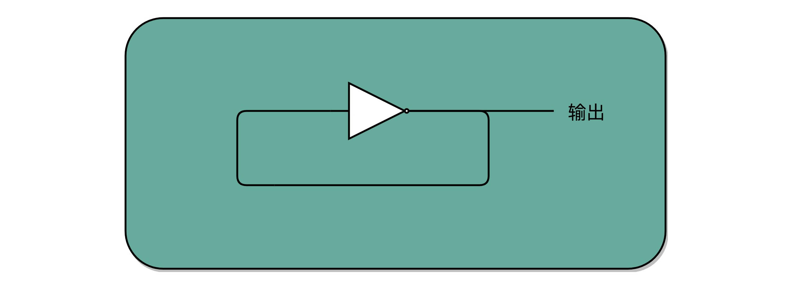
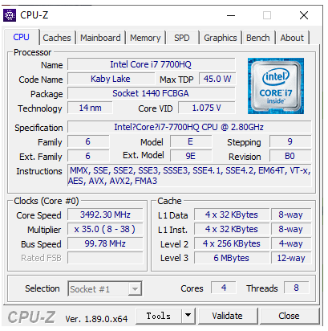
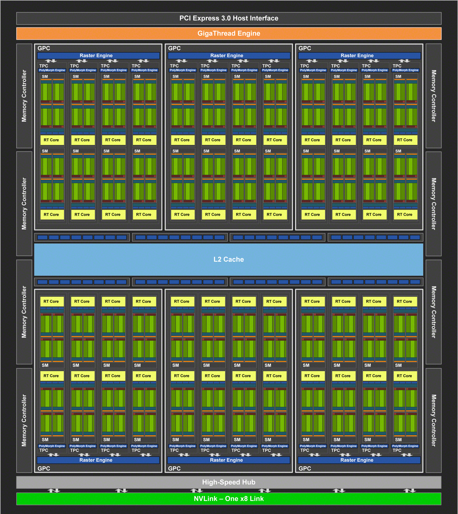
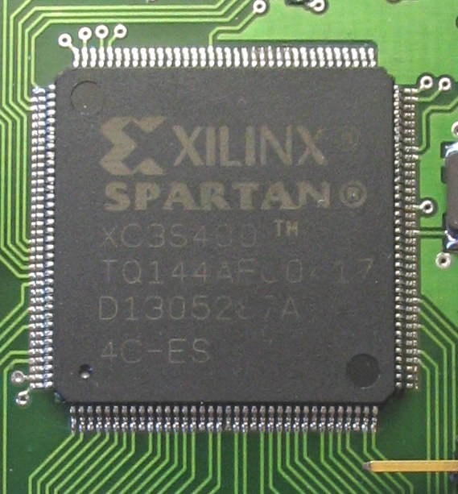

## CPU 如何运转

### 指令周期（Instruction Cycle）

计算机每执行一条指令的过程，可以分解成这样几个步骤 ： 

- Fetch（取得指令），也就是从 PC 寄存器里找到对应的指令地址，根据指令地址从内存里把具体的指令，加载到指令寄存器中，然后把 PC 寄存器自增，好在未来执行下一条指令。
- Decode（指令译码），也就是根据指令寄存器里面的指令，解析成要进行什么样的操作，是 R、I、J 中的哪一种指令，具体要操作哪些寄存器、数据或者内存地址。
- Execute（执行指令），也就是实际运行对应的 R、I、J 这些特定的指令，进行算术逻辑操作、数据传输或者直接的地址跳转。
- 重复进行 1～3 的步骤。


在这个循环过程中，不同部分其实是由计算机中的不同组件完成的：

- 在取指令的阶段，我们的指令是放在存储器里的，实际上，通过 PC 寄存器和指令寄存器取出指令的过程，是由控制器（Control Unit）操作的。
- 指令的解码过程，也是由控制器进行的。
- 一旦到了执行指令阶段，无论是进行算术操作、逻辑操作的 R 型指令，还是进行数据传输、条件分支的 I 型指令，都是由算术逻辑单元（ALU）操作的，也就是由运算器处理的。不过，如果是一个简单的无条件地址跳转，那么我们可以直接在控制器里面完成，不需要用到运算器。


Machine Cycle：机器周期或者 CPU 周期。CPU 内部的操作速度很快，但是访问内存的速度却要慢很多。每一条指令都需要从内存里面加载而来，所以我们一般把从内存里面读取一条指令的最短时间，称为 CPU 周期。

Clock Cycle：就是时钟周期以及我们机器的主频。一个 CPU 周期，通常会由几个时钟周期累积起来。一个 CPU 周期的时间，就是这几个 Clock Cycle 的总和。


### 建立数据通路

一般来说，我们可以认为，数据通路就是我们的处理器单元。它通常由两类原件组成：

- 第一类叫操作元件，也叫组合逻辑元件（Combinational Element），其实就是我们的 ALU。在前面讲 ALU 的过程中可以看到，它们的功能就是在特定的输入下，根据下面的组合电路的逻辑，生成特定的输出。
- 第二类叫存储元件，也有叫状态元件（State Element）的。比如我们在计算过程中需要用到的寄存器，无论是通用寄存器还是状态寄存器，其实都是存储元件。

我们通过数据总线的方式，把它们连接起来，就可以完成数据的存储、处理和传输了，这就是所谓的建立数据通路了。
控制器。它的逻辑就没那么复杂了。我们可以把它看成只是机械地重复“Fetch -  Decode - Execute“循环中的前两个步骤，然后把最后一个步骤，通过控制器产生的控制信号，交给 ALU 去处理。

所有 CPU 支持的指令，都会在控制器里面，被解析成不同的输出信号 ：


### CPU所需要的硬件电路

- ALU：实际上是一个没有状态，根据输入计算输出结果的一个电路
- 寄存器：常见的能够进行状态读写的电路
- 自动数数的电路：我们看似写了各种复杂的高级程序进行各种函数调用、条件跳转。其实只是修改PC寄存器里面的地址。PC寄存器里面的地址一修改，计算机就可以加载一条指令新指令往下运行。实际上，PC寄存器还有一个名字，就叫作程序计数器。顾名思义，就是随着时间变化，不断去数数。数的数字变大了就去执行一条新指令。所以，我们需要的就是一个自动数数的电路。
- 译码器：无论对于指令译码还是根据内存地址获取对应的指令或者数据，都需要通过一个电路找到对应的数据，这个对应的电路就是译码器电路。

## 组合逻辑电路与时序逻辑电路

- 组合逻辑电路（Combinational Logic Circuit）(类比: 计算器)

- - 只需要给定输入，就能得到固定的输出

- 时序逻辑电路（Sequential Logic Circuit）

- - 第一个就是自动运行的问题。时序电路接通之后可以不停地开启和关闭开关，进入一个自动运行的状态。这个使得我们上一讲说的，控制器不停地让 PC 寄存器自增读取下一条指令成为可能。
  - 第二个是存储的问题。通过时序电路实现的触发器，能把计算结果存储在特定的电路里面，而不是像组合逻辑电路那样，一旦输入有任何改变，对应的输出也会改变。
  - 第三个本质上解决了各个功能按照时序协调的问题。无论是程序实现的软件指令，还是到硬件层面，各种指令的操作都有先后的顺序要求。时序电路使得不同的事件按照时间顺序发生。

## 时钟信号的硬件实现

CPU的主频是由一个晶体振荡器来实现的，而这个晶体振荡器生成的电路信号，就是我们的时钟信号。实现这样一个电路，和我们之前讲的，通过电的磁效应产生开关信号的方法是一样的。只不过，这里的磁性开关，打开的不再是后续的线路，而是当前的线路。

### 时钟信号


一般只放一个开关的信号输入端，放上了两个开关。一个开关A，一开始是断开的，由我们手工控制；另外一个开关B，
一开始是合上的，磁性线圈对准一开始就合上的开关B。于是，一旦我们合上开关A，磁性线圈就会通电，产生磁性，开关B就会从合上变成断开。一旦这个开关断开了，电路就中断了，磁性线圈就失去了磁性。于是，开关B又会弹回到合上的状态。这样一来，电路接通，线圈又有了磁性。我们的电路就会来回不断地在开启、关闭这两个状态中切换。这个不断切换的过程，对于下游电路来说，就是不断地产生新的0和1这样的信号。如果你在下游的电路上接上一个灯泡，就会发现这个灯泡在亮和暗之间不停切换。这个按照固定的周期不断在0和1之间切换的信号，就是我们的 时钟信号（Clock Signal）。

### 反馈电路

一般这样产生的时钟信号，就像你在各种教科书图例中看到的一样，是一个振荡产生的0、1信号。


这种电路，其实就相当于把电路的输出信号作为输入信号，再回到当前电路。这样的电路构造方式呢，我们叫作反馈电路（Feedback Circuit）。接下来，我们还会看到更多的反馈电路。上面这个反馈电路一般可以用下面这个示意图来表示，其实就是一个输出结果接回输入的 反相器（Inverter），也就是我们之前讲过的非门：



## 通过D触发器实现存储功能

有了时钟信号，我们的系统里就有了一个像“自动门”一样的开关。利用这个开关和相同的反馈电路，我们就可以构造出一个有“记忆”功能的电路。这个有记忆功能的电路，可以实现在CPU中用来存储计算结果的寄存器，也可以用来实现计算机五大组成部分之一的存储器。


我们先来看下面这个RS触发器电路。这个电路由两个或非门电路组成。我在图里面，把它标成了A和B。


- 在这个电路一开始，输入开关都是关闭的，所以或非门（NOR）A的输入是0和0。对应到我列的这个真值表，输出就是1。而或非门B的输入是0和A的输出1，对应输出就是0。B的输出0反馈到A，和之前的输入没有变化，A的输出仍然是1。而整个电路的 输出Q，也就是0。
- 当我们把A前面的开关R合上的时候，A的输入变成了1和0，输出就变成了0，对应B的输入变成0和0，输出就变成了1。B的输出1反馈给到了A，A的输入变成了1和1，输出仍然是0。所以把A的开关合上之后，电路仍然是稳定的，不会像晶振那样振荡，但是整个电路的 输出Q变成了1。
- 这个时候，如果我们再把A前面的开关R打开，A的输入变成和1和0，输出还是0，对应的B的输入没有变化，输出也还是1。B的输出1反馈给到了A，A的输入变成了1和0，输出仍然是0。这个时候，电路仍然稳定。 开关R和S的状态和上面的第一步是一样的，但是最终的输出Q仍然是1，和第1步里Q状态是相反的。我们的输入和刚才第二步的开关状不一样，但是输出结果仍然保留在了第2步时的输出没有发生变化。
- 这个时候，只有我们再去关闭下面的开关S，才可以看到，这个时候，B有一个输入必然是1，所以B的输出必然是0，也就是电路的最终 输出Q必然是0。

这样一个电路，我们称之为触发器（Flip-Flop）。接通开关R，输出变为1，即使断开开关，输出还是1不变。接通开关S，输出变为0，即使断开开关，输出也还是0。也就是，当两个开关都断开的时候，最终的输出结果，取决于之前动作的输出结果，这个也就是我们说的记忆功能。这里的这个电路是最简单的RS触发器，也就是所谓的复位置位触发器（Reset-Set Flip Flop) 。对应的输出结果的真值表，你可以看下面这个表格。可以看到，当两个开关都是0的时候，对应的输出不是1或者0，而是和Q的上一个状态一致。


再往这个电路里加两个与门和一个小小的时钟信号，我们就可以实现一个利用时钟信号来操作一个电路了。这个电路可以帮我们实现什么时候可以往Q里写入数据。

我们看看下面这个电路，这个在我们的上面的R-S触发器基础之上，在R和S开关之后，加入了两个与门，同时给这两个与门加入了一个时钟信号CLK作为电路输入，这样，当时钟信号CLK在低电平的时候，与门的输入里有一个0，两个实际的R和S后的与门的输出必然是0。也就是说，无论我们怎么按R和S的开关，根据R-S触发器的真值表，对应的Q的输出都不会发生变化。

只有当时钟信号CLK在高电平的时候，与门的一个输入是1，输出结果完全取决于R和S的开关。我们可以在这个时候，通过开关R和S，来决定对应Q的输出。


如果这个时候，我们让R和S的开关，也用一个反相器连起来，也就是通过同一个开关控制R和S。只要CLK信号是1，R和S就可以设置输出Q。而当CLK信号是0的时候，无论R和S怎么设置，输出信号Q是不变的。这样，这个电路就成了我们最常用的D型触发器。用来控制R和S这两个开关的信号呢，我们视作一个输入的数据信号D，也就是Data，这就是D型触发器的由来。


一个D型触发器，只能控制1个比特的读写，但是如果我们同时拿出多个D型触发器并列在一起，并且把用同一个CLK信号控制作为所有D型触发器的开关，这就变成了一个N位的D型触发器，也就可以同时控制N位的读写。

CPU里面的寄存器可以直接通过D型触发器来构造。我们可以在D型触发器的基础上，加上更多的开关，来实现清0或者全部置为1这样的快捷操作。

## PC 寄存器所需要的计数器

我们常说的PC寄存器，还有个名字叫程序计数器(Program Counter)。下面我们就来看看，它为什么叫作程序计数器。

有了时钟信号，我们可以提供定时的输入；有了D型触发器，我们可以在时钟信号控制的时间点写入数据。我们把这两个功能组合起来，就可以实现一个自动的计数器了。

加法器的两个输入，一个始终设置成1，另外一个来自于一个D型触发器A。我们把加法器的输出结果，写到这个D型触发器A里面。于是，D型触发器里面的数据就会在固定的时钟信号为1的时候更新一次。


同一个程序的指令应该要顺序地存放在内存里面。这里就和前面对应上了，顺序地存放指令，就是为了让我们通过程序计数器就能定时地不断执行新指令。

加法计数、内存取值，乃至后面的命令执行，最终其实都是由我们一开始讲的时钟信号，来控制执行时间点和先后顺序的，这也是我们需要时序电路最核心的原因。

在最简单的情况下，我们需要让每一条指令，从程序计数，到获取指令、执行指令，都在一个时钟周期内完成。如果PC寄存器自增地太快，程序就会出错。
因为前一次的运算结果还没有写回到对应的寄存器里面的时候，后面一条指令已经开始读取里面的数据来做下一次计算了。这个时候，如果我们的指令使用同样的寄存器，前一条指令的计算就会没有效果，计算结果就错了。

在这种设计下，我们需要在一个时钟周期里，确保执行完一条最复杂的CPU指令，也就是耗时最长的一条CPU指令。这样的CPU设计，我们称之为 单指令周期处理器（Single Cycle Processor）。很显然，这样的设计有点儿浪费。因为即便只调用一条非常简单的指令，我们也需要等待整个时钟周期的时间走完，才能执行下一条指令。

## 读写数据所需要的译码器

我们的数据能够存储在D型触发器里了。如果我们把很多个D型触发器放在一起，就可以形成一块很大的存储空间，甚至可以当成一块内存来用。那我们怎么才能知道，写入和读取的数据，是在这么大的内存的哪几个比特呢？于是，我们就需要有一个电路，来完成“寻址”的工作。这个“寻址”电路，就是译码器。

在现在实际使用的计算机里面，内存所使用的DRAM，并不是通过上面的D型触发器来实现的，而是使用了一种CMOS芯片来实现的。不过，这并不影响我们从基础原理方面来理解译码器。在这里，我们还是可以把内存芯片，当成是很多个连在一起的D型触发器来实现的。

如果把“寻址”这件事情退化到最简单的情况，就是在两个地址中，去选择一个地址。这样的电路，我们叫作 2-1选择器。

通过一个反相器、两个与门和一个或门，就可以实现一个2-1选择器。通过控制反相器的输入是0还是1，能够决定对应的输出信号，是和地址A，还是地址B的输入信号一致。


一个反向器只能有0和1这样两个状态，所以我们只能从两个地址中选择一个。如果输入的信号有三个不同的开关，我们就能从 `2^3`，也就是8个地址中选择一个了。这样的电路，我们就叫 3-8译码器。现代的计算机，如果CPU是64位的，就意味着我们的寻址空间也是$2^{64}$，那么我们就需要一个有64个开关的译码器。


所以说，其实译码器的本质，就是从输入的多个位的信号中，根据一定的开关和电路组合，选择出自己想要的信号。除了能够进行“寻址”之外，我们还可以把对应的需要运行的指令码，同样通过译码器，找出我们期望执行的指令，也就是在之前我们讲到过的opcode，以及后面对应的操作数或者寄存器地址。只是，这样的“译码器”，比起2-1选择器和3-8译码器，要复杂的多。

## 建立数据通路，构造一个最简单的CPU


- 首先，我们有一个自动计数器。这个自动计数器会随着时钟主频不断地自增，来作为我们的PC寄存器。
- 在这个自动计数器的后面，我们连上一个译码器。译码器还要同时连着我们通过大量的D触发器组成的内存。
- 自动计数器会随着时钟主频不断自增，从译码器当中，找到对应的计数器所表示的内存地址，然后读取出里面的CPU指令。
- 读取出来的CPU指令会通过我们的CPU时钟的控制，写入到一个由D触发器组成的寄存器，也就是指令寄存器当中。
- 在指令寄存器后面，我们可以再跟一个译码器。这个译码器不再是用来寻址的了，而是把我们拿到的指令，解析成opcode和对应的操作数。
- 当我们拿到对应的opcode和操作数，对应的输出线路就要连接ALU，开始进行各种算术和逻辑运算。对应的计算结果，则会再写回到D触发器组成的寄存器或者内存当中。

## 面向流水线的指令设计

不同指令的执行时间不同，但是我们需要让所有指令都在一个时钟周期内完成，那就只好把时钟周期和执行时间最长的那个指令设成一样。这就好比学校体育课 1000 米考试，我们要给这场考试预留的时间，肯定得和跑得最慢的那个同学一样。因为就算其他同学先跑完，也要等最慢的同学跑完间，我们才能进行下一项活动。


### 现代处理器的流水线设计

如果我们把一个指令拆分成“取指令-指令译码-执行指令”这样三个部分，那这就是一个三级的流水线。如果我们进一步把“执行指令”拆分成“ALU计算（指令执行）-内存访问-数据写回”，那么它就会变成一个五级的流水线。

五级的流水线，就表示我们在同一个时钟周期里面，同时运行五条指令的不同阶段。这个时候，虽然执行一条指令的时钟周期变成了5，但是我们可以把CPU的主频提得更高了。 我们不需要确保最复杂的那条指令在时钟周期里面执行完成，而只要保障一个最复杂的流水线级的操作，在一个时钟周期内完成就好了。

如果某一个操作步骤的时间太长，我们就可以考虑把这个步骤，拆分成更多的步骤，让所有步骤需要执行的时间尽量都差不多长。这样，也就可以解决我们在单指令周期处理器中遇到的，性能瓶颈来自于最复杂的指令的问题。像我们现代的ARM或者Intel的CPU，流水线级数都已经到了14级。

虽然我们不能通过流水线，来减少单条指令执行的“延时”这个性能指标，但是，通过同时在执行多条指令的不同阶段，我们提升了CPU的“吞吐率”。在外部看来，我们的CPU好像是“一心多用”，
在同一时间，同时执行5条不同指令的不同阶段。在CPU内部，其实它就像生产线一样，不同分工的组件不断处理上游传递下来的内容，而不需要等待单件商品生产完成之后，再启动下一件商品的生产过程。


### 超长流水线的性能瓶颈

既然流水线可以增加我们的吞吐率，为什么我们不把流水线级数做得更深呢？为什么不做成 20 级，乃至 40 级呢？一个最基本的原因，就是增加流水线深度，其实是有性能成本的。

我们用来同步时钟周期的，不再是指令级别的，而是流水线阶段级别的。每一级流水线对应的输出，都要放到流水线寄存器（Pipeline Register）里面，然后在下一个时钟周期，交给下一个流水线级去处理。所以，每增加一级的流水线，就要多一级写入到流水线寄存器的操作。


虽然流水线寄存器非常快，比如只有20皮秒，但是，如果我们不断加深流水线，这些操作占整个指令的执行时间的比例就会不断增加。最后，我们的性能瓶颈就会出现在这些overhead上。如果我们指令的执行有3纳秒，也就是3000皮秒。
我们需要20级的流水线，那流水线寄存器的写入就需要花费400皮秒，占了超过10%。如果我们需要50级流水线，就要多花费1纳秒在流水线寄存器上，占到25%。这也就意味着，单纯地增加流水线级数，不仅不能提升性能，反而会有更多的overhead的开销。所以，设计合理的流水线级数也是现代CPU中非常重要的一点。

流水线技术并不能缩短单条指令的 响应时间这个性能指标，但是可以增加在运行很多条指令时候的 吞吐率。因为不同的指令，实际执行需要的时间是不同的。

我们顺序执行这样三条指令：

- 一条整数的加法，需要200ps
- 一条整数的乘法，需要300ps
- 一条浮点数的乘法，需要600ps

如果我们是在单指令周期的CPU上运行，最复杂的指令是一条浮点数乘法，那就需要600ps。那这三条指令，都需要600ps。三条指令的执行时间，就需要1800ps。

如果我们采用的是6级流水线CPU，每一个Pipeline的Stage都只需要100ps。那么，在这三个指令的执行过程中，在指令1的第一个100ps的Stage结束之后，第二条指令就开始执行了。
在第二条指令的第一个100ps的Stage结束之后，第三条指令就开始执行了。这种情况下，这三条指令顺序执行所需要的总时间，就是800ps。那么在1800ps内，使用流水线的CPU比单指令周期的CPU就可以多执行一倍以上的指令数。虽然每一条指令从开始到结束拿到结果的时间并没有变化，也就是响应时间没有变化。但是同样时间内，完成的指令数增多了，也就是吞吐率上升了。


## 冒险和预测

流水线设计需要解决的三大冒险，分别是:

- 结构冒险（Structural Hazard）
- 数据冒险（Data Hazard）
- 控制冒险（Control Hazard）

### 结构冒险

如下图，可以看到，在第 1 条指令执行到访存（MEM）阶段的时候，流水线里的第 4 条指令，在执行取指令（Fetch）的操作。访存和取指令，都要进行内存数据的读取。我们的内存，只有一个地址译码器的作为地址输入，那就只能在一个时钟周期里面读取一条数据，没办法同时执行第 1 条指令的读取内存数据和第 4 条指令的读取指令代码。


对于访问内存数据和取指令的冲突，一个直观的解决方案就是把我们的内存分成两部分，让它们各有各的地址译码器。这两部分分别是存放指令的程序内存和存放数据内存。

这样把内存拆成两部分的解决方案，在计算机体系结构里叫作哈佛架构，对应的，我们之前说的冯·诺依曼体系结构，
又叫作普林斯顿架构（Princeton Architecture）。

不过，我们今天使用的CPU，仍然是冯·诺依曼体系结构的，并没有把内存拆成程序内存和数据内存这两部分。因为如果那样拆的话，对程序指令和数据需要的内存空间，我们就没有办法根据实际的应用去动态分配了。虽然解决了资源冲突的问题，但是也失去了灵活性。


现代的 CPU 虽然没有在内存层面进行对应的拆分，却在 CPU 内部的高速缓存部分进行了区分，把高速缓存分成了指令缓存（Instruction Cache）和数据缓存（Data Cache）两部分。

### 数据冒险

数据冒险，其实就是同时在执行的多个指令之间，有数据依赖的情况。这些数据依赖，我们可以分成三大类，分别是:

- 先写后读（Read After Write，RAW）
- 先读后写（Write After Read，WAR）
- 写后再写（Write After Write，WAW）

#### 先写后读（Read After Write）

这个先写后读的依赖关系，我们一般被称之为数据依赖，也就是 Data Dependency。

```
int main() {
  int a = 1;
  int b = 2;
  a = a + 2;
  b = a + 3;
}
```

汇编代码：

```
int main() {
   0:   55                      push   rbp
   1:   48 89 e5                mov    rbp,rsp
  int a = 1;
   4:   c7 45 fc 01 00 00 00    mov    DWORD PTR [rbp-0x4],0x1
  int b = 2;
   b:   c7 45 f8 02 00 00 00    mov    DWORD PTR [rbp-0x8],0x2
  a = a + 2;
  12:   83 45 fc 02             add    DWORD PTR [rbp-0x4],0x2
  b = a + 3;
  16:   8b 45 fc                mov    eax,DWORD PTR [rbp-0x4]
  19:   83 c0 03                add    eax,0x3
  1c:   89 45 f8                mov    DWORD PTR [rbp-0x8],eax
}
  1f:   5d                      pop    rbp
  20:   c3                      ret
```

可以看到，在内存地址为12的机器码，我们把0x2添加到 rbp-0x4 对应的内存地址里面。然后，在紧接着的内存地址为16的机器码，我们又要从rbp-0x4这个内存地址里面，把数据写入到eax这个寄存器里面。

所以，我们需要保证，在内存地址为16的指令读取rbp-0x4里面的值之前，内存地址12的指令写入到rbp-0x4的操作必须完成。这就是先写后读所面临的数据依赖。如果这个顺序保证不了，我们的程序就会出错。

#### 先读后写（Write After Read）

这个先读后写的依赖，一般被叫作反依赖，也就是 Anti-Dependency。

```
int main() {
  int a = 1;
  int b = 2;
  a = b + a;
  b = a + b;
}
```

汇编代码：

```
int main() {
   0:   55                      push   rbp
   1:   48 89 e5                mov    rbp,rsp
   int a = 1;
   4:   c7 45 fc 01 00 00 00    mov    DWORD PTR [rbp-0x4],0x1
   int b = 2;
   b:   c7 45 f8 02 00 00 00    mov    DWORD PTR [rbp-0x8],0x2
   a = b + a;
  12:   8b 45 f8                mov    eax,DWORD PTR [rbp-0x8]
  15:   01 45 fc                add    DWORD PTR [rbp-0x4],eax
   b = a + b;
  18:   8b 45 fc                mov    eax,DWORD PTR [rbp-0x4]
  1b:   01 45 f8                add    DWORD PTR [rbp-0x8],eax
}
  1e:   5d                      pop    rbp
  1f:   c3                      ret
```

在内存地址为15的汇编指令里，我们要把 eax 寄存器里面的值读出来，再加到 rbp-0x4 的内存地址里。接着在内存地址为18的汇编指令里，我们要再写入更新 eax 寄存器里面。

如果我们在内存地址18的eax的写入先完成了，在内存地址为15的代码里面取出 eax 才发生，我们的程序计算就会出错。这里，我们同样要保障对于eax的先读后写的操作顺序。

#### 写后再写（Write After Write）

这个写后再写的依赖，一般被叫作输出依赖，也就是 Output Dependency。

```
int main() {
  int a = 1;
  a = 2;
}
```

汇编：

```
int main() {
   0:   55                      push   rbp
   1:   48 89 e5                mov    rbp,rsp
  int a = 1;
   4:   c7 45 fc 01 00 00 00    mov    DWORD PTR [rbp-0x4],0x1
  a = 2;
   b:   c7 45 fc 02 00 00 00    mov    DWORD PTR [rbp-0x4],0x2
}
```

内存地址4所在的指令和内存地址b所在的指令，都是将对应的数据写入到 rbp-0x4 的内存地址里面。如果内存地址b的指令在内存地址4的指令之后写入。那么这些指令完成之后，rbp-0x4 里的数据就是错误的。这就会导致后续需要使用这个内存地址里的数据指令，没有办法拿到正确的值。所以，我们也需要保障内存地址4的指令的写入，在内存地址b的指令的写入之前完成。

#### 通过流水线停顿解决数据冒险

除了读之后再进行读，你会发现，对于同一个寄存器或者内存地址的操作，都有明确强制的顺序要求。而这个顺序操作的要求，也为我们使用流水线带来了很大的挑战。因为流水线架构的核心，就是在前一个指令还没有结束的时候，后面的指令就要开始执行。

所以，我们需要有解决这些数据冒险的办法。其中最简单的一个办法，不过也是最笨的一个办法，就是流水线停顿（Pipeline Stall），或者叫流水线冒泡（Pipeline Bubbling）。

流水线停顿的办法很容易理解。如果我们发现了后面执行的指令，会对前面执行的指令有数据层面的依赖关系，那最简单的办法就是“ 再等等”。我们在进行指令译码的时候，
会拿到对应指令所需要访问的寄存器和内存地址。所以，在这个时候，我们能够判断出来，这个指令是否会触发数据冒险。如果会触发数据冒险，我们就可以决定，让整个流水线停顿一个或者多个周期。


这个插入的指令，就好像一个水管（Pipeline）里面，进了一个空的气泡。在水流经过的时候，没有传送水到下一个步骤，而是给了一个什么都没有的空气泡。这也是为什么，我们的流水线停顿，又被叫作流水线冒泡（Pipeline Bubble）的原因。

在实践当中，各个指令不需要的阶段，并不会直接跳过，而是会运行一次NOP操作。通过插入一个NOP操作，我们可以使后一条指令的每一个Stage，一定不和前一条指令的同Stage在一个时钟周期执行。这样，就不会发生先后两个指令，在同一时钟周期竞争相同的资源，产生结构冒险了。


#### 操作数前推

通过NOP操作进行对齐，我们在流水线里，就不会遇到资源竞争产生的结构冒险问题了。除了可以解决结构冒险之外，这个NOP操作，也是我们之前讲的流水线停顿插入的对应操作。但是，插入过多的NOP操作，意味着我们的CPU总是在空转，干吃饭不干活。

以两条先后发生的ADD指令作为例子，看看能不能找到一些好的解决方案：

```
add $t0, $s2,$s1
add $s2, $s1,$t0
```

这两条指令很简单：
- 第一条指令，把 s1 和 s2 寄存器里面的数据相加，存入到 t0 这个寄存器里面。
- 第二条指令，把 s1 和 t0 寄存器里面的数据相加，存入到 s2 这个寄存器里面。

因为后一条的 add 指令，依赖寄存器 t0 里的值。而 t0 里面的值，又来自于前一条指令的计算结果。所以后一条指令，需要等待前一条指令的数据写回阶段完成之后，才能执行。
就像上一讲里讲的那样，我们遇到了一个数据依赖类型的冒险。于是，我们就不得不通过流水线停顿来解决这个冒险问题。我们要在第二条指令的译码阶段之后，插入对应的NOP指令，直到前一条指令的数据写回完成之后，才能继续执行。这样的方案，虽然解决了数据冒险的问题，但是也浪费了两个时钟周期。我们的第2条指令，其实就是多花了2个时钟周期，运行了两次空转的NOP操作。


不过，其实我们第二条指令的执行，未必要等待第一条指令写回完成，才能进行。如果我们第一条指令的执行结果，能够直接传输给第二条指令的执行阶段，作为输入，那我们的第二条指令，就不用再从寄存器里面，把数据再单独读出来一次，才来执行代码。

我们完全可以在第一条指令的执行阶段完成之后，直接将结果数据传输给到下一条指令的ALU。然后，下一条指令不需要再插入两个NOP阶段，就可以继续正常走到执行阶段。


这样的解决方案，我们就叫作 操作数前推（Operand Forwarding），或者操作数旁路（OperandBypassing）。

旁路（Bypassing），则是这个技术的 硬件含义。为了能够实现这里的“前推”，我们在CPU的硬件里面，需要再单独拉一根信号传输的线路出来，使得ALU的计算结果，能够重新回到ALU的输入里来。这样的一条线路，就是我们的“旁路”。它越过（Bypass）了写入寄存器，再从寄存器读出的过程，也为我们节省了2个时钟周期。

操作数前推的解决方案不但可以单独使用，还可以和流水线冒泡一起使用。有的时候，虽然我们可以把操作数转发到下一条指令，但是下一条指令仍然需要停顿一个时钟周期。比如说，我们先去执行一条LOAD指令，再去执行ADD指令。LOAD指令在访存阶段才能把数据读取出来，所以下一条指令的执行阶段，需要在访存阶段完成之后，才能进行。


总的来说，操作数前推的解决方案，比流水线停顿更进了一步。

流水线停顿的方案，有点儿像游泳比赛的接力方式。下一名运动员，需要在前一个运动员游玩了全程之后，触碰到了游泳池壁才能出发。而操作数前推，就好像短跑接力赛。后一个运动员可以提前抢跑，而前一个运动员会多跑一段主动把交接棒传递给他。

## 填上空闲的NOP

无论是流水线停顿，还是操作数前推，归根到底，只要前面指令的特定阶段还没有执行完成，后面的指令就会被“阻塞”住。

但是这个“阻塞”很多时候是没有必要的。因为尽管你的代码生成的指令是顺序的，但是如果后面的指令不需要依赖前面指令的执行结果，完全可以不必等待前面的指令运算完成。

```
a = b + c
d = a * e
x = y * z
```

计算里面的 x ，却要等待 a 和 d 都计算完成，实在没啥必要。所以我们完全可以在 d 的计算等待 a 的计算的过程中，先把 x 的结果给算出来。

在流水线里，后面的指令不依赖前面的指令，那就不用等待前面的指令执行，它完全可以先执行。


可以看到，因为第三条指令并不依赖于前两条指令的计算结果，所以在第二条指令等待第一条指令的访存和写回阶段的时候，第三条指令就已经执行完成了。

这就好比你开了一家餐馆，顾客会排队来点菜。餐馆的厨房里会有洗菜、切菜、炒菜、上菜这样的各个步骤。后厨也是按照点菜的顺序开始做菜的。但是不同的菜需要花费的时间和工序可能都有差别。有些菜做起来特别麻烦，特别慢。比如做一道佛跳墙有好几道工序。我们没有必要非要等先点的佛跳墙上菜了，再开始做后面的炒鸡蛋。只要有厨子空出来了，就可以先动手做前面的简单菜，先给客户端上去。

这样的解决方案，在计算机组成里面，被称为 乱序执行（Out-of-Order Execution，OoOE）。

### CPU里的“线程池”：理解乱序执行

使用乱序执行技术后，CPU里的流水线就和我之前给你看的5级流水线不太一样了。我们一起来看一看下面这张图。


- 在取指令和指令译码的时候，乱序执行的CPU和其他使用流水线架构的CPU是一样的。它会一级一级顺序地进行取指令和指令译码的工作。
- 在指令译码完成之后，就不一样了。CPU不会直接进行指令执行，而是进行一次指令分发，把指令发到一个叫作保留站（Reservation Stations）的地方。顾名思义，这个保留站，就像一个火车站一样。发送到车站的指令，就像是一列列的火车。
- 这些指令不会立刻执行，而要等待它们所依赖的数据，传递给它们之后才会执行。这就好像一列列的火车都要等到乘客来齐了才能出发。
- 一旦指令依赖的数据来齐了，指令就可以交到后面的功能单元（Function Unit，FU），其实就是ALU，去执行了。我们有很多功能单元可以并行运行，但是不同的功能单元能够支持执行的指令并不相同。就和我们的铁轨一样，有些从上海北上，可以到北京和哈尔滨；有些是南下的，可以到广州和深圳。
- 指令执行的阶段完成之后，我们并不能立刻把结果写回到寄存器里面去，而是把结果再存放到一个叫作重排序缓冲区（Re-Order Buffer，ROB）的地方。
- 在重排序缓冲区里，我们的CPU会按照取指令的顺序，对指令的计算结果重新排序。只有排在前面的指令都已经完成了，才会提交指令，完成整个指令的运算结果。
- 实际的指令的计算结果数据，并不是直接写到内存或者高速缓存里，而是先写入存储缓冲区（StoreBuffer面，最终才会写入到高速缓存和内存里。

有了乱序执行，我们重新去执行上面的3行代码：

```
a = b + c
d = a * e
x = y * z
```

里面的 d 依赖于 a 的计算结果，不会在 a 的计算完成之前执行。但是我们的CPU并不会闲着，因为 x = y * z的指令同样会被分发到保留站里。因为 x 所依赖的 y 和 z 的数据是准备好的，
 这里的乘法运算不会等待计算 d，而会先去计算 x 的值。

如果我们只有一个FU能够计算乘法，那么这个FU并不会因为 d 要等待 a 的计算结果，而被闲置，而是会先被拿去计算 x。

在 x 计算完成之后，d 也等来了 a 的计算结果。这个时候，我们的FU就会去计算出 d 的结果。然后在重排序缓冲区里，把对应的计算结果的提交顺序，仍然设置成 a -> d -> x，而计算完成的顺序是 x -> a -> d。在这整个过程中，整个计算乘法的FU都没有闲置，这也意味着我们的CPU的吞吐率最大化了。

整个乱序执行技术，就好像在指令的执行阶段提供一个“线程池”。指令不再是顺序执行的，而是根据池里所拥有的资源，以及各个任务是否可以进行执行，进行动态调度。在执行完成之后，又重新把结果在一个队列里面，按照指令的分发顺序重新排序。即使内部是“乱序”的，但是在外部看起来，仍然是井井有条地顺序执行。

乱序执行，极大地提高了CPU的运行效率。核心原因是，现代CPU的运行速度比访问主内存的速度要快很多。如果完全采用顺序执行的方式，很多时间都会浪费在前面指令等待获取内存数据的时间里。CPU不得不加入NOP操作进行空转。而现代CPU的流水线级数也已经相对比较深了，到达了14级。这也意味着，同一个时钟周期内并行执行的指令数是很多的。

而乱序执行，以及我们后面要讲的高速缓存，弥补了CPU和内存之间的性能差异。同样，也充分利用了较深的流水行带来的并发性，使得我们可以充分利用CPU的性能。

## 分支预测

在结构冒险和数据冒险中，你会发现，所有的流水线停顿操作都要从 指令执行阶段开始。流水线的前两个阶段，也就是取指令（IF）和指令译码（ID）的阶段，是不需要停顿的。CPU会在流水线里面直接去取下一条指令，然后进行译码。

取指令和指令译码不会需要遇到任何停顿，这是基于一个假设。这个假设就是，所有的指令代码都是顺序加载执行的。不过这个假设，在执行的代码中，一旦遇到 if…else 这样的条件分支，或者 for/while 循环，就会不成立。

这种为了确保能取到正确的指令，而不得不进行等待延迟的情况，就是控制冒险（Control Harzard）。这也是流水线设计里最后一种冒险。

### 缩短分支延迟

第一种，是进行条件比较。这个条件比较，需要的输入是，根据指令的opcode，就能确认的条件码寄存器。
第二种，是进行实际的跳转，也就是把要跳转的地址信息写入到PC寄存器。无论是opcode，还是对应的条件码寄存器，还是我们跳转的地址，都是在指令译码（ID）的阶段就能获得的。而对应的条件码比较的电路，只要是简单的逻辑门电路就可以了，并不需要一个完整而复杂的ALU。

所以，我们可以将条件判断、地址跳转，都提前到指令译码阶段进行，而不需要放在指令执行阶段。对应的，我们也要在CPU里面设计对应的旁路，在指令译码阶段，就提供对应的判断比较的电路。

这种方式，本质上和前面数据冒险的操作数前推的解决方案类似，就是在硬件电路层面，把一些计算结果更早地反馈到流水线中。这样反馈变得更快了，后面的指令需要等待的时间就变短了。

不过只是改造硬件，并不能彻底解决问题。跳转指令的比较结果，仍然要在指令执行的时候才能知道。在流水线里，第一条指令进行指令译码的时钟周期里，我们其实就要去取下一条指令了。这个时候，我们其实还没有开始指令执行阶段，自然也就不知道比较的结果。

### 分支预测

分支预测（Branch Prediction）技术，也就是说，让我们的CPU来猜一猜，条件跳转后执行的指令，应该是哪一条。

最简单的分支预测技术，叫作“ 假装分支不发生”。顾名思义，自然就是仍然按照顺序，把指令往下执行。其实就是CPU预测，条件跳转一定不发生。这样的预测方法，其实也是一种 静态预测技术。就好像猜硬币的时候，你一直猜正面，会有50%的正确率。

如果分支预测是正确的，我们自然赚到了。这个意味着，我们节省下来本来需要停顿下来等待的时间。如果分支预测失败了呢？那我们就把后面已经取出指令已经执行的部分，给丢弃掉。
这个丢弃的操作，在流水线里面，叫作Zap或者Flush。CPU不仅要执行后面的指令，对于这些已经在流水线里面执行到一半的指令，我们还需要做对应的清除操作。比如，清空已经使用的寄存器里面的数据等等，这些清除操作，也有一定的开销。

所以，CPU需要提供对应的丢弃指令的功能，通过控制信号清除掉已经在流水线中执行的指令。只要对应的清除开销不要太大，我们就是划得来的。


### 动态分支预测

这种策略，我们叫 一级分支预测（One Level BranchPrediction），或者叫 1比特饱和计数（1-bit saturating counter）。这个方法，其实就是用一个比特，去记录当前分支的比较情况，直接用当前分支的比较情况，来预测下一次分支时候的比较情况。


这个状态机里，我们一共有4个状态，所以我们需要2个比特来记录对应的状态。这样这整个策略，就可以叫作 2比特饱和计数，或者叫 双模态预测器（Bimodal Predictor）。

## 多发射与超标量

CPI的倒数，又叫作IPC（Instruction Per Clock），也就是一个时钟周期里面能够执行的指令数，代表了CPU的吞吐率。

最佳情况下，IPC也只能到1。因为无论做了哪些流水线层面的优化，即使做到了指令执行层面的乱序。

 

但是，我们现在用的Intel CPU或者ARM的CPU，一般的CPI都能做到2以上，这是怎么做到的呢？


这种CPU设计，我们叫作 多发射（Mulitple Issue）和 超标量（Superscalar）。

其实它意思就是说，我们同一个时间，可能会同时把多条指令发射（Issue）到不同的译码器或者后续处理的流水线中去。在超标量的CPU里面，有很多条并行的流水线，而不是只有一条流水线。“超标量“这个词是说，本来我们在一个时钟周期里面，只能执行一个标量（Scalar）的运算。在多发射的情况下，我们就能够超越这个限制，同时进行多次计算。


你可以看我画的这个超标量设计的流水线示意图。仔细看，你应该能看到一个有意思的现象，每一个功能单元的流水线的长度是不同的。事实上，不同的功能单元的流水线长度本来就不一样。我们平时所说的14级流水线，指的通常是进行整数计算指令的流水线长度。如果是浮点数运算，实际的流水线长度则会更长一些。

### Intel的失败之作：安腾的超长指令字设计

无论是乱序执行还是超标量技术，在实际的硬件层面，其实实施起来都挺麻烦的。这是因为，在乱序执行和超标量的体系里面，我们的CPU要解决依赖冲突的问题。

CPU需要在指令执行之前，去判断指令之间是否有依赖关系。如果有对应的依赖关系，指令就不能分发到执行阶段。因为这样，上面我们所说的超标量CPU的多发射功能，又被称为 动态多发射处理器。这些对于依赖关系的检测，都会使得我们的CPU电路变得更加复杂。

于是，计算机科学家和工程师们就又有了一个大胆的想法。我们能不能不把分析和解决依赖关系的事情，放在硬件里面，而是放到软件里面来干呢？

要想优化CPU的执行时间，关键就是拆解这个公式：

```
程序的CPU执行时间 = 指令数 × CPI × Clock Cycle Time
```

一个非常大胆的CPU设计想法，叫作 超长指令字设计（Very Long Instruction Word，VLIW）。这个设计是一个著名的“史诗级”失败，也就是著名的IA-64架构的安腾（Itanium）处理器。

在乱序执行和超标量的CPU架构里，指令的前后依赖关系，是由CPU内部的硬件电路来检测的。而到了 超长指令字的架构里面，这个工作交给了编译器这个软件。


C代码到汇编代码和机器代码的对照，编译器在这个过程中，其实也能够知道前后数据的依赖。于是，我们可以让编译器把没有依赖关系的代码位置进行交换。然后，再把多条连续的指令打包成一个指令包。安腾的CPU就是把3条指令变成一个指令包。


CPU在运行的时候，不再是取一条指令，而是取出一个指令包。然后，译码解析整个指令包，解析出3条指令直接并行运行。可以看到，使用 超长指令字架构的CPU，同样是采用流水线架构的。也就是说，一组（Group）指令，仍然要经历多个时钟周期。同样的，下一组指令并不是等上一组指令执行完成之后再执行，而是在上一组指令的指令译码阶段，就开始取指令了。

值得注意的一点是，流水线停顿这件事情在 超长指令字里面，很多时候也是由编译器来做的。除了停下整个处理器流水线， 超长指令字的CPU不能在某个时钟周期停顿一下，等待前面依赖的操作执行完成。编译器需要在适当的位置插入NOP操作，直接在编译出来的机器码里面，就把流水线停顿这个事情在软件层面就安排妥当。

安腾失败的原因有很多，其中有一个重要的原因就是“向前兼容”。

一方面，安腾处理器的指令集和x86是不同的。这就意味着，原来x86上的所有程序是没有办法在安腾上运行的，而需要通过编译器重新编译才行。

另一方面，安腾处理器的VLIW架构决定了，如果安腾需要提升并行度，就需要增加一个指令包里包含的指令数量，比方说从3个变成6个。一旦这么做了，虽然同样是VLIW架构，同样指令集的安腾CPU，程序也需
要重新编译。因为原来编译器判断的依赖关系是在3个指令以及由3个指令组成的指令包之间，现在要变成6个指令和6个指令组成的指令包。编译器需要重新编译，交换指令顺序以及NOP操作，才能满足条件。甚至，我们需要重新来写编译器，才能让程序在新的CPU上跑起来。

于是，安腾就变成了一个既不容易向前兼容，又不容易向后兼容的CPU。

## 超线程

无论的多个 CPU 核心运行不同的程序，还是在单个 CPU 核心里面切换运行不同线程的任务，在同一时间点上，一个物理的 CPU 核心只会运行一个线程的指令，所以其实我们并没有真正地做到指令的并行运行。


超线程可不是这样。超线程的CPU，其实是把一个物理层面CPU核心，“伪装”成两个逻辑层面的CPU核心。这个CPU，会在硬件层面增加很多电路，使得我们可以在一个CPU核心内部，维护两个不同线程的指令的状态信息。

比如，在一个物理CPU核心内部，会有双份的PC寄存器、指令寄存器乃至条件码寄存器。这样，这个CPU核心就可以维护两条并行的指令的状态。在外面看起来，似乎有两个逻辑层面的CPU在同时运行。所以，超线程技术一般也被叫作 同时多线程（Simultaneous Multi-Threading，简称SMT）技术 。

不过，在CPU的其他功能组件上，Intel可不会提供双份。无论是指令译码器还是ALU，一个CPU核心仍然只有一份。因为超线程并不是真的去同时运行两个指令，那就真的变成物理多核了。超线程的目的，是在一个线程A的指令，在流水线里停顿的时候，让另外一个线程去执行指令。因为这个时候，CPU的译码器和ALU就空出来了，那么另外一个线程B，就可以拿来干自己需要的事情。这个线程B可没有对于线程A里面指令的关联和依赖。

这样，CPU通过很小的代价，就能实现“同时”运行多个线程的效果。通常我们只要在CPU核心的添加10%左右的逻辑功能，增加可以忽略不计的晶体管数量，就能做到这一点。

我们并没有增加真的功能单元。所以超线程只在特定的应用场景下效果比较好。一般是在那些各个线程“等待”时间比较长的应用场景下。比如，我们需要应对很多请求的数据库应用，就很适合使用超线程。各个指令都要等待访问内存数据，但是并不需要做太多计算。于是，我们就可以利用好超线程。我们的CPU计算并没有跑满，但是往往当前的指令要停顿在流水线上，等待内存里面的数据返回。这个时候，让CPU里的各个功能单元，去处理另外一个数据库连接的查询请求就是
一个很好的应用案例。



你可以看到，在右下角里，我的CPU的Cores，被标明了是4，而Threads，则是8。这说明我手头的这个CPU，只有4个物理的CPU核心，也就是所谓的4核CPU。但是在逻辑层面，它“装作”有8个CPU核心，可以利用超线程技术，来同时运行8条指令。

## SIMD

在上面的CPU信息的图里面，你会看到，中间有一组信息叫作Instructions，里面写了有MMX、SSE等等。这些信息就是这个CPU所支持的指令集。这里的MMX和SSE的指令集。 SIMD，中文叫作 单指令多数据流（Single Instruction Multiple Data）。

为什么SIMD指令能快那么多呢？这是因为，SIMD在获取数据和执行指令的时候，都做到了并行。一方面，在从内存里面读取数据的时候，SIMD是一次性读取多个数据。

数组里面的每一项都是一个 integer，也就是需要 4 Bytes 的内存空间。Intel 在引入 SSE 指令集的时候，在 CPU 里面添上了 8 个 128 Bits 的寄存器。128 Bits 也就是 16 Bytes ，也就是说，一个寄存器一次性可以加载 4 个整数。比起循环分别读取 4 次对应的数据，时间就省下来了。(一次取更多的数据)

在数据读取到了之后，在指令的执行层面，SIMD 也是可以并行进行的。


在数据读取到了之后，在指令的执行层面，SIMD也是可以并行进行的。4个整数各自加1，互相之前完全没有依赖，也就没有冒险问题需要处理。只要CPU里有足够多的功能单元，能够同时进行这些计算，这个加法就是4路同时并行的，自然也省下了时间。

过去通常是在进行图片、视频、音频的处理。最近几年则通常是在进行各种机器学习算法的计算。而基于SIMD的向量计算指令，也正是在Intel发布Pentium处理器的时候，被引入的指令集。当时的指令集叫作 MMX，也就是Matrix Math eXtensions的缩写，中文名字就是 矩阵数学扩展。

## 异常和中断

计算机会为每一种可能会发生的异常，分配一个异常代码（Exception Number）。有些教科书会把异常代码叫作中断向量（Interrupt Vector）。

拿到异常代码之后，CPU 就会触发异常处理的流程。计算机在内存里，会保留一个异常表（Exception Table）。也有地方，把这个表叫作中断向量表（Interrupt Vector Table），好和上面的中断向量对应起来。


### 异常的分类

#### 中断(Interrupt)

第一种异常叫中断（Interrupt）。顾名思义，自然就是程序在执行到一半的时候，被打断了。这个打断执行的信号，来自于 CPU 外部的 I/O 设备。你在键盘上按下一个按键，就会对应触发一个相应的信号到达 CPU 里面。CPU 里面某个开关的值发生了变化，也就触发了一个中断类型的异常。

#### 陷阱(Trap)

第二种异常叫陷阱（Trap）。陷阱，其实是我们程序员“故意“主动触发的异常。就好像你在程序里面打了一个断点，这个断点就是设下的一个"陷阱"。当程序的指令执行到这个位置的时候，就掉到了这个陷阱当中。然后，对应的异常处理程序就会来处理这个"陷阱"当中的猎物。最常见的一类陷阱发生在我们的应用程序调用系统调用的时候，也就是从程序的用户态切换到内核态的时候。我们的应用程序通过系统调用去读取文件、创建进程，其实也是通过触发一次陷阱来进行的。这是因为，我们用户态的应用程序没有权限来做这些事情，
需要把对应的流程转交给有权限的异常处理程序来进行。

#### 故障(Fault)

它和陷阱的区别在于，陷阱是我们开发程序的时候刻意触发的异常，而故障通常不是。比如，我们在程序执行的过程中，进行加法计算发生了溢出，其实就是故障类型的异常。这个异常不是我们在开发的时候计划内的，也一样需要有对应的异常处理程序去处理。

#### 中止(Abort)

与其说这是一种异常类型，不如说这是故障的一种特殊情况。当 CPU 遇到了故障，但是恢复不过来的时候，程序就不得不中止了。

#### 四种异常的比较


在这四种异常里，中断异常的信号来自系统外部，而不是在程序自己执行的过程中，所以我们称之为“异步”类型的异常。而陷阱、故障以及中止类型的异常，是在程序执行的过程中发生的，所以我们称之为“同步“类型的异常。

在处理异常的过程当中，无论是异步的中断，还是同步的陷阱和故障，我们都是采用同一套处理流程：

- 保存现场
- 异常代码查询
- 异常处理程序调用

而中止类型的异常，其实是在故障类型异常的一种特殊情况。当故障发生，但是我们发现没有异常处理程序能够处理这种异常的情况下，程序就不得不进入中止状态，也就是最终会退出当前的程序执行。

### 异常的处理：上下文切换

在实际的异常处理程序执行之前，CPU需要去做一次“保存现场”的操作。

因为切换到异常处理程序的时候，其实就好像是去调用一个异常处理函数。指令的控制权被切换到了另外一个"函数"里面，所以我们自然要把当前正在执行的指令去压栈。这样，我们才能在异常处理程序执行完成之后，重新回到当前的指令继续往下执行。不过，切换到异常处理程序，比起函数调用，还是要更复杂一些。原因有下面几点。

- 因为异常情况往往发生在程序正常执行的预期之外，比如中断、故障发生的时候。所以，除了本来程序压栈要做的事情之外，我们还需要把CPU内当前运行程序用到的所有寄存器，都放到栈里面。最典型的就是条件码寄存器里面的内容。
- 像陷阱这样的异常，涉及程序指令在用户态和内核态之间的切换。对应压栈的时候，对应的数据是压到内核栈里，而不是程序栈里。
- 像故障这样的异常，在异常处理程序执行完成之后。从栈里返回出来，继续执行的不是顺序的下一条指令，而是故障发生的当前指令。因为当前指令因为故障没有正常执行成功，必须重新去执行一次。所以，对于异常这样的处理流程，不像是顺序执行的指令间的函数调用关系。而是更像两个不同的独立进程之间在CPU层面的切换，所以这个过程我们称之为 上下文切换（Context Switch）。


## CISC VS RISC

- 复杂指令集（Complex Instruction Set Computing，简称 CISC）, 指令长度可变
- 精简指令集（Reduced Instruction Set Computing，简称 RISC）

在计算机历史的早期，其实没有什么CISC和RISC之分。或者说，所有的CPU其实都是CISC。

历史的车轮滚滚向前，计算机的性能越来越好，存储的空间也越来越大了。实际在CPU运行的程序里，80%的时间都是在使用20%的简单指令。于是，他就提出了RISC的理念。自此之后，RISC类型的CPU开始快速蓬勃发展。


CISC的架构，其实就是通过优化指令数，来减少CPU的执行时间。

而RISC的架构，其实是在优化CPI。因为指令比较简单，需要的时钟周期就比较少。

因为RISC降低了CPU硬件的设计和开发难度，所以从80年代开始，大部分新的CPU都开始采用RISC架构。

### Intel的进化：微指令架构的出现

而x86架构所面临的种种问题，其实都来自于一个最重要的考量，那就是指令集的向前兼容性。因为x86在商业上太成功了，所以市场上有大量的Intel CPU。
而围绕着这些CPU，又有大量的操作系统、编译器。这些系统软件只支持x86的指令集，就比如著名的Windows 95。而在这些系统软件上，又有各种各样的应用软件。如果Intel要放弃x86的架构和指令集，开发一个RISC架构的CPU，面临的第一个问题就是所有这些软件都是不兼容的。当时，Intel想要在CPU进入64位的时代的时候，丢掉x86的历史包袱，所以推出了全新的IA-64的架构。但是，却因为不兼容x86的指令集，遭遇了重大的失败。

反而是AMD，趁着Intel研发安腾的时候，推出了兼容32位x86指令集的64位架构，也就是AMD64。如果你现在在Linux下安装各种软件包，一定经常会看到像下面这样带有AMD64字样的内容。这是因为x86下的64位的指令集x86-64，并不是Intel发明的，而是AMD发明的。

从Pentium Pro时代开始，Intel就开始在处理器里引入了 微指令（Micro-Instructions/Micro-Ops） 架构。而微指令架构的引入，也让CISC和RISC的分界变得模糊了。


在微指令架构的CPU里面，编译器编译出来的机器码和汇编代码并没有发生什么变化。但在指令译码的阶段，指令译码器“翻译”出来的，不再是某一条CPU指令。
译码器会把一条机器码，“ 翻译”成好几条“微指令”。这里的一条条微指令，就不再是CISC风格的了，而是变成了固定长度的RISC风格的了。

这些RISC风格的微指令，会被放到一个微指令缓冲区里面，然后再从缓冲区里面，分发给到后面的超标量，并且是乱序执行的流水线架构里面。
不过这个流水线架构里面接受的，就不是复杂的指令，而是精简的指令了。在这个架构里，我们的指令译码器相当于变成了设计模式里的一个“适配器”（Adaptor）。这个适配器，填平了CISC和RISC之间的指令差异。

### ARM和RISC-V

ARM这个名字现在的含义，是“Advanced RISC Machines”。你从名字就能够看出来，ARM的芯片是基于RISC架构的。不过，ARM能够在移动端战胜Intel，并不是因为RISC架构。

为什么ARM能够在移动端战胜Intel？

- 第一点是功耗优先的设计
- 第二点则是低价

## GPU

### 图形流水线

现在我们电脑里面显示出来的3D的画面，其实是通过多边形组合出来的。你可以看看下面这张图，你在玩的各种游戏，里面的人物的脸，并不是那个相机或者摄像头拍出来的，而是通过多边形建模（PolygonModeling）创建出来的。


而实际这些人物在画面里面的移动、动作，乃至根据光线发生的变化，都是通过计算机根据图形学的各种计算，实时渲染出来的。这个对于图像进行实时渲染的过程，可以被分解成下面这样 5 个步骤：

- 顶点处理（Vertex Processing）
- 图元处理（Primitive Processing）
- 栅格化（Rasterization）
- 片段处理（Fragment Processing）
- 像素操作（Pixel Operations）

#### 顶点处理

顶点在三维空间里面的位置，转化到屏幕这个二维空间里面。这个转换的操作，就被叫作顶点处理。

线性代数计算. 可以并行计算：


####  图元处理

图元处理，其实就是要把顶点处理完成之后的各个顶点连起来，变成多边形。


#### 栅格化

在图元处理完成之后呢，渲染还远远没有完成。我们的屏幕分辨率是有限的。它一般是通过一个个“像素（Pixel）”来显示出内容的。所以，对于做完图元处理的多边形，我们要开始进行第三步操作。这个操作就是把它们转换成屏幕里面的一个个像素点。这个操作呢，就叫作栅格化。 这个栅格化操作，有一个特点和上面的顶点处理是一样的，就是每一个图元都可以并行独立地栅格化。


#### 片段处理

在栅格化变成了像素点之后，我们的图还是“黑白”的。我们还需要计算每一个像素的颜色、透明度等信息，给像素点上色。这步操作，就是片段处理。这步操作，同样也可以每个片段并行、独立进行，和上面的顶点处理和栅格化一样。


#### 像素操作

要把不同的多边形的像素点“混合（Blending）”到一起。


经过这完整的5个步骤之后，我们就完成了从三维空间里的数据的渲染，变成屏幕上你可以看到的3D动画了。这样5个步骤的渲染流程呢，一般也被称之为图形流水线（Graphic Pipeline）。这个名字和我们讲解CPU里面的流水线非常相似，都叫 Pipeline。


### 解放图形渲染的GPU

整个计算流程是完全固定的，不需要流水线停顿、乱序执行等等的各类导致 CPU 计算变得复杂的问题。我们也不需要有什么可编程能力，只要让硬件按照写好的逻辑进行运算就好了。


### Shader的诞生和可编程图形处理器

1999 年 NVidia 推出的 GeForce 256 显卡，就把顶点处理的计算能力，也从 CPU 里挪到了显卡里。

这个时候，程序员希望我们的 GPU 也能有一定的可编程能力。这个编程能力不是像 CPU 那样，有非常通用的指令，可以进行任何你希望的操作，而是在整个的渲染管线（Graphics Pipeline）的一些特别步骤，能够自己去定义处理数据的算法或者操作。于是，从 2001 年的 Direct3D 8.0 开始，微软第一次引入了可编程管线（Programable Function Pipeline）的概念。


一开始的可编程管线呢，仅限于顶点处理（Vertex Processing）和片段处理（Fragment Processing）部分。这些可以编程的接口，我们称之为 Shader，中文名称就是着色器。

这个时候的 GPU，有两类 Shader：

- Vertex Shader
- Fragment Shader

既然大家用的指令集是一样的，那不如就在 GPU 里面放很多个一样的 Shader 硬件电路，然后通过统一调度，把顶点处理、图元处理、片段处理这些任务，都交给这些 Shader 去处理，让整个 GPU 尽可能地忙起来。这样的设计，就是我们现代 GPU 的设计，就是统一着色器架构。

正是因为 Shader 变成一个“通用”的模块，才有了把 GPU 拿来做各种通用计算的用法，也就是 GPGPU（General-Purpose Computing on Graphics Processing Units，通用图形处理器）。而正是因为 GPU 可以拿来做各种通用的计算，才有了过去 10 年深度学习的火热。


### 现代 GPU 的三个核心创意

#### 芯片瘦身

GPU 的整个处理过程是一个流式处理（Stream Processing）的过程, 只留下取指令、指令译码、ALU 以及执行这些计算需要的寄存器和缓存就好了。


#### 多核并行和 SIMT

在一个 GPU 里面，塞很多个这样并行的 GPU 电路来实现计算, GPU 的运算是天然并行的：


无论是顶点去进行线性变换，还是屏幕上临近像素点的光照和上色，都是在用相同的指令流程进行计算。所以，GPU 就借鉴了 CPU 里面的 SIMD，用了一种叫作SIMT（Single Instruction，Multiple Threads）的技术。SIMT 呢，比 SIMD 更加灵活。在 SIMD 里面，CPU 一次性取出了固定长度的多个数据，放到寄存器里面，用一个指令去执行。而 SIMT，可以把多条数据，交给不同的线程去处理。


#### GPU 里的“超线程”

GPU 里的指令，可能会遇到和 CPU 类似的“流水线停顿”问题。想到流水线停顿，你应该就能记起，我们之前在 CPU 里面讲过超线程技术。在 GPU 上，我们一样可以做类似的事情，也就是遇到停顿的时候，调度一些别的计算任务给当前的 ALU。

和超线程一样，既然要调度一个不同的任务过来，我们就需要针对这个任务，提供更多的 执行上下文。所以，一个Core里面的 执行上下文的数量，需要比ALU多。


### GPU在深度学习上的性能差异

在通过芯片瘦身、SIMT以及更多的执行上下文，我们就有了一个更擅长并行进行暴力运算的GPU。这样的芯片，也正适合我们今天的深度学习的使用场景。

一方面，GPU是一个可以进行“通用计算”的框架，我们可以通过编程，在GPU上实现不同的算法。另一方面，现在的深度学习计算，都是超大的向量和矩阵，海量的训练样本的计算。整个计算过程中，没有复杂的逻辑和分支，非常适合GPU这样并行、计算能力强的架构。

我们去看NVidia 2080显卡的技术规格，就可以算出，它到底有多大的计算能力。2080一共有46个SM（Streaming Multiprocessor，流式处理器），这个SM相当于GPU里面的GPU Core，所每个SM里面有64个Cuda Core。

你可以认为，这里的Cuda Core就是我们上面说的ALU的数量或者Pixel Shader的数量，46x64呢一共就有2944个Shader。然后，还有184个TMU，TMU就是Texture Mapping Unit，也就是用来做纹理映射的计算单元，它也可以认为是另一种类型的Shader。



2080的主频是1515MHz，如果自动超频（Boost）的话，可以到1700MHz。而NVidia的显卡，根据硬件架构的设计，每个时钟周期可以执行两条指令。所以，能做的浮点数运算的能力，就是：

```
(2944 + 184) × 1700 MHz × 2 = 10.06 TFLOPS
```

对照一下官方的技术规格，正好就是10.07TFLOPS。

##  FPGA和ASIC

### FPGA

FPGA，也就是现场可编程门阵列（Field-Programmable Gate Array）。



P代表Programmable，这个很容易理解。也就是说这是一个可以通过编程来控制的硬件。

- `P` 代表 Programmable，这个很容易理解。也就是说这是一个可以通过编程来控制的硬件。
- `G` 代表 Gate 也很容易理解，它就代表芯片里面的门电路。我们能够去进行编程组合的就是这样一个一个门电路。
- `A` 代表的 Array，叫作阵列，说的是在一块 FPGA 上，密密麻麻列了大量 Gate 这样的门电路。
- `F` 不太容易理解。它其实是说，一块 FPGA 这样的板子，可以在“现场”多次进行编程。它不像 PAL（Programmable Array Logic，可编程阵列逻辑）这样更古老的硬件设备，只能“编程”一次，把预先写好的程序一次性烧录到硬件里面，之后就不能再修改了。

其实“FPGA”这样的组合，我们可以像软件一样对硬件编程，可以反复烧录，还有海量的门电路，可以组合实现复杂的芯片功能。

FPGA 的解决方案很精巧，我把它总结为这样三个步骤：

- 第一，用存储换功能实现组合逻辑。在 FPGA 里，这些基本的电路逻辑，不是采用布线连接的方式进行的，而是预先根据我们在软件里面设计的逻辑电路，算出对应的真值表，然后直接存到一个叫作 LUT（Look-Up Table，查找表）的电路里面。


- 第二，对于需要实现的时序逻辑电路，我们可以在 FPGA 里面直接放上 D 触发器，作为寄存器。把很多个 LUT 的电路和寄存器组合在一起，变成一个叫作逻辑簇（Logic Cluster）的东西。在 FPGA 里，这样组合了多个 LUT 和寄存器的设备，也被叫做 CLB（Configurable Logic Block，可配置逻辑块）。


第三，FPGA 是通过可编程逻辑布线，来连接各个不同的 CLB，最终实现我们想要实现的芯片功能。通过 LUT 和寄存器，我们能够组合出很多 CLB，而通过连接不同的 CLB，最终有了我们想要的芯片功能。

### ASIC

考虑为这些有专门用途的场景，单独设计一个芯片。这些专门设计的芯片呢，我们称之为 ASIC（Application-Specific Integrated Circuit），也就是专用集成电路。比如，现在手机里就有专门用在摄像头里的芯片；录音笔里会有专门处理音频的芯片。

那么，我们能不能用刚才说的FPGA来做ASIC的事情呢？当然是可以的。我们对FPGA进行“编程”，其实就是把FPGA的电路变成了一个ASIC。这样的芯片，往往在成本和功耗上优于需要做通用计算的CPU和GPU。

那你可能又要问了，那为什么我们干脆不要用ASIC了，全都用FPGA不就好了么？你要知道，其实FPGA一样有缺点，那就是它的硬件上有点儿“浪费”。

FPGA的优点在于，它没有硬件研发成本。ASIC的电路设计，需要仿真、验证，还需要经过流片（Tape out），变成一个印刷的电路版，最终变成芯片。

我们对FPGA进行“编程”，其实就是把FPGA的电路变成了一个ASIC。这样的芯片，往往在成本和功耗上优于需要做通用计算的CPU和GPU。

实际上，到底使用ASIC这样的专用芯片，还是采用FPGA这样可编程的通用硬件，核心的决策因素还是成本。不过这个成本，不只是单个芯片的生产制造成本，还要考虑 总体拥有成本（Total Cost ofOwnership），也就是说，除了生产成本之外，我们要把研发成本也算进去。如果我们只制造了一片芯片，

那么成本就是“这枚芯片的成本+为了这枚芯片建的生产线的成本+芯片的研发成本“，而不只是“芯片的原材料沙子的成本+生产的电费”。

单个ASIC的生产制造成本比FPGA低，ASIC的能耗也比能实现同样功能的FPGA要低。能耗低，意味着长时间运行这些芯片，所用的电力成本也更低。

但是，ASIC有一笔很高的NRE（Non-Recuring Engineering Cost，一次性工程费用）成本。这个成本，就是ASIC实际“研发”的成本。只有需要大量生产ASIC芯片的时候，我们才能摊薄这份研发成本。


学会从TCO和NRE的成本去衡量做决策，也是每一个架构师的必修课。

## TPU

第一代的TPU，首先优化的并不是深度学习的模型训练，而是深度学习的模型推断。这个时候你可能要问了，那模型的训练和推断有什么不同呢？主要有三个点。


**第一点，深度学习的推断工作更简单，对灵活性的要求也就更低。**

模型推断的过程，我们只需要去计算一些矩阵的乘法、加法，调用一些Sigmoid或者RELU这样的激活函数。这样的过程可能需要反复进行很多层，但是也只是这些计算过程的简单组合。

**第二点，深度学习的推断的性能，首先要保障响应时间的指标。**

计算机关注的性能指标，有响应时间（Response Time）和吞吐率（Throughput）。我们在模型训练的时候，只需要考虑吞吐率问题就行了。因为一个模型训练少则好几分钟，多的话要几个月。而推断过程，像互联网广告的点击预测，我们往往希望能在几十毫秒乃至几毫秒之内就完成，而人脸识别也不希望会超过几秒钟。很显然，模型训练和推断对于性能的要求是截然不同的。

**第三点，深度学习的推断工作，希望在功耗上尽可能少一些。**

深度学习的训练，对功耗没有那么敏感，只是希望训练速度能够尽可能快，多费点电就多费点儿了。这是因为，深度学习的推断，要7×24h地跑在数据中心里面。而且，对应的芯片，要大规模地部署在数据中心。一块芯片减少5%的功耗，就能节省大量的电费。


在芯片模块图里面，有单独的矩阵乘法单元（Matrix Multiply Unit）、累加器（Accumulators）模块、激活函数（Activation）模块和归一化/池化（Normalization/Pool）模块。而且，这些模块是顺序串联在一起的。

这是因为，一个深度学习的推断过程，是由很多层的计算组成的。而每一个层（Layer）的计算过程，就是先进行矩阵乘法，再进行累加，接着调用激活函数，最后进行归一化和池化。这里的硬件设计呢，就是把整个流程变成一套固定的硬件电路。这也是一个ASIC的典型设计思路，其实就是把确定的程序指令流程，变成固定的硬件电路。

下面的芯片布局图，其中控制电路（Control）只占了2%。这是因为，TPU的计算过程基本上是一个固定的流程。不像我们之前讲的CPU那样，有各种复杂的控制功能，比如冒险、分支预测等等。

你可以看到，超过一半的TPU的面积，都被用来作为Local Unified Buffer（本地统一缓冲区）（29%）和矩阵乘法单元（Matrix Mutliply Unit）了。
相比于矩阵乘法单元，累加器、实现激活函数和后续的归一/池化功能的激活管线（Activation Pipeline）也用得不多。这是因为，在深度学习推断的过程中，矩阵乘法的计算量是最大的，计算也更复杂，所以比简单的累加器和激活函数要占用更多的晶体管。

而统一缓冲区（Unified Buffer），则由SRAM这样高速的存储设备组成。SRAM一般被直接拿来作为CPU的寄存器或者高速缓存。我们在后面的存储器部分会具体讲。

SRAM比起内存使用的DRAM速度要快上很多，但是因为电路密度小，所以占用的空间要大很多。统一缓冲区之所以使用SRAM，是因为在整个的推断过程中，它会高频反复地被矩阵乘法单元读写，来完成计算。


除了整个TPU的模块设计和芯片布局之外，TPU在各个细节上也充分考虑了自己的应用场景，我们可以拿里面的矩阵乘法单元（Matrix Multiply Unit）来作为一个例子。

矩阵乘法单元，没有用32 Bits来存放一个浮点数，而是只用了一个8Bits来存放浮点数。这是因为，在实践的机器学习应用中，会对数据做归一化（Normalization）和正则化（Regularization）的处理。这两个操作呢，会使得我们在深度学习里面操作的数据都不会变得太大。通常来说呢，都能控制在-3到3这样一定的范围之内。因为这个数值上的特征，我们需要的浮点数的精度也不需要太高了。我们在第16讲讲解浮点数的时候说过，32位浮点数的精度，差不多可以到1/1600万。
如果我们用8位或者16位表示浮点数，也能把精度放到2^6或者2^12，也就是1/64或者1/4096。在深度学习里，常常够用了。特别是在模型推断的时候，要求的计算精度，往往可以比模型训练低。所以，8 Bits的矩阵乘法器，就可以放下更多的计算量，使得TPU的推断速度更快。

## 理解虚拟机

虚拟机（Virtual Machine）技术，其实就是指在现有硬件的操作系统上，能够模拟一个计算机系统的技术。
而模拟一个计算机系统，最简单的办法，其实不能算是虚拟机技术，而是一个模拟器（Emulator）。

要模拟一个计算机系统，最简单的办法，就是兼容这个计算机系统的指令集。我们可以开发一个应用程序，跑在我们的操作系统上。这个应用程序呢，可以识别我们想要模拟的、计算机系统的程序格式和指令，然后一条条去解释执行。

#### 宿主机、模拟器、客户机

在这个过程中，我们把原先的操作系统叫作 宿主机（Host），把能够有能力去模拟指令执行的软件，叫作模拟器（Emulator），而实际运行在模拟器上被“虚拟”出来的系统呢，我们叫 客户机（Guest VM）。这个方式，其实和运行Java程序的Java虚拟机很像。只不过，Java虚拟机运行的是Java自己定义发明的中间代码，而不是一个特定的计算机系统的指令。这种解释执行另一个系统的方式，有没有真实的应用案例呢？当然是有的，如果你是一个Android开发人员，你在开发机上跑的Android模拟器，其实就是这种方式。如果你喜欢玩一些老游戏，可以注意研究一下，很多能在Windows下运行的游戏机模拟器，用的也是类似的方式。

#### 模拟的系统可以跨硬件

这种解释执行方式的最大的优势就是，模拟的系统可以跨硬件。比如，Android手机用的CPU是ARM的，而我们的开发机用的是Intel X86的，两边的CPU指令集都不一样，但是一样可以正常运行。如果你想玩的街机游戏，里面的硬件早就已经停产了，那你自然只能选择MAME这样的模拟器。


#### 模拟系统存在的缺陷

第一个是，我们做不到精确的“模拟”。很多的老旧的硬件的程序运行，要依赖特定的电路乃至电路特有的时钟频率，想要通过软件达到100%模拟是很难做到的。
第二个缺陷就更麻烦了，那就是这种解释执行的方式，性能实在太差了。因为我们并不是直接把指令交给CPU去执行的，而是要经过各种解释和翻译工作。

### Type-1和Type-2：虚拟机的性能提升

首先我们需要一个“全虚拟化”的技术，也就是说，我们可以在现有的物理服务器的硬件和操作系统上，去跑一个完整的、不需要做任何修改的客户机操作系统（Guest OS）。那么，我们怎么在一个操作系统上，再去跑多个完整的操作系统呢？答案就是，我们自己做软件开发中很常用的一个解决方案，就是加入一个中间层。在虚拟机技术里面，这个中间层就叫作 虚拟机监视器，英文叫VMM（Virtual MachineManager）或者Hypervisor。


如果说我们宿主机的OS是房东的话，这个虚拟机监视器呢，就好像一个二房东。我们运行的虚拟机，都不是直接和房东打交道，而是要和这个二房东打交道。我们跑在上面的虚拟机呢，会把整个的硬件特征都映射到虚拟机环境里，这包括整个完整的CPU指令集、I/O操作、中断等等。
既然要通过虚拟机监视器这个二房东，我们实际的指令是怎么落到硬件上去实际执行的呢？这里有两种办法，也就是Type-1和Type-2这两种类型的虚拟机。

#### Type-2型虚拟机

在 **Type-2** 虚拟机里，我们上面说的虚拟机监视器好像一个运行在操作系统上的软件。你的客户机的操作系统呢，把最终到硬件的所有指令，都发送给虚拟机监视器。而虚拟机监视器，又会把这些指令再交给宿主机的操作系统去执行。

#### Type-1型的虚拟机

在数据中心里面用的虚拟机，我们通常叫作Type-1型的虚拟机。这个时候，客户机的指令交给虚拟机监视器之后呢，不再需要通过宿主机的操作系统，才能调用硬件，而是可以直接由虚拟机监视器去调用硬件。

另外，在数据中心里面，我们并不需要在Intel x86上面去跑一个ARM的程序，而是直接在x86上虚拟一个x86硬件的计算机和操作系统。所以，我们的指令不需要做什么翻译工作，可以直接往下传递执行就好了，所以指令的执行效率也会很高。


所以，在Type-1型的虚拟机里，我们的虚拟机监视器其实并不是一个操作系统之上的应用层程序，而是一个嵌入在操作系统内核里面的一部分。无论是KVM、XEN还是微软自家的Hyper-V，其实都是系统级的程序。

因为虚拟机监视器需要直接和硬件打交道，所以它也需要包含能够直接操作硬件的驱动程序。所以Type-1的虚拟机监视器更大一些，同时兼容性也不能像Type-2型那么好。
不过，因为它一般都是部署在我们的数据中心里面，硬件完全是统一可控的，这倒不是一个问题了。

### Docker：新时代的最佳选择

Type-1型的虚拟机看起来已经没有什么硬件损耗。但是，这里面还是有一个浪费的资源。在我们实际的物理机上，我们可能同时运行了多个的虚拟机，而这每一个虚拟机，都运行了一个属于自己的单独的操作系统。

多运行一个操作系统，意味着我们要多消耗一些资源在CPU、内存乃至磁盘空间上。那我们能不能不要多运行的这个操作系统呢？其实是可以的。因为我们想要的未必是一个完整的、独立的、全虚拟化的虚拟机。我们很多时候想要租用的不是“独立服务器”，而是独立的计算资源。
在服务器领域，我们开发的程序都是跑在Linux上的。其实我们并不需要一个独立的操作系统，只要一个能够进行资源和环境隔离的“独立空间”就好了。那么，能够满足这个需求的解决方案，就是过去几年特别火热的Docker技术。使用Docker来搭建微服务，可以说是过去两年大型互联网公司的必经之路了。


在实践的服务器端的开发中，虽然我们的应用环境需要各种各样不同的依赖，可能是不同的PHP或者Python的版本，可能是操作系统里面不同的系统库，但是通常来说，我们其实都是跑在Linux内核上的。通过Docker，我们不再需要在操作系统上再跑一个操作系统，而只需要通过容器编排工具，比如Kubernetes或者Docker Swarm，
能够进行各个应用之间的环境和资源隔离就好了。

这种隔离资源的方式呢，也有人称之为“操作系统级虚拟机”，好和上面的全虚拟化虚拟机对应起来。不过严格来说，Docker并不能算是一种虚拟机技术，而只能算是一种资源隔离的技术而已。


