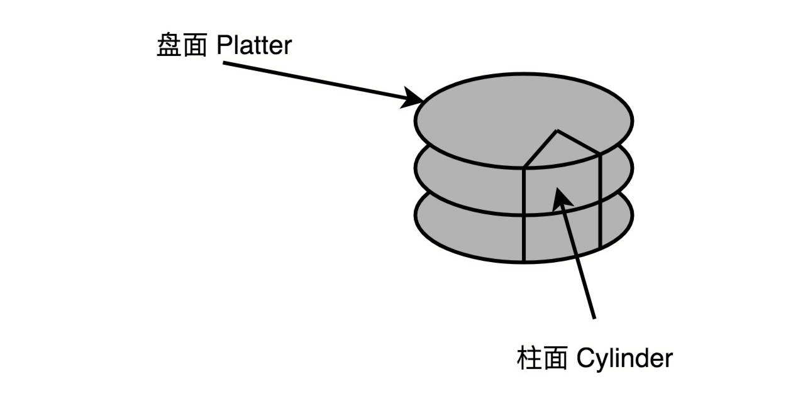
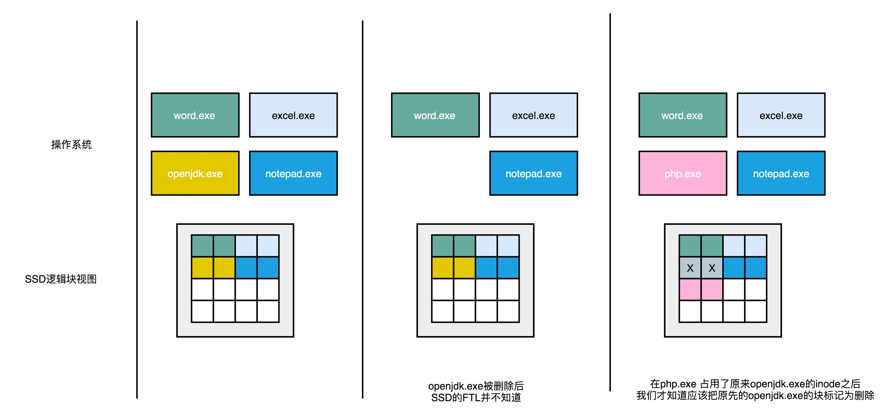
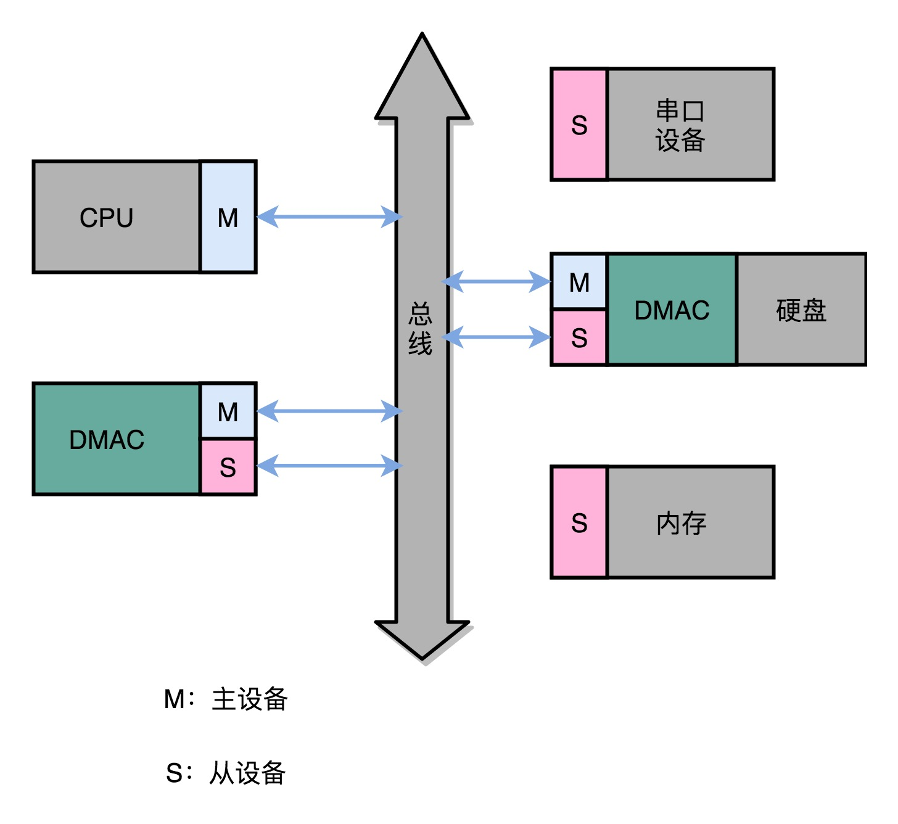
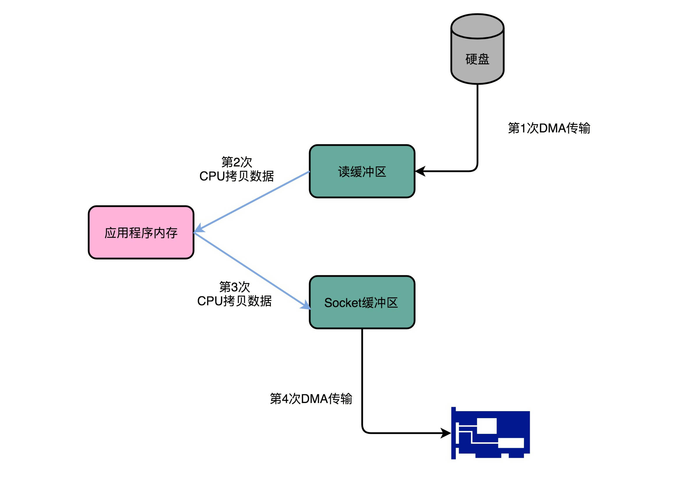

## 理解存储器的层次结构

### SRAM

SRAM被称为静态存储器：

- 只要是处于通电状态，里面的数据就可以保持存在，而一旦断电，里面的数据就会消失。
- SRAM 的存储密度不高，一个比特的数据需要6~8个晶体管，同样的物理空间下，能够存储的数据有限。
- SRAM 的电路简单，访问速度快

#### CPU的三级缓存

L1：每个CPU核心都有一块属于自己的L1高速缓存，包括指令缓存和数据缓存。L1 的cache往往就嵌在cpu核心的内部。

L2：L2 的 cache 同样是每个CPU核心都有的，不过它往往不在CPU核心的内部，所以L2 cache 的访问速度相对于L1要慢一些

L3：通常是多个CPU核心共用的，尺寸会大一些，访问速度自然慢一些。

### DRAM

内存用的芯片和 Cache 有所不同，它用的是一种叫作 DRAM（Dynamic Random Access Memory，动态随机存取存储器）的芯片，比起 SRAM 来说，它的密度更高，有更大的容量，而且它也比 SRAM 芯片便宜不少。

DRAM 被称为“动态”存储器，是因为 DRAM 需要靠不断地“刷新”，才能保持数据被存储起来。DRAM 的数据访问电路和刷新电路都比 SRAM 更复杂，所以访问延时也就更长。

### 存储器的层级结构

整个存储器的层次结构，其实都类似于 SRAM 和 DRAM 在性能和价格上的差异。SRAM 更贵，速度更快。DRAM 更便宜，容量更大。SRAM 好像我们的大脑中的记忆，而 DRAM 就好像属于我们自己的书桌。

对于内存来说，SSD（Solid-state drive 或 Solid-state disk，固态硬盘）、HDD（Hard Disk Drive，硬盘）这些被称为硬盘的外部存储设备，就是公共图书馆。

CPU 并不是直接和每一种存储器设备打交道，而是每一种存储器设备，只和它相邻的存储设备打交道。比如，CPU Cache 是从内存里加载而来的，或者需要写回内存，并不会直接写回数据到硬盘，也不会直接从硬盘加载数据到 CPU Cache 中，而是先加载到内存，再从内存加载到 Cache 中。
这样，各个存储器只和相邻的一层存储器打交道，并且随着一层层向下，存储器的容量逐层增大，访问速度逐层变慢，而单位存储成本也逐层下降，也就构成了我们日常所说的存储器层次结构。

## 局部性原理

平时进行服务端软件开发的时候，我们通常会把数据存储在数据库里。而服务端系统遇到的第一个性能瓶颈，往往就发生在访问数据库的时候。这个时候，大部分工程师和架构师会拿出一种叫作“缓存”的武器，通过使用Redis或者Memcache这样的开源软件，在数据库前面提供一层缓存的数据，来缓解数据库面临的压力，提升服务端的程序性能。

局部性原理（Principle of Locality）包括：

- 时间局部性（temporal locality）如果一个数据被访问了，那么它在短时间内还会被再次访问。
- 空间局部性（spatial locality）如果一个数据被访问了，那么和它相邻的数据也很快会被访问。

## 高速缓存

在95%的情况下，CPU都只需要访问L1-L3 Cache，从里面读取指令和数据，而无需访问内存。

CPU 从内存中读取数据到CPU cache的过程中，是一小块一小块的读取数据，而不是将整个数组元素读取进来，这样一小块一小块的数据在CPU cache 里面称为 cache line。日常使用的Intel服务器或者PC里，Cache的大小通常是64K字节。

CPU 会首先访问cache，只有当CPU在cache中找不到数据时，才去访问内存。而cache 的速度远远快于内存，这样CPU在等待访问内存的时间就大大缩短了。根据时间局部性原理，刚刚被访问的数据会很快再次被访问。

对于读取内存中的数据，首先拿到的是说句所在内存块的地址，而直接映射cache的策略，就是确保任何一个内存块的地址，始终映射到一个固定的CPU cache 地址。

### 映射关系

比如说，我们的主内存被分成0～31号这样32个块、我们一共有8个缓存块。用户想要访问第21号内存块，如果21号内存块内容在缓存块中的话，它一定在5号缓存块（21 mod 8 = 5）中：

一种计算方法是比如在这里有8个缓存块，也就是2的3次方，那么在对21取模时，可以对21的2进制表示的数据取低地址的三位，也就是 101，对应的是5：

存在的问题：除了12号内存块外，13号和5号等多个内存块的数据都对应5号缓存块，所以取得5号缓存块的数据后并不知道具体是哪个内存块的数据。

### Cache的数据结构

### 组标记

组标记会记录当前缓存块内存储的数据对应的内存块，，而缓存块本身的地址表示访问地址的低N位。比如上面的例子中，21的低3位是 101，缓存块本身的地址已经涵盖了对应的信息，对应的标记，我们只需要记录21的高2位信息，也就是10就可以了。

#### 有效位

用来标记对应缓存块中的数据是否是有效的，如果有效位是0，无论其中的组标记和Cache line里的内容是什么，CPU都不会管这些数据，而要直接访问内存，重新加载数据。

#### 偏移量

CPU在读取数据时，并不是要读取一整个block，而是读取一个它需要的数据，这样的数据在CPU里称为一个 word，具体是哪个字，就用这个字在整个 block里的位置来决定，这个位置称为偏移量。

#### 一个内存的访问地址

索引 +  组标记 + 数据：

- 高位表示组标记
- 低位表示表的索引，以及在对应的 data block 中定位对应字位置的偏移量

#### 内存地址对应到cache里数据结构

内存地址对应到cache里的数据结构：索引 +  有效位 + 组标记 + 数据

如果内存中数据已经在CPU cache 里：

- 根据内存地址的低位，计算在cache中的索引
- 判断有效位，确认cache中的数据是有效的
- 对比内存访问地址的高位，和cache中的组标记，确认cache中的数据就是我们要访问的内存数据
- 从cache line 中读取对应的数据块
- 根据内存地址的偏移量从 cache block 中读取希望读取的字

## CPU高速缓存的写入

我们现在用的Intel CPU，通常都是多核的的。每一个CPU核里面，都有独立属于自己的L1、L2的Cache，然后再有多个CPU核共用的L3的Cache、主内存。

因为CPU Cache的访问速度要比主内存快很多，而在CPU Cache里面，L1/L2的Cache也要比L3的Cache快。CPU始终都是尽可能地从CPU Cache中去获取数据，而不是每一次都要从主内存里面去读取数据。

### 写入策略：写直达

最简单的一种写入策略，叫作写直达（Write-Through）。在这个策略里，每一次数据都要写入到主内存里面。在写直达的策略里面：

- 写入前，我们会先去判断数据是否已经在Cache里面了。如果数据已经在Cache里面了，我们先把数据写入更新到Cache里面，再写入到主内存里面
- 如果数据不在Cache里，我们就只更新主内存

写直达的这个策略很直观，但是问题也很明显，那就是这个策略很慢。无论数据是不是在Cache里面，我们都需要把数据写到主内存里面。

### 写回

在CPU Cache的写入策略里，还有一种策略就叫作写回（Write-Back）。这个策略里，我们不再是每次都把数据写入到主内存，而是只写到CPU Cache里。只有当CPU Cache里面的数据要被“替换”的时候，我们才把数据写入到主内存里面去。写回策略的过程是这样的：

- 如果发现我们要写入的数据，就在CPU Cache里面，那么我们就只是更新CPU Cache里面的数据。同时，我们会标记CPU Cache里的这个Block是脏（Dirty）的。所谓脏的，就是指这个时候，我们的CPU Cache里面的这个Block的数据，和主内存是不一致的。
- 如果我们发现，我们要写入的数据所对应的Cache Block里，放的是别的内存地址的数据，那么我们就要看一看，那个Cache Block里面的数据有没有被标记成脏的。如果是脏的话，我们要先把这个Cache Block里面的数据，写入到主内存里面。再把当前要写入的数据，写入到Cache里，同时把Cache Block标记成脏的。
- 如果Block里面的数据没有被标记成脏的，那么我们直接把数据写入到Cache里面，然后再把CacheBlock标记成脏的就好了。在用了写回这个策略之后，我们在加载内存数据到Cache里面的时候，也要多出一步同步脏Cache的动作。
- 如果加载内存里面的数据到Cache的时候，发现Cache Block里面有脏标记，我们也要先把Cache Block里的数据写回到主内存，才能加载数据覆盖掉Cache。

## 缓存一致性

比方说，iPhone降价了，我们要把iPhone最新的价格更新到内存里。为了性能问题，它采用了上一讲我们说的写回策略：

- 先把数据写入到L2 Cache里面，然后把Cache Block标记成脏的。这个时候，数据其实并没有被同步到L3 Cache或者主内存里
- 1号核心希望在这个Cache Block要被交换出去的时候，数据才写入到主内存里。如果我们的CPU只有1号核心这一个CPU核，那这其实是没有问题的。不过，我们旁边还有一个2号核心呢！
- 这个时候，2号核心尝试从内存里面去读取iPhone的价格，结果读到的是一个错误的价格。这是因为，iPhone的价格刚刚被1号核心更新过。但是这个更新的信息，只出现在1号核心的L2 Cache里，而没有出现在2号核心的L2 Cache或者主内存里面。这个问题，就是所谓的缓存一致性问题，1号核心和2号核心的缓存，在这个时候是不一致的。

### 写传播

为了解决这个缓存不一致的问题，我们就需要有一种机制，来同步两个不同核心里面的缓存数据。那这样的机制需要满足什么条件呢？我觉得能够做到下面两点就是合理的。

第一点叫写传播（Write Propagation）。写传播是说，在一个CPU核心里，我们的Cache数据更新，必须能够传播到其他的对应节点的Cache Line里。

### 事务的串行化

第二点叫 事务的串行化（Transaction Serialization），事务串行化是说，我们在一个CPU核心里面的读取和写入，在其他的节点看起来，顺序是一样的。

这一次，我们找一个有4个核心的CPU。1号核心呢，先把iPhone的价格改成了6000块。差不多在同一个时间，2号核心把iPhone的价格改成了5000块。这里两个修改，都会传播到3号核心和4号核心差不多在同一个时间。

然而这里有个问题，3号核心先收到了2号核心的写传播，再收到1号核心的写传播。所以3号核心看到的iPhone价格是先变成了6000块，再变成了5000块。而4号核心呢，是反过来的，先看到变成了5000块，再变成6000块。虽然写传播是做到了，但是各个Cache里面的数据，是不一致的。

事实上，我们需要的是，从1号到4号核心，都能看到相同顺序的数据变化。比如说，都是先变成了5000块，再变成了6000块。这样，我们才能称之为实现了事务的串行化。

事务的串行化，不仅仅是缓存一致性中所必须的。比如，我们平时所用到的系统当中，最需要保障事务串行的就是数据库。多个不同的连接去访问数据库的时候，化我们必须保障事务的串行化，做不到事务的串行化的数据库，根本没法作为可靠的商业数据库来使用。

在CPU Cache里做到事务串行化，需要做到两点：

- 一个CPU核心对于数据的操作，需要同步通信给到其他CPU核心
- 如果两个CPU核心里有同一个数据的Cache，那么对于这个Cache数据的更新，需要有一个“锁”的概念。只有拿到了对应Cache Block的“锁”之后，才能进行对应的数据更新

要解决缓存一致性问题，首先要解决的是多个CPU核心之间的数据传播问题。最常见的一种解决方案呢，叫作 总线嗅探（Bus Snooping）。这个策略，本质上就是把所有的读写请求都通过总线（Bus）广播给所有的CPU核心，然后让各个核心去“嗅探”这些请求，再根据本地的情况进行响应。总线本身就是一个特别适合广播进行数据传输的机制，所以总线嗅探这个办法也是我们日常使用的IntelCPU进行缓存一致性处理的解决方案。

### 写失效协议

基于总线嗅探机制，其实还可以分成很多种不同的缓存一致性协议。不过其中最常用的，就是今天我们要讲
的MESI协议。和很多现代的CPU技术一样，MESI协议也是在Pentium时代，被引入到Intel CPU中的。

MESI协议，是一种叫作写失效（Write Invalidate）的协议。在写失效协议里：

只有一个CPU核心负责写入数据，其他的核心，只是同步读取到这个写入。在这个CPU核心写入Cache之后，它会去广播一个“失效”请求告诉所有其他的CPU核心。其他的CPU核心，只是去判断自己是否也有一个“失效”版本的CacheBlock，然后把这个也标记成失效的就好了。

### 写广播协议

一个写入请求广播到所有的CPU核心，同时更新各个核心里的Cache。写广播在实现上自然很简单，但是写广播需要占用更多的总线带宽。　写失效只需要告诉其他的CPU核心，哪一个内存地址的缓存失效了，但是写广播还需要把对应的数据传输给其他CPU核心

### Cache Line的四个不同的标记

- M：代表已修改（Modified）
- E：代表独占（Exclusive）
- S：代表共享（Shared）
- I：代表已失效（Invalidated）

所谓的“已修改”，就是我们上一讲所说的“脏”的Cache Block。Cache Block里面的内容我们已经更新过了，
但是还没有写回到主内存里面。

所谓的“已失效“，自然是这个Cache Block里面的数据已经失效了，我们不可以相信这个Cache Block里面的数据。

无论是独占状态还是共享状态，缓存里面的数据都是“干净”的。这个“干净”，自然对应的是前面所说的“脏”的，也就是
说，这个时候，Cache Block里面的数据和主内存里面的数据是一致的。

在独占状态下，对应的Cache Line只加载到了当前CPU核所拥有的Cache里。其他的CPU核，并没有加载对应的数据到自己的Cache里。这个时候，如果要向独占的Cache Block写入数据，我们可以自由地写入数据，而不需要告知其他CPU核。如果收到了一个来自于总线的读取对应缓存的请求，它就会变成共享状态。这个共享状态是因为，这个时候，另外一个CPU核心，也把对应的Cache Block，从内存里面加载到了自己的Cache里来。

而在共享状态下因为同样的数据在多个CPU核心的Cache里都有。所以，当我们想要更新Cache里面的数据的时候，不能直接修改，而是要先向所有的其他CPU核心广播一个请求，要求先把其他CPU核心里面的Cache，都变成无效的状态，然后再更新当前Cache里面的数据。这个广播操作，一般叫作RFO（Request For Ownership），也就是获取当前对应Cache Block数据的所有权。

整个MESI的状态，可以用一个有限状态机来表示它的状态流转。

## 理解内存

### 简单页表

想要把虚拟内存地址，映射到物理内存地址，最直观的办法，就是来建一张映射表。这个映射表，能够实现虚拟内存里面的页，到物理内存里面的页的一一映射。这个映射表，在计算机里面，就叫作 **页表**（PageTable）。页表这个地址转换的办法，会把一个内存地址分成 页号（Directory）和 偏移量（Offset）两个部分。  

以一个32位的内存地址为例：

- 其实，前面的高位，就是内存地址的页号。后面的低位，就是内存地址里面的偏移量
- 做地址转换的页表，只需要保留虚拟内存地址的页号和物理内存地址的页号之间的映射关系就可以了。
- 同一个页里面的内存，在物理层面是连续的。以一个页的大小是4K比特（4KiB）为例，我们需要20位的高位，12位的低位。

内存地址转换，的三个步骤：

- 把虚拟内存地址，切分成页号和偏移量的组合
- 从页表里面，查询出虚拟页号，对应的物理页号
- 直接拿物理页号，加上前面的偏移量，就得到了物理内存地址

32位的内存地址空间，页表一共需要记录2^20个到物理页号的映射关系。这个存储关系，就好比一个2^20大小的数组。

一个页号是完整的32位的4字节（Byte），这样一个页表就需要4MB的空间。听起来4MB的空间好像还不大啊，毕竟我们现在的内存至少也有4GB，服务器上有个几十GB的内存很正常。

一个页号是完整的32位的4字节（Byte），这样一个页表就需要 4MB的空间。  不过，这个空间可不是只占用一份哦。我们每一个进程，都有属于自己独立的虚拟内存地址空间。这也就意味着，每一个进程都需要这样一个页表。不管我们这个进程，是个本身只有几KB大小的程序，还是需要几GB的内存空间。

### 多级页表

在整个进程的内存地址空间，通常是“两头实、中间空”。在程序运行的时候，内存地址从顶部往下，不断分配占用的栈的空间。而堆的空间，内存地址则是从底部往上，是不断分配占用的。

所以，在一个实际的程序进程里面，虚拟内存占用的地址空间，通常是两段连续的空间。而不是完全散落的随机的内存地址。而多级页表，就特别适合这样的内存地址分布。

多级页表就是把内存分成区块来管理，将原来的映射关系改成区块索引和区块内的偏移。由于虚拟内存空间通常只用了很少一部分，那么多级页表就只保存这些使用中的区块，这样就可以大大地减少页表的项数，Linux 用的正是四级页表来管理内存页,如下图所示，虚拟地址被分为 5 个部分，前 4 个表项用于选择页，而最后一个索引表示页内偏移。

事实上，多级页表就像一个多叉树的数据结构，所以我们常常称它为 页表树（Page Table Tree）。因为虚拟内存地址分布的连续性，树的第一层节点的指针，很多就是空的，也就不需要有对应的子树了。所谓不需要子树，其实就是不需要对应的2级、3级的页表。找到最终的物理页号，就好像通过一个特定的访问路径，走到树最底层的叶子节点。

以这样的分成4级的多级页表来看，每一级如果都用5个比特表示。那么每一张某1级的页表，只需要2^5=32个条目。如果每个条目还是4个字节，那么一共需要128个字节。
而一个1级索引表，对应32个4KiB的也就是16KB的大小。一个填满的2级索引表，对应的就是32个1级索引表，也就是512KB的大小。

我们可以一起来测算一下，一个进程如果占用了1MB的内存空间，分成了2个512KB的连续空间。那么，它一共需要2个独立的、填满的2级索引表，也就意味着64个1级索引表，2个独立的3级索引表，1个4级索引表。一共需要69个索引表，每个128字节，大概就是9KB的空间。比起4MB来说，只有差不多1/500。

不过，多级页表虽然节约了我们的存储空间，却带来了时间上的开销，所以它其实是一个“以时间换空间”的策略。原本我们进行一次地址转换，只需要访问一次内存就能找到物理页号，算出物理内存地址。但是，用了4级页表，我们就需要访问4次内存，才能找到物理页号了。

### 加速地址转换：TLB

多级页表虽然节约了我们的存储空间，但是却带来了时间上的开销，变成了一个“以时间换空间”的策略。原本我们进行一次地址转换，只需要访问一次内存就能找到物理页号，算出物理内存地址。但是用了4级页表，我们就需要访问4次内存，才能找到物理页号。

程序所需要使用的指令，都顺序存放在虚拟内存里面。我们执行的指令，也是一条条顺序执行下去的。也就是说，我们对于指令地址的访问，存在前面几讲所说的“空间局部性”和“时间局部性”，而需要访问的数据也是一样的。我们连续执行了5条指令。因为内存地址都是连续的，所以这5条指令通常都在同一个“虚拟页”里。

因此，这连续5次的内存地址转换，其实都来自于同一个虚拟页号，转换的结果自然也就是同一个物理页号。那我们就可以用前面几讲说过的，用“加个缓存”的办法。把之前的内存转换地址缓存下来，使得我们不需要反复去访问内存来进行内存地址转换。

于是，计算机工程师们专门在CPU里放了一块缓存芯片。这块缓存芯片我们称之为 TLB，全称是 地址变换高速缓冲（Translation-Lookaside Buffer）。

这块缓存存放了之前已经进行过地址转换的查询结果。这样，当同样的虚拟地址需要进行地址转换的时候，我们可以直接在TLB里面查询结果，而不需要多次访问内存来完成一次转换。

TLB和我们前面讲的CPU的高速缓存类似，可以分成指令的TLB和数据的TLB，也就是 ITLB和 DTLB。同样的，我们也可以根据大小对它进行分级，变成L1、L2这样多层的TLB。除此之外，还有一点和CPU里的高速缓存也是一样的，我们需要用脏标记这样的标记位，来实现“写回”这样缓存管理策略。

为了性能，我们整个内存转换过程也要由硬件来执行。在CPU芯片里面，我们封装了内存管理单元（MMU，Memory Management Unit）芯片，用来完成地址转换。和TLB的访问和交互，都是由这个MMU控制的。

### 安全性与内存保护

进程的程序也好，数据也好，都要存放在内存里面。实际程序指令的执行，也是通过程序计数器里面的地址，去读取内存内的内容，然后运行对应的指令，使用相应的数据。

虽然我们现代的操作系统和CPU，已经做了各种权限的管控。正常情况下，我们已经通过虚拟内存地址和物理内存地址的区分，隔离了各个进程。但是，无论是CPU这样的硬件，还是操作系统这样的软件，都太复杂了，难免还是会被黑客们找到各种各样的漏洞。

就像我们在软件开发过程中，常常会有一个“兜底”的错误处理方案一样，在对于内存的管理里面，计算机也有一些最底层的安全保护机制。这些机制统称为 内存保护（Memory Protection）。

#### 可执行空间保护

第一个常见的安全机制，叫 可执行空间保护（Executable Space Protection）。这个机制是说，我们对于一个进程使用的内存，只把其中的指令部分设置成“可执行”的，对于其他部分，比如数据部分，不给予“可执行”的权限。因为无论是指令，还是数据，在我们的CPU看来，都是二进制的数据。我们直接把数据部分拿给CPU，如果这些数据解码后，也能变成一条合理的指令，其实就是可执行的。

这个时候，黑客们想到了一些搞破坏的办法。我们在程序的数据区里，放入一些要执行的指令编码后的数据，然后找到一个办法，让CPU去把它们当成指令去加载，那CPU就能执行我们想要执行的指令了。对于进程里内存空间的执行权限进行控制，可以使得CPU只能执行指令区域的代码。对于数据区域的内容，即使找到了其他漏洞想要加载成指令来执行，也会因为没有权限而被阻挡掉。

#### 地址空间布局随机化

第二个常见的安全机制，叫地址空间布局随机化（Address Space Layout Randomization）。

这里的核心问题是，其他的人、进程、程序，会去修改掉特定进程的指令、数据，然后，让当前进程去执行这些指令和数据，造成破坏。要想修改这些指令和数据，我们需要知道这些指令和数据所在的位置才行。

原先我们一个进程的内存布局空间是固定的，所以任何第三方很容易就能知道指令在哪里，程序栈在哪里，数据在哪里，堆又在哪里。这个其实为想要搞破坏的人创造了很大的便利。
而地址空间布局随机化这个机制，就是让这些区域的位置不再固定，在内存空间随机去分配这些进程里不同部分所在的内存空间地址，让破坏者猜不出来。猜不出来呢，自然就没法找到想要修改的内容的位置。如果只是随便做点修改，程序只会crash掉，而不会去执行计划之外的代码。

## 总线

### 降低复杂性

设备间的通信，都是互相之间单独进行的：

N 个不同的设备它们之间需要单独连接，复杂度就是 N^2。

与其让各个设备之间互联，不如设计一条公共线路：

### 事件总线（Event Bus）的设计模式

### 三种线路多种架构

以上案例就利用了局部性原理：

### CPU是如何控制I/O设备的？

## 理解 IO_WAIT

如果去看硬盘厂商的性能报告，通常你会看到两个指标。一个是响应时间（Response Time），另一个叫作数据传输率（Data Transfer Rate）。

我们现在常用的硬盘有两种。一种是 HDD 硬盘，也就是我们常说的机械硬盘。另一种是 SSD 硬盘，一般也被叫作固态硬盘。现在的 HDD 硬盘，用的是 SATA 3.0 的接口。而 SSD 硬盘呢，通常会用两种接口，一部分用的也是 SATA 3.0 的接口；另一部分呢，用的是 PCI Express 的接口。

现在我们常用的 SATA 3.0 的接口，带宽是 6Gb/s。这里的 “b” 是比特。这个带宽相当于每秒可以传输 768MB 的数据。而我们日常用的 HDD 硬盘的数据传输率，差不多在 200MB/s 左右。

这个每秒读写的次数，我们称之为 IOPS，也就是每秒输入输出操作的次数。事实上，比起响应时间，我们更关注 IOPS 这个性能指标。IOPS 和 DTR（Data Transfer Rate，数据传输率）才是输入输出性能的核心指标。HDD 硬盘的 IOPS 通常也就在 100 左右。

##  机械硬盘

一块机械硬盘是由盘面、磁头和悬臂三个部件组成的。

盘面其实就是我们实际存储数据的盘片。盘面本身通常是用的铝、玻璃或者陶瓷这样的材质做成的光滑盘片。然后，盘面上有一层磁性的涂层。我们的数据就存储在这个磁性的涂层上。盘面中间有一个受电机控制的转轴。这个转轴会控制我们的盘面去旋转。

平时买硬盘的时候经常会听到一个指标，叫作这个硬盘的转速。我们的硬盘有 5400 转的、7200 转的，乃至 10000 转的。这个多少多少转，指的就是盘面中间电机控制的转轴的旋转速度，英文单位叫 RPM，也就是每分钟的旋转圈数（Rotations Per Minute）。所谓 7200 转，其实更准确地说是 7200RPM，指的就是一旦电脑开机供电之后，我们的硬盘就可以一直做到每分钟转上 7200 圈。如果折算到每一秒钟，就是 120 圈。

我们的数据并不能直接从盘面传输到总线上，而是通过磁头，从盘面上读取到，然后再通过电路信号传输给控制电路、接口，再到总线上的。通常，我们的一个盘面上会有两个磁头，分别在盘面的正反面。盘面在正反两面都有对应的磁性涂层来存储数据，而且一块硬盘也不是只有一个盘面，而是上下堆叠了很多个盘面，各个盘面之间是平行的。每个盘面的正反两面都有对应的磁头。

悬臂链接在磁头上，并且在一定范围内会去把磁头定位到盘面的某个特定的磁道（Track）上。这个磁道是怎么来呢？想要了解这个问题，我们要先看一看我们的数据是怎么存放在盘面上的。一个盘面通常是圆形的，由很多个同心圆组成，就好像是一个个大小不一样的 “甜甜圈” 嵌套在一起。每一个 “甜甜圈” 都是一个磁道。每个磁道都有自己的一个编号。悬臂其实只是控制，到底是读最里面那个 “甜甜圈” 的数据，还是最外面 “甜甜圈” 的数据。

磁道会分成一个一个扇区（Sector）。上下平行的一个一个盘面的相同扇区呢，我们叫作一个柱面（Cylinder）。

读取数据，其实就是两个步骤。一个步骤，就是把盘面旋转到某一个位置。在这个位置上，我们的悬臂可以定位到整个盘面的某一个子区间。这个子区间的形状有点儿像一块披萨饼，我们一般把这个区间叫作几何扇区（Geometrical Sector），意思是，在 “几何位置上”，所有这些扇区都可以被悬臂访问到。另一个步骤，就是把我们的悬臂移动到特定磁道的特定扇区，也就在这个 “几何扇区” 里面，找到我们实际的扇区。找到之后，我们的磁头会落下，就可以读取到正对着扇区的数据。

所以，我们进行一次硬盘上的随机访问，需要的时间由两个部分组成。

第一个部分，叫作平均延时（Average Latency）。这个时间，其实就是把我们的盘面旋转，把几何扇区对准悬臂位置的时间。这个时间很容易计算，它其实就和我们机械硬盘的转速相关。随机情况下，平均找到一个几何扇区，我们需要旋转半圈盘面。上面 7200 转的硬盘，那么一秒里面，就可以旋转 240 个半圈。那么，这个平均延时就是：1s / 240 = 4.17ms

第二个部分，叫作平均寻道时间（Average Seek Time），也就是在盘面选转之后，我们的悬臂定位到扇区的的时间。我们现在用的 HDD 硬盘的平均寻道时间一般在 4-10ms。这样，我们就能够算出来，如果随机在整个硬盘上找一个数据，需要 8-14 ms。我们的硬盘是机械结构的，只有一个电机转轴，也只有一个悬臂，所以我们没有办法并行地去定位或者读取数据。那一块 7200 转的硬盘，我们一秒钟随机的 IO 访问次数，也就是：1s / 8 ms = 125 IOPS 或者 1s / 14ms = 70 IOPS 。

### PartialStroking：根据场景提升性能

Partial Stroking 或者 Short Stroking，暂时把它翻译成 “缩短行程” 技术。

既然我们访问一次数据的时间，是 “平均延时 + 寻道时间”，那么只要能缩短这两个之一，不就可以提升 IOPS 了吗？

一般情况下，硬盘的寻道时间都比平均延时要长。那么我们自然就可以想一下，有什么办法可以缩短平均的寻道时间。最极端的办法就是我们不需要寻道，也就是说，我们把所有数据都放在一个磁道上。比如，我们始终把磁头放在最外道的磁道上。这样，我们的寻道时间就基本为 0，访问时间就只有平均延时了。那样，我们的 IOPS，就变成了：1s / 4ms = 250 IOPS

不过呢，只用一个磁道，我们能存的数据就比较有限了。这个时候，可能我们还不如把这些数据直接都放到内存里面呢。所以，实践当中，我们可以只用 1/2 或者 1/4 的磁道，也就是最外面 1/4 或者 1/2 的磁道。这样，我们硬盘可以使用的容量可能变成了 1/2 或者 1/4。但是呢，我们的寻道时间，也变成了 1/4 或者 1/2，因为悬臂需要移动的 “行程” 也变成了原来的 1/2 或者 1/4，我们的 IOPS 就能够大幅度提升了。

比如说，我们一块 7200 转的硬盘，正常情况下，平均延时是 4.17ms，而寻道时间是 9ms。那么，它原本的 IOPS 就是：1s / (4.17ms + 9ms) = 75.9 IOPS

如果我们只用其中 1/4 的磁道，那么，它的 IOPS 就变成了：1s / (4.17ms + 9ms/4) = 155.8 IOPS

## SSD

### SSD和机械硬盘的优缺点

SSD没有像机械硬盘那样的寻道过程，所以它的随机读写都更快。我在下面列了一个表格，对比了一下SSD和机械硬盘的优缺点。

### SLC、MLC、TLC和QLC

能够记录一个比特很容易理解。给电容里面充上电有电压的时候就是1，给电容放电里面没有电就是0。采用这样方式存储数据的SSD硬盘，我们一般称之为 使用了SLC的颗粒，全称是Single-Level Cell，也就是一个存储单元中只有一位数据。

但是，这样的方式会遇到和CPU Cache类似的问题，那就是，同样的⾯积下，能够存放下的元器件是有限的。如果只用SLC，我们就会遇到，存储容量上不去，并且价格下不来的问题。

于是呢，硬件工程师们就陆续发明了 MLC（Multi-Level Cell）、 TLC（Triple-Level Cell）以及 QLC（Quad-Level Cell），也就是能在续发明了 MLC（Multi-Level Cell）、 TLC（Triple-Level Cell）以及 QLC（Quad-Level Cell），也就是能在一个电容里面存下2个、3个乃至4个比特。

只有一个电容，我们怎么能够表示更多的比特呢？别忘了，这里我们还有一个电压计。4个比特一共可以从0000-1111表⽰16个不同的数。那么，如果我们能往电容⾥⾯充电的时候，充上15个不同的电压，并且我们电压计能够区分出这15个不同的电压。加上电容被放空代表的0，就能够代表从0000-1111这样4个比特了。

不过，要想表示15个不同的电压，充电和读取的时候，对于精度的要求就会更高。这会导致充电和读取的时候都更慢，所以QLC的SSD的读写速度，要⽐SLC的慢上好几倍。

### P/E擦写问题

如果我们去看一看SSD硬盘的硬件构造，可以看到，它大概是自顶向下是这么构成的。

首先，虽然和其他的I/O设备一样，它有对应的 接⼝和控制电路。现在的SSD硬盘⽤的是SATA或者PCIExpress接⼝。在控制电路，有一个很重要的模块，叫作 FTL（Flash-Translation?Layer），也就是 闪存转换层。这个可以说是SSD硬盘的一个核新模块，SSD硬盘性能的好坏，很大程度上也取决于FTL的算法好不好。

接下来是 实际I/O设备，它其实和机械硬盘很像。现在新的大容量SSD硬盘都是3D封装的了，也就是说，是由很多个裸片（Die）叠在一起的，就好像我们的机械硬盘把很多个盘面（Platter）叠放在一起一样，这样可以在同样的空间下放下更多的容量。

接下来，一张裸片上可以放多个 平面（Plane），一般一个平面上的存储容量大概在GB级别。一个平面上面，会划分成很多个块（Block），一般一个块（Block）的存储大小，通常几百KB到几MB大小。一个块里面，还会区分很多个页（Page），就和我们内存里面的页一样，一个页的小小通常是4KB。

对于SSD硬盘来说，数据的写入叫作Program。写入不能像机械硬盘一样，通过 覆写（Overwrite）来进行的，而是要先去 擦除（Erase），然后再写入。SSD的读取和写入的基本单位，不是一个比特（bit）或者一个字节（byte），而是一个 页（Page）。SSD的擦除单位就更夸张了，我们不仅不能按照照特或者字节来擦除，连按照 页来擦除都不行，我们必须按照块来擦除。

SSD的使用寿命，其实是每一个块（Block）的擦除的次数。你可以把SSD硬盘的一个平面看成是一张白纸。我们在上面写入数据，
就好像用铅笔在白纸上写字。如果想要把已经写过字的地方写入新的数据，我们先要用橡皮把已经写好的字擦掉。但是，如果频繁擦同一个地方，那这个地方就
会破掉，之后就没有办法再写字了。

上⾯说的SLC的芯⽚，可以擦除的次数⼤概在10万次，MLC就在1万次左右，而TLC和QLC就只在几千次了。这也是为什么，你去购买SSD硬盘，会看到同样的容量的价格差别很大，因为它们的芯片颗粒和寿命完全不⼀样。

### SSD读写的生命周期

白色代表这个页从来没有写入过数据，绿色代表里面写入的是有效的数据，红色代表里面的数据，在我们的操作系统看来已经是删除的了。

说到这里，你可能要问了，这是不是说，我们的SSD硬盘的容量是⽤不满的？因为我们总会遇到一些红色空洞？

没错，一块SSD的硬盘容量，是没办法完全用满的。不过，为了不得罪消费者，生产SSD硬盘的厂商，其实是预留了一部分空间，专们用来做这个“磁盘碎片整理”工作的。
一块标成256G的SSD硬盘，往往实际有240G的硬盘空间。SSD硬盘通过我们的控制芯片电路，把多出来的硬盘空间，用来进行各种数据的闪转腾挪，让你能够写满那240G的空间。这个多出来的16G空间，叫作 预留空间（Over Provisioning），一般SSD的硬盘的预留空间都在7%-15%左右。

### 磨损均衡、TRIM 和写入放大效应

我们日常使用 PC 进行软件开发的时候，会先在硬盘上装上操作系统和常用软件，比如 Office，或者工程师们会装上 VS Code、WebStorm 这样的集成开发环境。这些软件所在的块，写入一次之后，就不太会擦除了，所以就只有读的需求。

一旦开始开发，我们就会不断添加新的代码文件，还会不断修改已经有的代码文件。因为 SSD 硬盘没有覆写（Override）的功能，所以，这个过程中，其实我们是在反复地写入新的文件，然后再把原来的文件标记成逻辑上删除的状态。等 SSD 里面空的块少了，我们会用 “垃圾回收” 的方式，进行擦除。这样，我们的擦除会反复发生在这些用来存放数据的地方。

有一天，这些块的擦除次数到了，变成了坏块。但是，我们安装操作系统和软件的地方还没有坏，而这块硬盘的可以用的容量却变小了。

让 SSD 硬盘各个块的擦除次数，均匀分摊到各个块上。这个策略呢，就叫作磨损均衡（Wear-Leveling）。实现这个技术的核心办法，和我们前面讲过的虚拟内存一样，就是添加一个间接层。这个间接层，就是 FTL 这个闪存转换层。

就像在管理内存的时候，我们通过一个页表映射虚拟内存页和物理页一样，在 FTL 里面，存放了逻辑块地址（Logical Block Address，简称 LBA）到物理块地址（Physical Block Address，简称 PBA）的映射。

操作系统访问的硬盘地址，其实都是逻辑地址。只有通过 FTL 转换之后，才会变成实际的物理地址，找到对应的块进行访问。操作系统本身，不需要去考虑块的磨损程度，只要和操作机械硬盘一样来读写数据就好了。

操作系统所有对于 SSD 硬盘的读写请求，都要经过 FTL。FTL 里面又有逻辑块对应的物理块，所以 FTL 能够记录下来，每个物理块被擦写的次数。如果一个物理块被擦写的次数多了，FTL 就可以将这个物理块，挪到一个擦写次数少的物理块上。但是，逻辑块不用变，操作系统也不需要知道这个变化。

#### TRIM 指令的支持

在 SSD 硬盘的使用上，也会带来一个问题。这个问题就是，操作系统的逻辑层和 SSD 的逻辑层里的块状态，是不匹配的。我们在操作系统里面去删除一个文件，其实并没有真的在物理层面去删除这个文件，只是在文件系统里面，把对应的 inode 里面的元信息清理掉，这代表这个 inode 还可以继续使用，可以写入新的数据。这个时候，实际物理层面的对应的存储空间，在操作系统里面被标记成可以写入了。

所以，其实我们日常的文件删除，都只是一个操作系统层面的逻辑删除。这也是为什么，很多时候我们不小心删除了对应的文件，我们可以通过各种恢复软件，把数据找回来。同样的，这也是为什么，如果我们想要删除干净数据，需要用各种 “文件粉碎” 的功能才行。

这个删除的逻辑在机械硬盘层面没有问题，因为文件被标记成可以写入，后续的写入可以直接覆写这个位置。

一开始，操作系统里面有好几个文件，不同的文件我用不同的颜色标记出来了。下面的 SSD 的逻辑块里面占用的页，我们也用同样的颜色标记出来文件占用的对应页。

当我们在操作系统里面，删除掉一个刚刚下载的文件，比如标记成黄色 openjdk.exe 这样一个 jdk 的安装文件，在操作系统里面，对应的 inode 里面，就没有文件的元信息。

但是，这个时候，我们的 SSD 的逻辑块层面，其实并不知道这个事情。所以在，逻辑块层面，openjdk.exe 仍然是占用了对应的空间。对应的物理页，也仍然被认为是被占用了的。

这个时候，如果我们需要对 SSD 进行垃圾回收操作，openjdk.exe 对应的物理页，仍然要在这个过程中，被搬运到其他的 Block 里面去。只有当操作系统，再在刚才的 inode 里面写入数据的时候，我们才会知道原来的些黄色的页，其实都已经没有用了，我们才会把它标记成废弃掉。

所以，在使用 SSD 的硬盘情况下，你会发现，操作系统对于文件的删除，SSD 硬盘其实并不知道。这就导致，我们为了磨损均衡，很多时候在都在搬运很多已经删除了的数据。这就会产生很多不必要的数据读写和擦除，既消耗了 SSD 的性能，也缩短了 SSD 的使用寿命。

为了解决这个问题，现在的操作系统和 SSD 的主控芯片，都支持 **TRIM 命令。**这个命令可以在文件被删除的时候，让操作系统去通知 SSD 硬盘，对应的逻辑块已经标记成已删除了。现在的 SSD 硬盘都已经支持了 TRIM 命令。无论是 Linux、Windows 还是 MacOS，这些操作系统也都已经支持了 TRIM 命令了。

TRIM 命令的发明，也反应了一个使用 SSD 硬盘的问题，那就是，SSD 硬盘容易越用越慢。

当 SSD 硬盘的存储空间被占用得越来越多，每一次写入新数据，我们都可能没有足够的空白。我们可能不得不去进行垃圾回收，合并一些块里面的页，然后再擦除掉一些页，才能匀出一些空间来。

这个时候，从应用层或者操作系统层面来看，我们可能只是写入了一个 4KB 或者 4MB 的数据。但是，实际通过 FTL 之后，我们可能要去搬运 8MB、16MB 甚至更多的数据。

我们通过 “实际的闪存写入的数据量 / 系统通过 FTL 写入的数据量 = 写入放大”，可以得到，写入放大的倍数越多，意味着实际的 SSD 性能也就越差，会远远比不上实际 SSD 硬盘标称的指标。

而解决写入放大，需要我们在后台定时进行垃圾回收，在硬盘比较空闲的时候，就把搬运数据、擦除数据、留出空白的块的工作做完，而不是等实际数据写入的时候，再进行这样的操作。

## 理解 DMA

本质上，DMA 技术就是我们在主板上放一块独立的芯片。在进行内存和 I/O 设备的数据传输的时候，我们不再通过 CPU 来控制数据传输，而直接通过 DMA 控制器（DMA Controller，简称 DMAC）。这块芯片，我们可以认为它其实就是一个协处理器（Co-Processor）。

DMAC 最有价值的地方体现在，当我们要传输的数据特别大、速度特别快，或者传输的数据特别小、速度特别慢的时候。

比如说，我们用千兆网卡或者硬盘传输大量数据的时候，如果都用 CPU 来搬运的话，肯定忙不过来，所以可以选择 DMAC。而当数据传输很慢的时候，DMAC 可以等数据到齐了，再发送信号，给到 CPU 去处理，而不是让 CPU 在那里忙等待。

DMAC 其实也是一个特殊的 I/O 设备，它和 CPU 以及其他 I/O 设备一样，通过连接到总线来进行实际的数据传输。总线上的设备呢，其实有两种类型。一种我们称之为主设备（Master），另外一种，我们称之为从设备（Slave）。

想要主动发起数据传输，必须要是一个主设备才可以，CPU 就是主设备。而我们从设备（比如硬盘）只能接受数据传输。所以，如果通过 CPU 来传输数据，要么是 CPU 从 I/O 设备读数据，要么是 CPU 向 I/O 设备写数据。

这个时候你可能要问了，那我们的 I/O 设备不能向主设备发起请求么？可以是可以，不过这个发送的不是数据内容，而是控制信号。I/O 设备可以告诉 CPU，我这里有数据要传输给你，但是实际数据是 CPU 拉走的，而不是 I/O 设备推给 CPU 的。

不过，DMAC 就很有意思了，它既是一个主设备，又是一个从设备。对于 CPU 来说，它是一个从设备；对于硬盘这样的 IO 设备来说呢，它又变成了一个主设备。

- 首先，CPU 还是作为一个主设备，向 DMAC 设备发起请求。这个请求，其实就是在 DMAC 里面修改配置寄存器。
- CPU 修改 DMAC 的配置的时候，会告诉 DMAC 这样几个信息：
  - 首先是源地址的初始值以及传输时候的地址增减方式。所谓源地址，就是数据要从哪里传输过来。如果我们要从内存里面写入数据到硬盘上，那么就是要读取的数据在内存里面的地址。如果是从硬盘读取数据到内存里，那就是硬盘的 I/O 接口的地址。I/O 的地址可以是一个内存地址，也可以是一个端口地址。而地址的增减方式就是说，数据是从大的地址向小的地址传输，还是从小的地址往大的地址传输。
  - 其次是目标地址初始值和传输时候的地址增减方式。目标地址自然就是和源地址对应的设备，也就是我们数据传输的目的地。
  - 第三个自然是要传输的数据长度，也就是我们一共要传输多少数据。
- 设置完这些信息之后，DMAC 就会变成一个空闲的状态（Idle）。
- 如果我们要从硬盘上往内存里面加载数据，这个时候，硬盘就会向 DMAC 发起一个数据传输请求。这个请求并不是通过总线，而是通过一个额外的连线。
- DMAC 需要再通过一个额外的连线响应这个申请。于是，DMAC 这个芯片，就向硬盘的接口发起要总线读的传输请求。数据就从硬盘里面，读到了 DMAC 的控制器里面。 然后，DMAC 再向我们的内存发起总线写的数据传输请求，把数据写入到内存里面。DMAC 会反复进行上面的操作，直到 DMAC 的寄存器里面设置的数据长度传输完成。
-  数据传输完成之后，DMAC 重新回到空闲状态。

所以，整个数据传输的过程中，我们不是通过 CPU 来搬运数据，而是由 DMAC 这个芯片来搬运数据。但是 CPU 在这个过程中也是必不可少的。因为传输什么数据，从哪里传输到哪里，其实还是由 CPU 来设置的。这也是为什么，DMAC 被叫作 “协处理器”。

最早，计算机里是没有 DMAC 的，所有数据都是由 CPU 来搬运的。随着人们对于数据传输的需求越来越多，先是出现了主板上独立的 DMAC 控制器。到了今天，各种 I/O 设备越来越多，数据传输的需求越来越复杂，使用的场景各不相同。加之显示器、网卡、硬盘对于数据传输的需求都不一样，所以各个设备里面都有自己的 DMAC 芯片了。

### Kafka 

Kafka 是一个用来处理实时数据的管道，我们常常用它来做一个消息队列，或者用来收集和落地海量的日志。作为一个处理实时数据和日志的管道，瓶颈自然也在 I/O 层面。

Kafka 里面会有两种常见的海量数据传输的情况。一种是从网络中接收上游的数据，然后需要落地到本地的磁盘上，确保数据不丢失。另一种情况呢，则是从本地磁盘上读取出来，通过网络发送出去。

- 第一次传输，是从硬盘上，读到操作系统内核的缓冲区里。这个传输是通过 DMA 搬运的。
- 第二次传输，需要从内核缓冲区里面的数据，复制到我们应用分配的内存里面。这个传输是通过 CPU 搬运的。
- 第三次传输，要从我们应用的内存里面，再写到操作系统的 Socket 的缓冲区里面去。这个传输，还是由 CPU 搬运的。
- 最后一次传输，需要再从 Socket 的缓冲区里面，写到网卡的缓冲区里面去。这个传输又是通过 DMA 搬运的。

这个时候，你可以回过头看看这个过程。我们只是要 “搬运” 一份数据，结果却整整搬运了四次。而且这里面，从内核的读缓冲区传输到应用的内存里，再从应用的内存里传输到 Socket 的缓冲区里，其实都是把同一份数据在内存里面搬运来搬运去，特别没有效率。

事实上，Kafka 做的事情就是，把这个数据搬运的次数，从上面的四次，变成了两次，并且只有 DMA 来进行数据搬运，而不需要 CPU。

Kafka 的代码调用了 Java NIO 库，具体是 FileChannel 里面的 transferTo 方法。我们的数据并没有读到中间的应用内存里面，而是直接通过 Channel，写入到对应的网络设备里。并且，对于 Socket 的操作，也不是写入到 Socket 的 Buffer 里面，而是直接根据描述符（Descriptor）写入到网卡的缓冲区里面。于是，在这个过程之中，我们只进行了两次数据传输。

第一次，是通过 DMA，从硬盘直接读到操作系统内核的读缓冲区里面。第二次，则是根据 Socket 的描述符信息，直接从读缓冲区里面，写入到网卡的缓冲区里面。这样，我们同一份数据传输的次数从四次变成了两次，并且没有通过 CPU 来进行数据搬运，所有的数据都是通过 DMA 来进行传输的。

在这个方法里面，我们没有在内存层面去 “复制（Copy）” 数据，所以这个方法，也被称之为零拷贝（Zero-Copy）。

## 数据完整性

单比特翻转（Single-Bit Flip）

奇偶校验的思路很简单。我们把内存里面的 N 位比特当成是一组。常见的，比如 8 位就是一个字节。然后，用额外的一位去记录，这 8 个比特里面有奇数个 1 还是偶数个 1。如果是奇数个 1，那额外的一位就记录为 1；如果是偶数个 1，那额外的一位就记录成 0。那额外的一位，我们就称之为校验码位。

如果在这个字节里面，我们不幸发生了单比特翻转，那么数据位计算得到的校验码，就和实际校验位里面的数据不一样。我们的内存就知道出错了。除此之外，校验位有一个很大的优点，就是计算非常快，往往只需要遍历一遍需要校验的数据，通过一个 O (N) 的时间复杂度的算法，就能把校验结果计算出来。

不过，使用奇偶校验，还是有两个比较大的缺陷。

第一个缺陷，就是奇偶校验只能解决遇到单个位的错误，或者说奇数个位的错误。如果出现 2 个位进行了翻转，那么这个字节的校验位计算结果其实没有变，我们的校验位自然也就不能发现这个错误。

第二个缺陷，是它只能发现错误，但是不能纠正错误。所以，即使在内存里面发现数据错误了，我们也只能中止程序，而不能让程序继续正常地运行下去。如果这个只是我们的个人电脑，做一些无关紧要的应用，这倒是无所谓了。

所以，我们需要一个比简单的校验码更好的解决方案，一个能够发现更多位的错误，并且能够把这些错误纠正过来的解决方案，也就是工程师们发明的 ECC 内存所使用的解决方案。

这个策略，我们通常叫作纠错码（Error Correcting Code）。它还有一个升级版本，叫作纠删码（Erasure Code），不仅能够纠正错误，还能够在错误不能纠正的时候，直接把数据删除。无论是我们的 ECC 内存，还是网络传输，乃至硬盘的 RAID，其实都利用了纠错码和纠删码的相关技术。