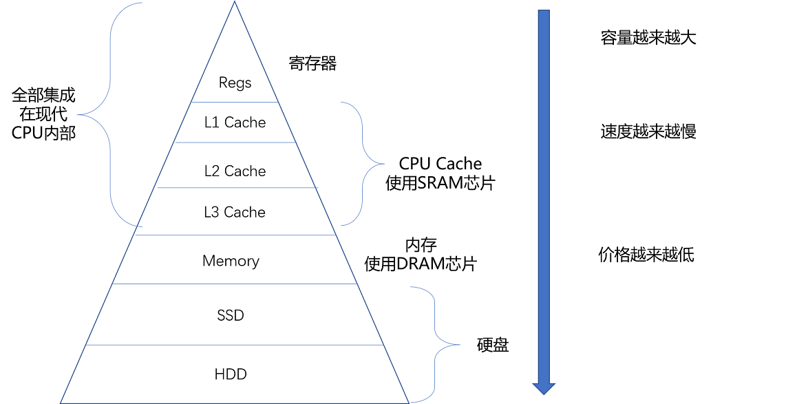
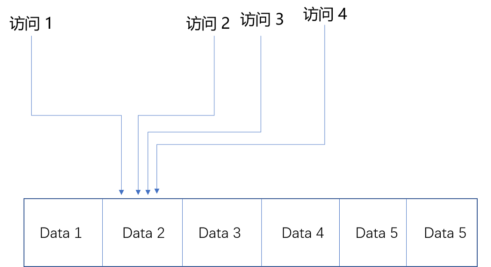

## 理解存储器的层次结构

### SRAM

SRAM被称为静态存储器：

- 只要是处于通电状态，里面的数据就可以保持存在，而一旦断电，里面的数据就会消失。
- SRAM 的存储密度不高，一个比特的数据需要6~8个晶体管，同样的物理空间下，能够存储的数据有限。
- SRAM 的电路简单，访问速度快

#### CPU的三级缓存

L1：每个CPU核心都有一块属于自己的L1高速缓存，包括指令缓存和数据缓存。L1 的cache往往就嵌在cpu核心的内部。

L2：L2 的 cache 同样是每个CPU核心都有的，不过它往往不在CPU核心的内部，所以L2 cache 的访问速度相对于L1要慢一些

L3：通常是多个CPU核心共用的，尺寸会大一些，访问速度自然慢一些。

### DRAM

内存用的芯片和 Cache 有所不同，它用的是一种叫作 DRAM（Dynamic Random Access Memory，动态随机存取存储器）的芯片，比起 SRAM 来说，它的密度更高，有更大的容量，而且它也比 SRAM 芯片便宜不少。

DRAM 被称为“动态”存储器，是因为 DRAM 需要靠不断地“刷新”，才能保持数据被存储起来。DRAM 的数据访问电路和刷新电路都比 SRAM 更复杂，所以访问延时也就更长。

### 存储器的层级结构

整个存储器的层次结构，其实都类似于 SRAM 和 DRAM 在性能和价格上的差异。SRAM 更贵，速度更快。DRAM 更便宜，容量更大。SRAM 好像我们的大脑中的记忆，而 DRAM 就好像属于我们自己的书桌。

对于内存来说，SSD（Solid-state drive 或 Solid-state disk，固态硬盘）、HDD（Hard Disk Drive，硬盘）这些被称为硬盘的外部存储设备，就是公共图书馆。

CPU 并不是直接和每一种存储器设备打交道，而是每一种存储器设备，只和它相邻的存储设备打交道。比如，CPU Cache 是从内存里加载而来的，或者需要写回内存，并不会直接写回数据到硬盘，也不会直接从硬盘加载数据到 CPU Cache 中，而是先加载到内存，再从内存加载到 Cache 中。
这样，各个存储器只和相邻的一层存储器打交道，并且随着一层层向下，存储器的容量逐层增大，访问速度逐层变慢，而单位存储成本也逐层下降，也就构成了我们日常所说的存储器层次结构。

## 局部性原理

平时进行服务端软件开发的时候，我们通常会把数据存储在数据库里。而服务端系统遇到的第一个性能瓶颈，往往就发生在访问数据库的时候。这个时候，大部分工程师和架构师会拿出一种叫作“缓存”的武器，通过使用Redis或者Memcache这样的开源软件，在数据库前面提供一层缓存的数据，来缓解数据库面临的压力，提升服务端的程序性能。

局部性原理（Principle of Locality）包括：

- 时间局部性（temporal locality）如果一个数据被访问了，那么它在短时间内还会被再次访问。
- 空间局部性（spatial locality）如果一个数据被访问了，那么和它相邻的数据也很快会被访问。

## 高速缓存

在95%的情况下，CPU都只需要访问L1-L3 Cache，从里面读取指令和数据，而无需访问内存。

CPU 从内存中读取数据到CPU cache的过程中，是一小块一小块的读取数据，而不是将整个数组元素读取进来，这样一小块一小块的数据在CPU cache 里面称为 cache line。日常使用的Intel服务器或者PC里，Cache的大小通常是64K字节。

CPU 会首先访问cache，只有当CPU在cache中找不到数据时，才去访问内存。而cache 的速度远远快于内存，这样CPU在等待访问内存的时间就大大缩短了。根据时间局部性原理，刚刚被访问的数据会很快再次被访问。

对于读取内存中的数据，首先拿到的是说句所在内存块的地址，而直接映射cache的策略，就是确保任何一个内存块的地址，始终映射到一个固定的CPU cache 地址。

### 映射关系

比如说，我们的主内存被分成0～31号这样32个块、我们一共有8个缓存块。用户想要访问第21号内存块，如果21号内存块内容在缓存块中的话，它一定在5号缓存块（21 mod 8 = 5）中：

一种计算方法是比如在这里有8个缓存块，也就是2的3次方，那么在对21取模时，可以对21的2进制表示的数据取低地址的三位，也就是 101，对应的是5：

存在的问题：除了12号内存块外，13号和5号等多个内存块的数据都对应5号缓存块，所以取得5号缓存块的数据后并不知道具体是哪个内存块的数据。

### Cache的数据结构

### 组标记

组标记会记录当前缓存块内存储的数据对应的内存块，，而缓存块本身的地址表示访问地址的低N位。比如上面的例子中，21的低3位是 101，缓存块本身的地址已经涵盖了对应的信息，对应的标记，我们只需要记录21的高2位信息，也就是10就可以了。

#### 有效位

用来标记对应缓存块中的数据是否是有效的，如果有效位是0，无论其中的组标记和Cache line里的内容是什么，CPU都不会管这些数据，而要直接访问内存，重新加载数据。

#### 偏移量

CPU在读取数据时，并不是要读取一整个block，而是读取一个它需要的数据，这样的数据在CPU里称为一个 word，具体是哪个字，就用这个字在整个 block里的位置来决定，这个位置称为偏移量。

#### 一个内存的访问地址

索引 +  组标记 + 数据：

- 高位表示组标记
- 低位表示表的索引，以及在对应的 data block 中定位对应字位置的偏移量

#### 内存地址对应到cache里数据结构

内存地址对应到cache里的数据结构：索引 +  有效位 + 组标记 + 数据

如果内存中数据已经在CPU cache 里：

- 根据内存地址的低位，计算在cache中的索引
- 判断有效位，确认cache中的数据是有效的
- 对比内存访问地址的高位，和cache中的组标记，确认cache中的数据就是我们要访问的内存数据
- 从cache line 中读取对应的数据块
- 根据内存地址的偏移量从 cache block 中读取希望读取的字

## CPU高速缓存的写入

我们现在用的Intel CPU，通常都是多核的的。每一个CPU核里面，都有独立属于自己的L1、L2的Cache，然后再有多个CPU核共用的L3的Cache、主内存。

因为CPU Cache的访问速度要比主内存快很多，而在CPU Cache里面，L1/L2的Cache也要比L3的Cache快。CPU始终都是尽可能地从CPU Cache中去获取数据，而不是每一次都要从主内存里面去读取数据。

### 写入策略：写直达

最简单的一种写入策略，叫作写直达（Write-Through）。在这个策略里，每一次数据都要写入到主内存里面。在写直达的策略里面：

- 写入前，我们会先去判断数据是否已经在Cache里面了。如果数据已经在Cache里面了，我们先把数据写入更新到Cache里面，再写入到主内存里面
- 如果数据不在Cache里，我们就只更新主内存

写直达的这个策略很直观，但是问题也很明显，那就是这个策略很慢。无论数据是不是在Cache里面，我们都需要把数据写到主内存里面。

### 写回

在CPU Cache的写入策略里，还有一种策略就叫作写回（Write-Back）。这个策略里，我们不再是每次都把数据写入到主内存，而是只写到CPU Cache里。只有当CPU Cache里面的数据要被“替换”的时候，我们才把数据写入到主内存里面去。写回策略的过程是这样的：

- 如果发现我们要写入的数据，就在CPU Cache里面，那么我们就只是更新CPU Cache里面的数据。同时，我们会标记CPU Cache里的这个Block是脏（Dirty）的。所谓脏的，就是指这个时候，我们的CPU Cache里面的这个Block的数据，和主内存是不一致的。
- 如果我们发现，我们要写入的数据所对应的Cache Block里，放的是别的内存地址的数据，那么我们就要看一看，那个Cache Block里面的数据有没有被标记成脏的。如果是脏的话，我们要先把这个Cache Block里面的数据，写入到主内存里面。再把当前要写入的数据，写入到Cache里，同时把Cache Block标记成脏的。
- 如果Block里面的数据没有被标记成脏的，那么我们直接把数据写入到Cache里面，然后再把CacheBlock标记成脏的就好了。在用了写回这个策略之后，我们在加载内存数据到Cache里面的时候，也要多出一步同步脏Cache的动作。
- 如果加载内存里面的数据到Cache的时候，发现Cache Block里面有脏标记，我们也要先把Cache Block里的数据写回到主内存，才能加载数据覆盖掉Cache。

## 缓存一致性

比方说，iPhone降价了，我们要把iPhone最新的价格更新到内存里。为了性能问题，它采用了上一讲我们说的写回策略：

- 先把数据写入到L2 Cache里面，然后把Cache Block标记成脏的。这个时候，数据其实并没有被同步到L3 Cache或者主内存里
- 1号核心希望在这个Cache Block要被交换出去的时候，数据才写入到主内存里。如果我们的CPU只有1号核心这一个CPU核，那这其实是没有问题的。不过，我们旁边还有一个2号核心呢！
- 这个时候，2号核心尝试从内存里面去读取iPhone的价格，结果读到的是一个错误的价格。这是因为，iPhone的价格刚刚被1号核心更新过。但是这个更新的信息，只出现在1号核心的L2 Cache里，而没有出现在2号核心的L2 Cache或者主内存里面。这个问题，就是所谓的缓存一致性问题，1号核心和2号核心的缓存，在这个时候是不一致的。

### 写传播

为了解决这个缓存不一致的问题，我们就需要有一种机制，来同步两个不同核心里面的缓存数据。那这样的机制需要满足什么条件呢？我觉得能够做到下面两点就是合理的。

第一点叫写传播（Write Propagation）。写传播是说，在一个CPU核心里，我们的Cache数据更新，必须能够传播到其他的对应节点的Cache Line里。

### 事务的串行化

第二点叫 事务的串行化（Transaction Serialization），事务串行化是说，我们在一个CPU核心里面的读取和写入，在其他的节点看起来，顺序是一样的。

这一次，我们找一个有4个核心的CPU。1号核心呢，先把iPhone的价格改成了6000块。差不多在同一个时间，2号核心把iPhone的价格改成了5000块。这里两个修改，都会传播到3号核心和4号核心差不多在同一个时间。

然而这里有个问题，3号核心先收到了2号核心的写传播，再收到1号核心的写传播。所以3号核心看到的iPhone价格是先变成了6000块，再变成了5000块。而4号核心呢，是反过来的，先看到变成了5000块，再变成6000块。虽然写传播是做到了，但是各个Cache里面的数据，是不一致的。

事实上，我们需要的是，从1号到4号核心，都能看到相同顺序的数据变化。比如说，都是先变成了5000块，再变成了6000块。这样，我们才能称之为实现了事务的串行化。

事务的串行化，不仅仅是缓存一致性中所必须的。比如，我们平时所用到的系统当中，最需要保障事务串行的就是数据库。多个不同的连接去访问数据库的时候，化我们必须保障事务的串行化，做不到事务的串行化的数据库，根本没法作为可靠的商业数据库来使用。

在CPU Cache里做到事务串行化，需要做到两点：

- 一个CPU核心对于数据的操作，需要同步通信给到其他CPU核心
- 如果两个CPU核心里有同一个数据的Cache，那么对于这个Cache数据的更新，需要有一个“锁”的概念。只有拿到了对应Cache Block的“锁”之后，才能进行对应的数据更新

要解决缓存一致性问题，首先要解决的是多个CPU核心之间的数据传播问题。最常见的一种解决方案呢，叫作 总线嗅探（Bus Snooping）。这个策略，本质上就是把所有的读写请求都通过总线（Bus）广播给所有的CPU核心，然后让各个核心去“嗅探”这些请求，再根据本地的情况进行响应。总线本身就是一个特别适合广播进行数据传输的机制，所以总线嗅探这个办法也是我们日常使用的IntelCPU进行缓存一致性处理的解决方案。

### 写失效协议

基于总线嗅探机制，其实还可以分成很多种不同的缓存一致性协议。不过其中最常用的，就是今天我们要讲
的MESI协议。和很多现代的CPU技术一样，MESI协议也是在Pentium时代，被引入到Intel CPU中的。

MESI协议，是一种叫作写失效（Write Invalidate）的协议。在写失效协议里：

只有一个CPU核心负责写入数据，其他的核心，只是同步读取到这个写入。在这个CPU核心写入Cache之后，它会去广播一个“失效”请求告诉所有其他的CPU核心。其他的CPU核心，只是去判断自己是否也有一个“失效”版本的CacheBlock，然后把这个也标记成失效的就好了。

### 写广播协议

一个写入请求广播到所有的CPU核心，同时更新各个核心里的Cache。写广播在实现上自然很简单，但是写广播需要占用更多的总线带宽。　写失效只需要告诉其他的CPU核心，哪一个内存地址的缓存失效了，但是写广播还需要把对应的数据传输给其他CPU核心

### Cache Line的四个不同的标记

- M：代表已修改（Modified）
- E：代表独占（Exclusive）
- S：代表共享（Shared）
- I：代表已失效（Invalidated）

所谓的“已修改”，就是我们上一讲所说的“脏”的Cache Block。Cache Block里面的内容我们已经更新过了，
但是还没有写回到主内存里面。

所谓的“已失效“，自然是这个Cache Block里面的数据已经失效了，我们不可以相信这个Cache Block里面的数据。

无论是独占状态还是共享状态，缓存里面的数据都是“干净”的。这个“干净”，自然对应的是前面所说的“脏”的，也就是
说，这个时候，Cache Block里面的数据和主内存里面的数据是一致的。

在独占状态下，对应的Cache Line只加载到了当前CPU核所拥有的Cache里。其他的CPU核，并没有加载对应的数据到自己的Cache里。这个时候，如果要向独占的Cache Block写入数据，我们可以自由地写入数据，而不需要告知其他CPU核。如果收到了一个来自于总线的读取对应缓存的请求，它就会变成共享状态。这个共享状态是因为，这个时候，另外一个CPU核心，也把对应的Cache Block，从内存里面加载到了自己的Cache里来。

而在共享状态下因为同样的数据在多个CPU核心的Cache里都有。所以，当我们想要更新Cache里面的数据的时候，不能直接修改，而是要先向所有的其他CPU核心广播一个请求，要求先把其他CPU核心里面的Cache，都变成无效的状态，然后再更新当前Cache里面的数据。这个广播操作，一般叫作RFO（Request For Ownership），也就是获取当前对应Cache Block数据的所有权。

整个MESI的状态，可以用一个有限状态机来表示它的状态流转。

## 理解内存

### 简单页表

想要把虚拟内存地址，映射到物理内存地址，最直观的办法，就是来建一张映射表。这个映射表，能够实现虚拟内存里面的页，到物理内存里面的页的一一映射。这个映射表，在计算机里面，就叫作 **页表**（PageTable）。页表这个地址转换的办法，会把一个内存地址分成 页号（Directory）和 偏移量（Offset）两个部分。  

以一个32位的内存地址为例：

- 其实，前面的高位，就是内存地址的页号。后面的低位，就是内存地址里面的偏移量
- 做地址转换的页表，只需要保留虚拟内存地址的页号和物理内存地址的页号之间的映射关系就可以了。
- 同一个页里面的内存，在物理层面是连续的。以一个页的大小是4K比特（4KiB）为例，我们需要20位的高位，12位的低位。

内存地址转换，的三个步骤：

- 把虚拟内存地址，切分成页号和偏移量的组合
- 从页表里面，查询出虚拟页号，对应的物理页号
- 直接拿物理页号，加上前面的偏移量，就得到了物理内存地址

32位的内存地址空间，页表一共需要记录2^20个到物理页号的映射关系。这个存储关系，就好比一个2^20大小的数组。

一个页号是完整的32位的4字节（Byte），这样一个页表就需要4MB的空间。听起来4MB的空间好像还不大啊，毕竟我们现在的内存至少也有4GB，服务器上有个几十GB的内存很正常。

一个页号是完整的32位的4字节（Byte），这样一个页表就需要 4MB的空间。  不过，这个空间可不是只占用一份哦。我们每一个进程，都有属于自己独立的虚拟内存地址空间。这也就意味着，每一个进程都需要这样一个页表。不管我们这个进程，是个本身只有几KB大小的程序，还是需要几GB的内存空间。

### 多级页表

在整个进程的内存地址空间，通常是“两头实、中间空”。在程序运行的时候，内存地址从顶部往下，不断分配占用的栈的空间。而堆的空间，内存地址则是从底部往上，是不断分配占用的。

所以，在一个实际的程序进程里面，虚拟内存占用的地址空间，通常是两段连续的空间。而不是完全散落的随机的内存地址。而多级页表，就特别适合这样的内存地址分布。

多级页表就是把内存分成区块来管理，将原来的映射关系改成区块索引和区块内的偏移。由于虚拟内存空间通常只用了很少一部分，那么多级页表就只保存这些使用中的区块，这样就可以大大地减少页表的项数，Linux 用的正是四级页表来管理内存页,如下图所示，虚拟地址被分为 5 个部分，前 4 个表项用于选择页，而最后一个索引表示页内偏移。

事实上，多级页表就像一个多叉树的数据结构，所以我们常常称它为 页表树（Page Table Tree）。因为虚拟内存地址分布的连续性，树的第一层节点的指针，很多就是空的，也就不需要有对应的子树了。所谓不需要子树，其实就是不需要对应的2级、3级的页表。找到最终的物理页号，就好像通过一个特定的访问路径，走到树最底层的叶子节点。

以这样的分成4级的多级页表来看，每一级如果都用5个比特表示。那么每一张某1级的页表，只需要2^5=32个条目。如果每个条目还是4个字节，那么一共需要128个字节。
而一个1级索引表，对应32个4KiB的也就是16KB的大小。一个填满的2级索引表，对应的就是32个1级索引表，也就是512KB的大小。

我们可以一起来测算一下，一个进程如果占用了1MB的内存空间，分成了2个512KB的连续空间。那么，它一共需要2个独立的、填满的2级索引表，也就意味着64个1级索引表，2个独立的3级索引表，1个4级索引表。一共需要69个索引表，每个128字节，大概就是9KB的空间。比起4MB来说，只有差不多1/500。

不过，多级页表虽然节约了我们的存储空间，却带来了时间上的开销，所以它其实是一个“以时间换空间”的策略。原本我们进行一次地址转换，只需要访问一次内存就能找到物理页号，算出物理内存地址。但是，用了4级页表，我们就需要访问4次内存，才能找到物理页号了。

