## 计算机指令

### 在软硬件接口中，CPU 帮我们做了什么事？

从硬件的角度来看：CPU 就是一个超大规模集成电路，通过电路实现了加法、乘法乃至各种各样的处理逻辑

从软件工程师的角度来讲：CPU 就是一个执行各种计算机指令（Instruction Code）的逻辑机器。这里的计算机指令，就好比一门 CPU 能够听得懂的语言，我们也可以把它叫作机器语言（Machine Language）。

这种程序指令存储在存储器里面的计算机，我们就叫作存储程序型计算机（Stored-program Computer）。

### 从编译到汇编，代码怎么变成机器码？

```
int main()
{
  int a = 1;
  int b = 2;
  a = a + b;
}
```

把整个程序翻译成一个汇编语言：

```
gcc -g -c test.c
objdump -d -M intel -S test.o  # 对应的汇编代码和机器码都打印出来

test.o:     file format elf64-x86-64
 
 
Disassembly of section .text:
 
0000000000000000 <main>:
int main()
{
   0:   55                      push   rbp
   1:   48 89 e5                mov    rbp,rsp
  int a = 1;
   4:   c7 45 fc 01 00 00 00    mov    DWORD PTR [rbp-0x4],0x1
  int b = 2;
   b:   c7 45 f8 02 00 00 00    mov    DWORD PTR [rbp-0x8],0x2
  a = a + b;
  12:   8b 45 f8                mov    eax,DWORD PTR [rbp-0x8]
  15:   01 45 fc                add    DWORD PTR [rbp-0x4],eax
}
  18:   5d                      pop    rbp
  19:   c3                      ret
```

从高级语言—>汇编代码—>机器码：


机器码和汇编代码是一 一对应的。

### 解析指令和机器码

- 第一类是算术类指令。我们的加减乘除，在 CPU 层面，都会变成一条条算术类指令。
- 第二类是数据传输类指令。给变量赋值、在内存里读写数据，用的都是数据传输类指令。
- 第三类是逻辑类指令。逻辑上的与或非，都是这一类指令。
- 第四类是条件分支类指令。日常我们写的“if/else”，其实都是条件分支类指令。
- 最后一类是无条件跳转指令。写一些大一点的程序，我们常常需要写一些函数或者方法。在调用函数的时候，其实就是发起了一个无条件跳转指令。


不同的 CPU 有不同的指令集，也就对应着不同的汇编语言和不同的机器码。

## 指令跳转：原来if...else就是goto

寄存器就是 CPU 内部，由多个触发器（Flip-Flop）或者锁存器（Latches）组成的简单电路。触发器和锁存器，其实就是两种不同原理的数字电路组成的逻辑门。N 个触发器或者锁存器，就可以组成一个 N 位（Bit）的寄存器，能够保存 N 位的数据。


### CPU执行指令流程


- CPU会根据PC寄存器里的地址，从内存里面把需要执行的指令读取到指令寄存器里面直面执行
- 然后根据指令长度自增、开始顺序读取下一条指令。可以看到一个程序的一条条指令在内存里面是连续保存的。也会一条条顺序加载
- 而有些特殊指令(J类跳转指令)、会修改寄存器里面的地址
- 这样下一条要执行的指令就不是从内存里面顺序加载的
- 事实上、这些跳转指令存在，也就是我们在写程序的时候，使用了 if…else 条件语句和 while/for 循环语句的原因

### 从 if…else 来看程序的执行和跳转

```
#include <time.h>
#include <stdlib.h>
 
 
int main()
{
  srand(time(NULL));
  int r = rand() % 2;
  int a = 10;
  if (r == 0)
  {
    a = 1;
  } else {
    a = 2;
  }
}
```

把整个程序翻译成一个汇编语言：

```
gcc -g -c test.c
objdump -d -M intel -S test.o


test.o:     file format elf64-x86-64
 
 
Disassembly of section .text:
 
0000000000000000 <main>:
#include <time.h>
#include <stdlib.h>
 
 
int main()
{
   0:   55                      push   rbp
   1:   48 89 e5                mov    rbp,rsp
   4:   48 83 ec 10             sub    rsp,0x10
  srand(time(NULL));
   8:   bf 00 00 00 00          mov    edi,0x0
   d:   e8 00 00 00 00          call   12 <main+0x12>
  12:   89 c7                   mov    edi,eax
  14:   e8 00 00 00 00          call   19 <main+0x19>
  int r = rand() % 2;
  19:   e8 00 00 00 00          call   1e <main+0x1e>
  1e:   99                      cdq
  1f:   c1 ea 1f                shr    edx,0x1f
  22:   01 d0                   add    eax,edx
  24:   83 e0 01                and    eax,0x1
  27:   29 d0                   sub    eax,edx
  29:   89 45 fc                mov    DWORD PTR [rbp-0x4],eax
  int a = 10;
  2c:   c7 45 f8 0a 00 00 00    mov    DWORD PTR [rbp-0x8],0xa
  if (r == 0)
  33:   83 7d fc 00             cmp    DWORD PTR [rbp-0x4],0x0
  37:   75 09                   jne    42 <main+0x42>
  {
    a = 1;
  39:   c7 45 f8 01 00 00 00    mov    DWORD PTR [rbp-0x8],0x1
  40:   eb 07                   jmp    49 <main+0x49>
  } else {
    a = 2;
  42:   c7 45 f8 02 00 00 00    mov    DWORD PTR [rbp-0x8],0x2
  }
}
  49:   c9                      leave
  4a:   c3                      ret
```

可以看到，这里对于 `r == 0` 的条件判断，被编译成了cmp 和 jne 这两条指令。cmp 指令比较了前后两个操作数的值，这里的 DWORD PTR 代表操作的数据类型是 32 位的整数，而 `[rbp-0x4]` 则是一个寄存器的地址。所以，第一个操作数就是从寄存器里拿到的变量 r 的值。第二个操作数 0x0 就是我们设定的常量 0 的 16 进制表示。cmp 指令的比较结果，会存入到条件码寄存器当中去。
在这里，如果比较的结果是 True，也就是 `r == 0`，就把零标志条件码（对应的条件码是 ZF，Zero Flag）设置为 1。除了零标志之外，Intel 的 CPU 下还有进位标志（CF，Carry Flah）符号标志（SF，Sign Flag）以及溢出标志（OF，Overflow Flag），用在不同的判断条件下。
cmp 指令执行完成之后，PC 寄存器会自动自增，开始执行下一条 jne(jmp not equal) 的指令。


##  函数调用：为什么会发生stack overflow？

### 为什么我们需要程序栈？

```
// function_example.c
#include <stdio.h>
int static add(int a, int b)
{
    return a+b;
}
 
 
int main()
{
    int x = 5;
    int y = 10;
    int u = add(x, y);
}
```

汇编代码：

```
gcc -g -c function_example.c
objdump -d -M intel -S function_example.o

function_example.o:     file format elf64-x86-64
 
 
Disassembly of section .text:
 
0000000000000000 <add>:
#include <stdio.h>
int static add(int a, int b)
{
   0:   55                      push   rbp
   1:   48 89 e5                mov    rbp,rsp
   4:   89 7d fc                mov    DWORD PTR [rbp-0x4],edi
   7:   89 75 f8                mov    DWORD PTR [rbp-0x8],esi
    return a+b;
   a:   8b 45 f8                mov    eax,DWORD PTR [rbp-0x8]
   d:   8b 55 fc                mov    edx,DWORD PTR [rbp-0x4]
  10:   01 d0                   add    eax,edx
}
  12:   5d                      pop    rbp
  13:   c3                      ret
 
0000000000000014 <main>:
 
 
int main()
{
  14:   55                      push   rbp
  15:   48 89 e5                mov    rbp,rsp
  18:   48 83 ec 10             sub    rsp,0x10
    int x = 5;
  1c:   c7 45 fc 05 00 00 00    mov    DWORD PTR [rbp-0x4],0x5
    int y = 10;
  23:   c7 45 f8 0a 00 00 00    mov    DWORD PTR [rbp-0x8],0xa
    int u = add(x, y);
  2a:   8b 55 f8                mov    edx,DWORD PTR [rbp-0x8]
  2d:   8b 45 fc                mov    eax,DWORD PTR [rbp-0x4]
  30:   89 d6                   mov    esi,edx
  32:   89 c7                   mov    edi,eax
  34:   e8 c7 ff ff ff          call   0 <add>
  39:   89 45 f4                mov    DWORD PTR [rbp-0xc],eax
}
  3c:   c9                      leave
  3d:   c3                      ret
```

发生函数调用时，会使用 call指令，call 指令后面跟着的是跳转后的程序地址。

### 程序栈

在内存里面开辟一段空间，用栈这个后进先出的数据结构记录函数调用过程：


- 压栈：每次程序调用函数之前，我们都把调用返回后的地址写在一个乒乓球上，然后塞进这个球桶。这个操作其实就是我们常说的压栈。
- 出栈：如果函数执行完了，我们就从球桶里取出最上面的那个乒乓球，很显然，这就是出栈。
- 栈底：拿到出栈的乒乓球，找到上面的地址，把程序跳转过去，就返回到了函数调用后的下一条指令了。如果函数 A 在执行完成之前又调用了函数 B，那么在取出乒乓球之前，我们需要往球桶里塞一个乒乓球。而我们从球桶最上面拿乒乓球的时候，拿的也一定是最近一次的，也就是最下面一层的函数调用完成后的地址。乒乓球桶的底部，就是栈底。
- 栈顶：最上面的乒乓球所在的位置，就是栈顶。
- 栈帧：在真实的程序里，压栈的不只有函数调用完成后的返回地址，比如函数A在调用B的时候，需要传输一些参数数据，这些参数数据在寄存器不够用的时候也会压入栈中。整个函数A所占用的所有空间，就是函数A的栈帧。

### 实际程序的布局

而实际的程序栈布局，顶和底与我们的乒乓球桶相比是倒过来的，底在最上面，顶在最下面，这样的布局是因为栈底的内存地址是一开始就固定的，而一层层压栈之后，栈顶的内存地址是在逐渐变小。


- 对应上面函数 add 的汇编代码，我们来仔细看看，main函数调用 add 函数时，add 函数入口在 0～1 行，add 函数结束之后在 12～13 行。
- 我们在调用第 34 行的 call 指令时，会把当前的 PC寄存器里的下一条指令的地址压栈，保留函数调用结束后要执行的指令地址。而 add 函数的第 0 行，push rbp 这个指令，就是在进行压栈。这里的 rbp又叫栈帧指针（Frame Pointer），是一个存放了当前栈帧位置的寄存器。push rbp 就把之前调用函数，main 函数的栈帧的栈底地址，压到栈顶。
- 接着，第 1 行的一条命令 mov rbp, rsp 里，则是把 rsp 这个栈指针（Stack Pointer）的值复制到 rbp 里，而 rsp 始终会指向栈顶。这个命令意味着，rbp 这个栈帧指针指向的地址，变成当前最新的栈顶，也就是 add 函数的栈帧的栈底地址了。
- 而在函数 add 执行完成之后，又会分别调用第 12 行的 pop rbp 来将当前的栈顶出栈，这部分操作维护好了我们整个栈帧。然后，我们可以调用第 13 行的 行的 ret 指令，这时候同时要把 call 调用的时候压入的 PC 寄存器里的下一条指令出栈，更新到 PC 寄存器中，将程序的控制权返回到出栈后的栈顶。

### 如何构造一个stack overflow

栈的大小也是有限的。如果函数调用层数太多，我们往栈里压入它存不下的内容，程序在执行的过程中就会遇到栈溢出的错误，这就是大名鼎鼎的“stack overflow”。

导致栈溢出的情况：

- 无限递归
- 递归层数过深
- 巨大的数组(在栈空间里面创建非常占内存的变量)

### 利用函数内联进行性能优化

只要在GCC编译的时候，加上对应的一个让编译器自动化的参数-O,编译器就会再可行的情况下、进行这样的指令替换：

```
#include <stdio.h>
#include <time.h>
#include <stdlib.h>
 
int static add(int a, int b)
{
    return a+b;
}
 
int main()
{
    srand(time(NULL));
    int x = rand() % 5;
    int y = rand() % 10;
    int u = add(x, y);
    printf("u = %d\n", u);
}
```

编译：

```
 gcc -g -c -O  .\function_example.c
 objdump -d -M intel -S .\function_example.o
```

查看汇编代码可以发现，没有把 add 函数单独编译成一段指令顺序，而是在调用 u = add(x, y) 的时候，直接替换成了一个 add 指令：

```
  int u = add(x, y);
  printf("u = %d\n", u);
  60:   89 74 24 04             mov    DWORD PTR [esp+0x4],esi
  64:   c7 04 24 00 00 00 00    mov    DWORD PTR [esp],0x0
  6b:   e8 00 00 00 00          call   70 <_main+0x70>
  70:   b8 00 00 00 00          mov    eax,0x0
```

除了依靠编译器的自动优化，还以在定义函数的地方，加上 `inline` 的关键字，来提示编译器对函数进行内联。

内联带来的优化是，CPU需要执行的指令数变少了，根据地址跳转的过程不需要了，压栈和出栈的过程也不用了。

不过内联并不是没有代价，内联意味着，我们把可以服用的程序指令在调用它的地方完全展开了，如果一个函数在很多地方被调用了，那么久会展开很多次，整个程序占用的空间就会大了。

## ELF和静态链接

### C 语言程序是如何变成一个可执行程序的

实际上，“C 语言代码 - 汇编代码 - 机器码”  这个过程，在我们的计算机上进行的时候是由两部分组成的。

- 第一个部分由编译（Compile）、汇编（Assemble）以及链接（Link）三个阶段组成。在这三个阶段完成之后，我们就生成了一个可执行文件。
- 第二部分，我们通过装载器（Loader）把可执行文件装载（Load）到内存中。CPU 从内存中读取指令和数据，来开始真正执行程序。


### ELF 格式和链接：理解链接过程

程序最终是通过装载器变成指令和数据的，所以其实我们生成的可执行代码也并不仅仅是一条条的指令。

在 Linux 下，可执行文件和目标文件所使用的都是一种叫 ELF（Execuatable and Linkable File Format）的文件格式，中文名字叫可执行与可链接文件格式，这里面不仅存放了编译成的汇编指令，还保留了很多别的数据。

像 add、main 等等，乃至你自己定义的全局可以访问的变量名称，都存放在这个 ELF 格式文件里。这些名字和它们对应的地址，在 ELF 文件里面，存储在一个叫作符号表（Symbols Table）的位置里。符号表相当于一个地址簿，把名字和地址关联了起来。


链接器会扫描所有输入的目标文件，然后把所有符号表里的信息收集起来，构成一个全局的符号表。然后再根据重定位表，把所有不确定要跳转地址的代码，根据符号表里面存储的地址，进行一次修正。最后，把所有的目标文件的对应段进行一次合并，变成了最终的可执行代码。这也是为什么，可执行文件里面的函数调用的地址都是正确的。


Windows 的可执行文件格式是一种叫作 PE（Portable Executable Format）的文件格式。Linux 下的装载器只能解析 ELF 格式而不能解析 PE 格式。

## 程序装载：“640K内存”真的不够用么？

### 程序装载面临的挑战

装载器需要满足两个要求：

- 第一，可执行程序加载后占用的内存空间应该是连续的。

- 第二，我们需要同时加载很多个程序，并且不能让程序自己规定在内存中加载的位置。

要满足这两个基本的要求，我们很容易想到一个办法。那就是我们可以在内存里面，找到一段连续的内存空间，然后分配给装载的程序，然后把这段连续的内存空间地址，和整个程序指令里指定的内存地址做一个映射。

- 指令里用到的内存地址叫作虚拟内存地址（Virtual Memory Address）
- 实际在内存硬件里面的空间地址，叫物理内存地址（Physical Memory Address）

### 内存分段

这种找出一段连续的物理内存和虚拟内存地址进行映射的方法，我们叫分段（Segmentation），这里的段，就是指系统分配出来的那个连续的内存空间。


分段的的办法很好，解决了程序本身不需要关心具体的物理内存地址的问题，但它也有一些不足之处，第一个就是内存碎片的问题。

假设物理内存 1G：现在依次打开了图形渲染程序占用 512M，chrome 浏览器占用128M，python 程序占用256M，此时关闭chrome，那么还剩余256M，此时想打开一个占用200M的程序，理论上应该可以加载，但是有可能出现下图的情况，导致加载失败：


### 内存交换

解决上述内存碎片问题的方法叫内存交换：

- 把 python 程序占用的 256M 内存写到硬盘上，然后再从硬盘读回到内存中，读回来的时候不是原来的位置而是紧紧跟在图形渲染程序占用的 512M的内存之后，这样就有了256M空闲内存可以用来加载新的程序。
- linux 操作系统中的 swap 分区是专门给 linux 操作系统进行内存交换使用的。

虚拟内存、分段、再加上内存交换，看起来视乎已经解决了计算机同时装载运行很多个程序的问题，但是如果内存交换时，交换的是一个很占内存空间的程序这样整个机器都会显得卡顿。

### 内存分页

和分段这样分配一整段连续的空间给到程序相比，分页是把整个物理内存空间切成一段段固定尺寸的大小。而对应的程序所需要占用的虚拟内存空间，也会同样切成一段段固定尺寸的大小。这样一个连续并且尺寸固定的内存空间，我们叫页（Page）。 linux 下通常将页大小设置为 4k，可以使用命令 `getconf PAGE_SIZE`查看当前系统的页大小。

内存分页解决了：

- 降低内存碎片

- 降低磁盘读写数据量

更进一步地，分页的方式使得我们在加载程序的时候，不载需要一次性把程序记载到物理内存中，我们完全可以进行虚拟内存和物理内存的页之间的映射之后，并不真的把页加载到物理内存里面去：


实际上，我们的操作系统，的确是这么做的，当要读取特定的页，却发现数据并没有加载到物理内存里的时候，就会触发一个来自CPU的缺页错误、我们的操作系统会捕捉到这个错误，然后将对应的页，从存放在硬盘上的虚拟内存里读取出来，加载到物理内存里，这种方式，使得我们可以运行那些大于我们实际物理内存的程序，同时，这样一来，任何程序都不需要一次性加载完所有指令和数据，只需要加载当前需要用到的就可行了。

通过虚拟内存、内存交换和内存分页这三个技术的组合，我们最终的到了一个程序不需要考虑实际的物理内存地址，大小和当前分配的解决方案，这些技术和方法，对于我们程序编写、编译和链接过程都是透明的，这也是我们在计算机的软硬件开发中常用的一种方法，这就是加入一个间接层。 

通过引入虚拟内存、页映射和内存交换，我们的程序本身，就不再考虑对应的真实的内存地址、程序加载、内存管理等问题了，任何一个程序、都主要把内存当成一块完成而连续的空间来直接使用。

## 动态链接：程序内部的“共享单车”

### 为什么需要动态链接库

假如有很多个程序都要通过装载器装载到内存的里面，那里面链接好的同样的功能代码，也需要再装载一遍、再占一遍内存空间。

 

在动态链接的过程中，我们想要“链接”的，不是存储在硬盘上的目标文件代码，而是加载到内存中的共享库（Shared Libraries）。

- 在 Windows 下，这些共享库文件就是.dll 文件，也就是 Dynamic-Link Libary（DLL，动态链接库）。
- 在 Linux 下，这些共享库文件就是.so 文件，也就是 Shared Object（一般我们也称之为动态链接库）。


### 地址无关很重要，相对地址解烦恼

地址无关： 这段代码无论加载在哪个内存地址，都能够正常执行，如果不能就是地址相关代码

- 编译出来的共享库文件的指令代码是地址无关的

- 大部分函数库都可以做到地址无关，因为它们的代码逻辑和输入的数据再内存里的位置并不重要

地址相关：绝对地址代码，例如重定位表，在程序链接的时候，就把函数调用后要跳转访问的地址确定下来，如果这个函数加载到不同的内存地址，跳转就会失败。

动态共享库无法做到地址无关，虽然共享库用的都是同一段物理内存地址，但是在不同的程序中，它所在的许你内存地址是不同的，没有办法要求动态链接同一个共享库的不同程序。

### PLT 和 GOT，动态链接的解决方案

- PLT : 程序链接表（PLT，Procedure Link Table）
- GOT : 重局偏移表（GOT, Global Offset Table）

定义三个文件和三段代码：

```
//@ lib.h
#ifndef LIB_H
#define LIB_H


void show_me_the_money(int money);

#endif

//@ lib.c
#include <stdio.h>

void show_me_the_money(int money)
{
    printf("Show me USD %d from lib.c \n", money);
}

//@ show_me_poor.c
#include "lib.h"
int main()
{
    int money = 5;
    show_me_the_money(money);
}
```

把lib.c变异成一个动态链接库，也就是 `.so` 文件并使用：

```
gcc .\lib.c -fPIC -shared -o lib.o

gcc -o show_me_poor .\show_me_poor.c .\lib.o
```

在编译 `.so` 的时候，我们使用了 `-fPIC` 参数， 这个参数其实就是Position Independent Code 的意思，也就是我们要把这个编译成一个地址无关代码。

把show_me_poor这个文件通过objdump，在main函数调用show_me_the_money的函数的时候，对应的代码是这样的：

```
call   400550 <show_me_the_money@plt>
```

这里后面一个@plt的关键字，代表了我们需要从PLT(program link table)，也就是程序链接表里面找要挑用的函数，对应的地址则是400550这个地址。

那么当我们把目录挪到上面的400550这个地址，你会看到里面进行了一次跳转，这个跳转指定国的跳转地址，你可以在后面的注释里可以看到  `GLOBAL_OFFSET_TABLE+0x18`。这里的`GLOBAL_OFFSET_TABLE`，就是我们接下来的要说的全局偏移表：

```
400550:       ff 25 12 05 20 00       jmp    QWORD PTR [rip+0x200512]        # 600a68 <_GLOBAL_OFFSET_TABLE_+0x18>
```

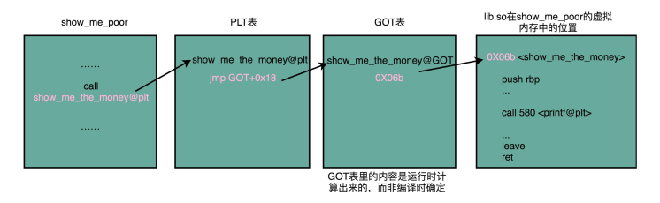

在动态链接对应的共享库，我们在共享库的data section里面，保存了一张全局偏移表，。所有需要引用当前共享库外部的地址的指令，都会查询GOT，来找到当前运行程序的虚拟内存里的对应位置。而GOT表里的数据，则是在我们加载一个个共享库的时候写进去的。

不同的进程，调用同样的lib.so各自里面指向最终加载的动态链接库里面的虚拟内存地址是不同的。

这样，虽然不同的程序调用的同样的动态库，各自的内存地址是独立的，调用的都是同一个动态库，但是不需要去修改动态库里面的代码所使用的地址，而是各个程序各自维护好自己的GOT，能够找到对应的动态库就好了。

GOT表位于共享库自己的数据段里，GOT表在内存里和对应的代码位置之间的偏移量，始终是确定的，这样我们的共享库是地址无关的代码，对应的各个程序只需要在物理内存里面加载同一份代码，而我们又要通过这个可以执行程序在加载时，生成的各个不相同的GOT表，来找到它需要调用到的外部变量和函数的地址。

## 二进制

### 理解二进制的“逢二进一

二进制数的优点：

- 二进制的数据表达具有抗干扰能力强、可靠性高
- 二进制非常适合逻辑运算

13这个十进制转化成二进制，需要经历一下几个步骤：


因此，对应的二进制数，就是 1101。

### 二进制中的负数是如何实现

比如一个4位的二进制补码数值1011，转成成十进制就是：

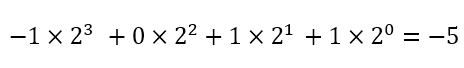


如果最高位是 1，这个数必然是负数；最高位是 0，必然是正数。并且，只有 0000 表示 0，1000 在这样的情况下表示-8。一个 4 位的二进制数，当然更重要的一点是，用补码来表示负数，使得我们的整数相加变得很容易，不需要做任何特殊处理，只是把它当成普通的二进制相加，就能得到正确的结果。

### 字符串的表示，从编码到数字

最早计算机只需要使用英文字符，加上数字和一些特殊符号，然后用二进制就能表示我们日常需要的所有字符了这个就是我们常说的 ASCII 码（American Standard Code for Information Interchange，美国信息交换标准代码)。


unicode 编码：

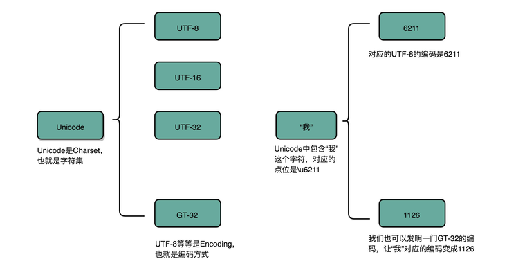

## 理解电路

电报机本质上就是一个“蜂鸣器 + 长长的电线 + 按钮开关”。蜂鸣器装在接收方手里，开关留在发送方手里。双方用长长的电线连在一起。当按钮开关按下的时候，电线的电路接通了，蜂鸣器就会响。短促地按下，就是一个短促的点信号；按的时间稍微长一些，就是一个稍长的划信号。


为了能够实现这样接力传输信号，在电路里面，工程师们造了一个叫作继电器（Relay）的设备。

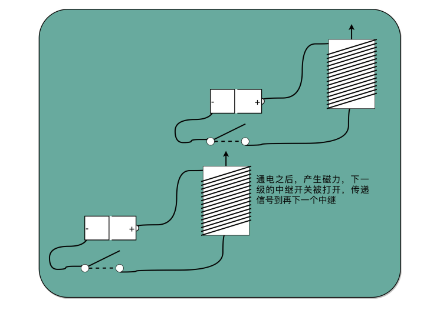

## 加法器

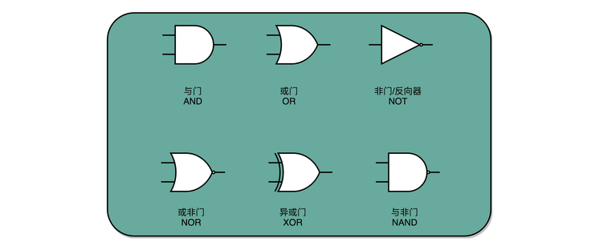

### 异或门和半加器

2个8位整数的加法：

- 2排8个开关加法得到结果
- 需要1排8位的开关

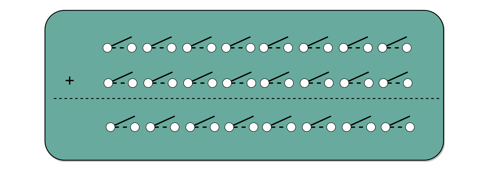

异或门用来实现加法，与门用来实现进位

通过一个异或门计算出个位，通过一个与门计算出是否进位，我们就通过电路算出了一个一位数的加法。于是，我们把两个门电路打包，给它取一个名字，就叫作半加器（Half Adder）。

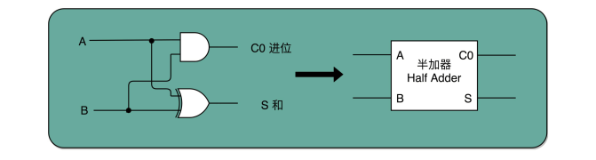

- 半加器解决了个位加法的问题
- 对于两位以上就不够用了，因为除了加数和被加数外，还需要进位，一共三个数相加才能得到结果

###  全加器

全加器就是两个半加器加上一个或门：

 

8位加法器可以由8个全加器串联而成：

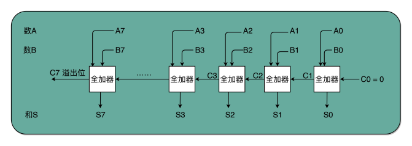

唯一需要注意的是，对于这个全加器，在个位，我们只需要用一个半加器，或者让全加器的进位输入始终是 0。因为个位没有来自更右侧的进位。而最左侧的一位输出的进位信号，表示的并不是再进一位，而是表示我们的加法是否溢出了。

在硬件层面，我们通过门电路、半加器、全加器一层层搭出了加法器这样的功能组件。我们把这些用来做算术逻辑计算的组件叫作 ALU，也就是算术逻辑单元。当进一步打造强大的 CPU 时，我们不会再去关注最细颗粒的门电路，只需要把门电路组合而成的 ALU，当成一个能够完成基础计算的黑盒子就可以了。

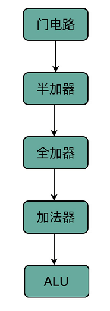

## 乘法器

### 二进制数乘法演示

二进制乘法的特点是: 将乘法转为加法：

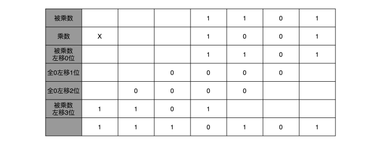

二进制的乘法有个很大的优点，就是这个过程你不需要背九九乘法口诀表了。因为单个位置上，乘数只能是 0 或者 1，所以实际的乘法，就退化成了位移和加法。

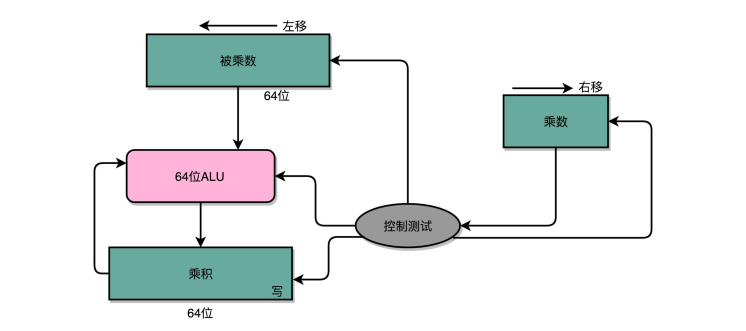

这个计算方式虽然节约电路了，但是也有一个很大的缺点，那就是慢。在这个乘法器的实现过程里，我们其实就是把乘法展开，变成了“加法 + 位移”来实现。我们用的是 4 位数，所以要进行 4 组“位移 + 加法”的操作。而且这 4 组操作还不能同时进行。因为下一组的加法要依赖上一组的加法后的计算结果，下一组的位移也要依赖上一组的位移的结果。这样，整个算法是“顺序”的，每一组加法或者位移的运算都需要一定的时间。

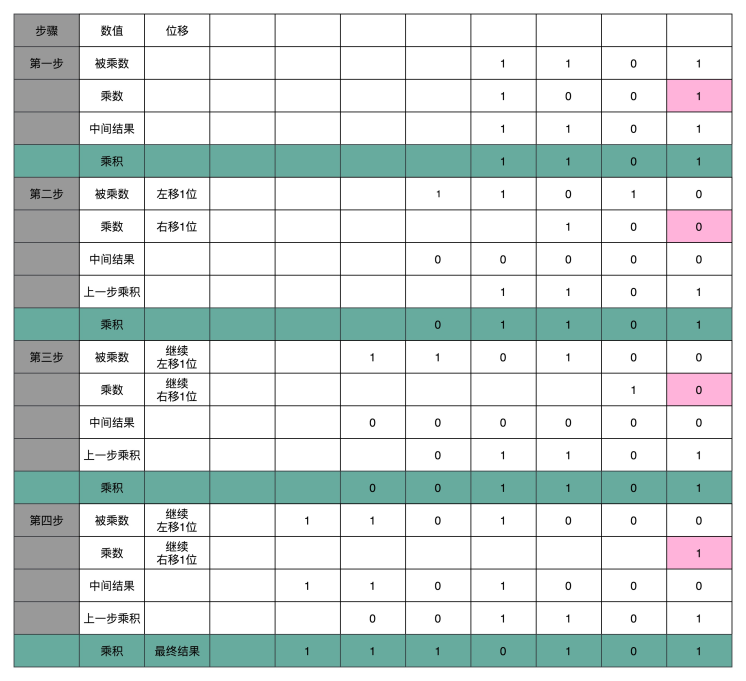

所以，最终这个乘法的计算速度，恰是和我们要计算的数的位数有关，比如：这里的4位，就需要4次的加法。而我们的现代CPU常常用32位或者是64位来表示整数，那么对应需要32次或者64次加法，比起4位数，要多花了8倍乃至16倍的时间。

### 并行加速方法

换个我们在算法和数据结构中的术语来说就是，这样的一个顺序乘法硬件进行计算的复杂度是O(N),这里的N，就是乘法的数里面的位数能不能把O(N)降低到O(logN)，办法还真的有，和软件开发里面改算法一样，在涉及CPU和电路的时候，我们可以改电路，32位数虽然是32次加法，但是我们可以让很多加法同时进行，回到这一开始，我们把位移和乘法的计算结果加到中间结果里的方法，32位整数的乘法，其实就编程了32个整数相加。

慢的原因：

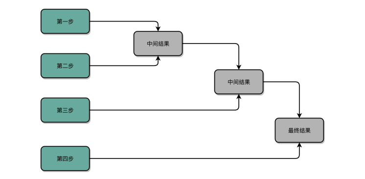

加速的办法，就是把比赛变成像世界杯足球赛那样的淘汰赛，32个球队捉对厮杀，同时开赛。这样一天一下子就淘汰了 16 支队，也就是说，32 个数两两相加后，你可以得到 16 个结果。后面的比赛也是一样同时开赛捉对厮杀。只需要 5 天，也就是 O(log2N) 的时间，就能得到计算的结果。但是这种方式要求我们得有 16 个球场。因为在淘汰赛的第一轮，我们需要 16 场比赛同时进行。对应到我们 CPU 的硬件上，就是需要更多的晶体管开关、来放下中间计算结果：

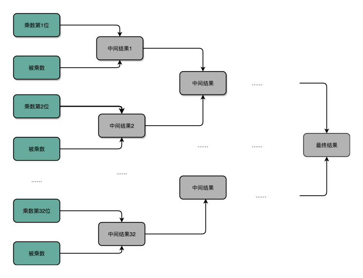

### 电路并行

并行加速慢的原因：

并行加速，之所以会慢，核心原因其实在“顺序”计算，也就是，都要等前面的计算完成之后，我们才能得到后面的计算结果。

最典型的例子就是我们上一讲讲的加法器。每一个全加器，都要等待待上一个全加器，把对应的进入输入结果算出来，才能算下一位的输出。位数越多，越往高位走，等待前面的步骤就越多，这个等待的时间有个专门的名词，叫作门延迟（Gate Delay）。

除了们延迟之外，还有一个问题就是时钟频率，在上面的顺序乘法计算里面，如果我们想要用更少的电路，计算的中间结果需要保存在寄存器里面，然后等待下一个时钟周期的到来，控制测试信号才能进行下一次移为和加法，这个延迟比上面的们延迟更可观。

把线路连结得复杂一点，让高位和低位的计算同时出结果：

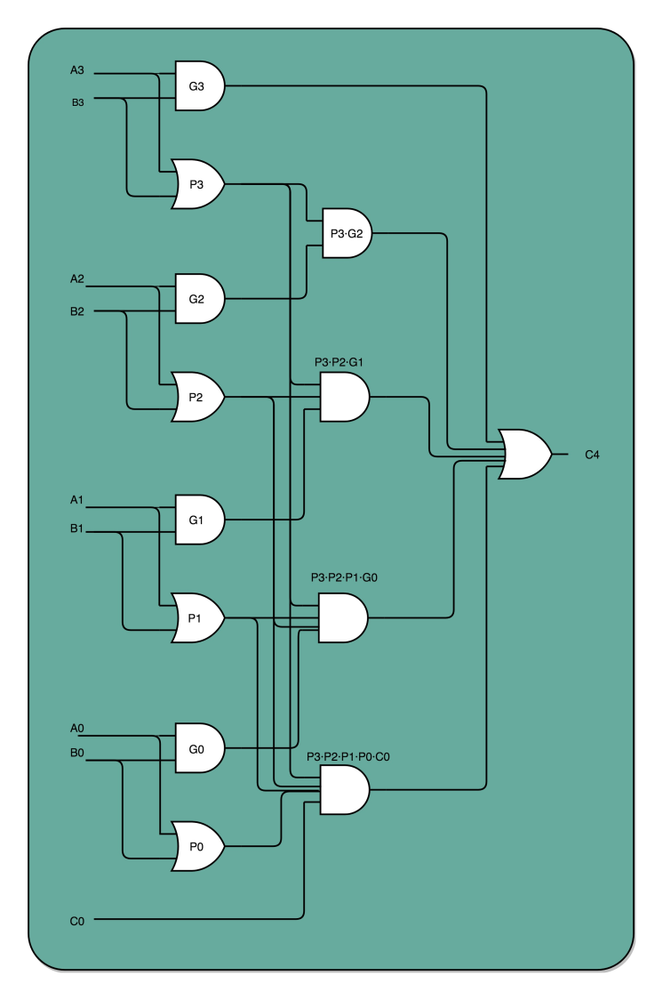

这个优化，本质上是利用了电路天然的并行性，电路只要接通，输入的信号自动传播到了所有接通的线路里面，这其实也是硬件和软件最大的不同，无论是这里把对应的门电路逻辑进行完全展开以减少门延迟，还是上面的乘法通过并行计算多个位的乘法，都是把我们完成一个计算的电路变复杂了，也就是意味着晶体管变多了。

## 浮点数

### 浮点数的不精确性

以32位计算机为例，、32 个比特，只能表示 2 的 32 次方个不同的数，差不多是 40 亿个。如果表示的数要超过这个数，就会有两个不同的数的二进制表示是一样的， 那计算机可就会一筹莫展，不知道这个数到底是多少。

40 亿个数看似已经很多了，但是比起无限多的实数集合却只是沧沧海一粟。所以，这个时候，计算机的设计者们，就要面临一个问题：我到底应该让这 40 亿个数映射到实数集合上的哪些数，在实际应用中才能最划得来呢？

### 定点数的表示

#### BCD 编码

用 4 个比特来表示 0～9 的整数，那么 32 个比特就可以表示 8 个这样的整数。然后我们把最右边的 2 个 0～9 的小数，当成小数部分；把左边 6 个 0～9 的整数，当成整数部分。这样，我们就可以用 32 个比特，来表示从 0 到 999999.99 这样 1 亿个实数了。

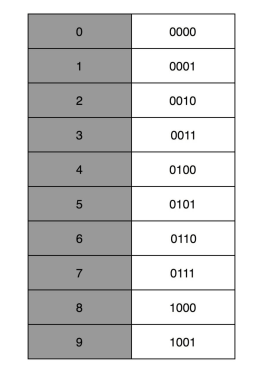

缺点：

- 第一，这样的表示方式有点“浪费”。 32 个比特我们可以表示 40 亿个不同的数，但是在 BCD 编码下，只能表示 1 亿个数
- 第二，这样的表示方式没办法同时表示很大的数字和很小的数字

#### IEEE 标准

IEEE 标准定义了两个基本的格式：

- 一个是用 32 比特表示单精度的浮点数，也就是我们常常说的 float 或者 float32 类型。
- 另外一个是用 64 比特表示双精度的浮点数，也就是我们平时说的 double 或者 float64 类型。

单精度结构：


- 符号位 s, 所有的浮点数都是有符号的
- 指数位 e, 值范围: 0～255, 我们在这里用 1～254 映射到 -126～127 这 254 个有正有负的数上

- 有效位 f

无法表示0

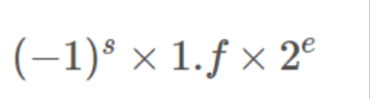

特殊值表示：

我们就要用上在 e 里面留下的 0 和 255 这两个表示，这两个表示其实是两个标记位。在 e 为 0 且 f 为 0的时候，我们就把这个浮点数认为是 0。至于其它的 e 是 0 或者 255 的特殊情况，如下表所示，分别可以表示出无穷大、无穷小、NAN 以及一个特殊的不规范数

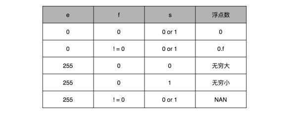

以 `0.5` 为例：

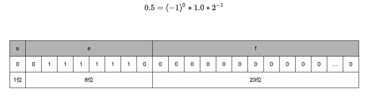

### 浮点数的二进制转化

十进制浮点转二进制浮点：

- 整数部分转二进制
- 小数部分转二进制
  - 小数部分转换成二进制是乘以 2，然后看看是否超过 1
  - 如果超过 1，我们就记下 1，并把结果减去 1，进一步循环操作

`9.1` 的转换：

- 整数部分 `1001` 

- 小数部分 `000110011...0011`

转换结果：

- `s` : 0
- `e` : 3 (需要转换)
- `f` : 00100011001100110011 001 (只能存储23位)

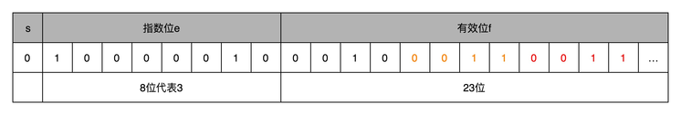

再将上面表格中的二进制转为十进制: 9.09999942779541015625 (不是原来的 `9.1` 了)。

### 浮点数的加法和精度损失

实现这样一个加法，也只需要位移。和整数加法类似的半加器和全加器的方法就能够实现，在电路层面，也并没有引入太多新的复杂性。

计算加法的原理: 先对齐、再计算。

先对齐：指数位较小的数，需要在有效位进行右移，在右移的过程中，最右侧的有效位就被丢弃了，这个会导致对应的指数位较小的数在加法发生前就会丢失精度：

- 两个相加数的指数位查越大，位移的位数越多，可能丢失的精度也越大
- 也可能右移的位都是0，那么实际上加法的精度不会丢失

`0.5+0.125` :

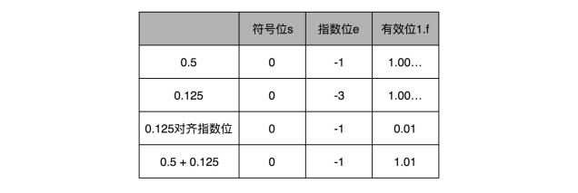


