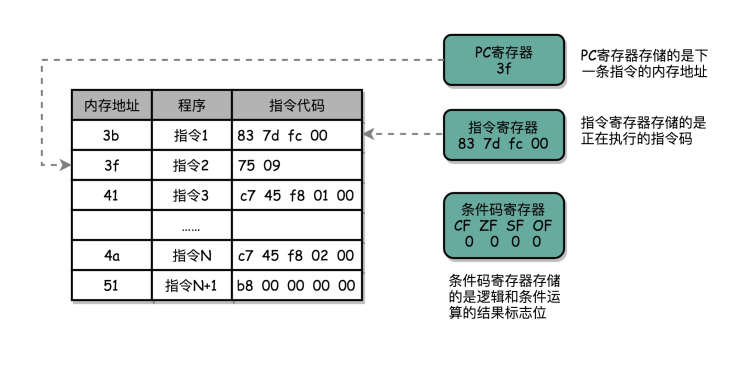

## 计算机指令

### 在软硬件接口中，CPU 帮我们做了什么事？

从硬件的角度来看：CPU 就是一个超大规模集成电路，通过电路实现了加法、乘法乃至各种各样的处理逻辑

从软件工程师的角度来讲：CPU 就是一个执行各种计算机指令（Instruction Code）的逻辑机器。这里的计算机指令，就好比一门 CPU 能够听得懂的语言，我们也可以把它叫作机器语言（Machine Language）。

这种程序指令存储在存储器里面的计算机，我们就叫作存储程序型计算机（Stored-program Computer）。

### 从编译到汇编，代码怎么变成机器码？

```
int main()
{
  int a = 1;
  int b = 2;
  a = a + b;
}
```

把整个程序翻译成一个汇编语言：

```
gcc -g -c test.c
objdump -d -M intel -S test.o  # 对应的汇编代码和机器码都打印出来

test.o:     file format elf64-x86-64
 
 
Disassembly of section .text:
 
0000000000000000 <main>:
int main()
{
   0:   55                      push   rbp
   1:   48 89 e5                mov    rbp,rsp
  int a = 1;
   4:   c7 45 fc 01 00 00 00    mov    DWORD PTR [rbp-0x4],0x1
  int b = 2;
   b:   c7 45 f8 02 00 00 00    mov    DWORD PTR [rbp-0x8],0x2
  a = a + b;
  12:   8b 45 f8                mov    eax,DWORD PTR [rbp-0x8]
  15:   01 45 fc                add    DWORD PTR [rbp-0x4],eax
}
  18:   5d                      pop    rbp
  19:   c3                      ret
```

从高级语言—>汇编代码—>机器码：


机器码和汇编代码是一 一对应的。

### 解析指令和机器码

- 第一类是算术类指令。我们的加减乘除，在 CPU 层面，都会变成一条条算术类指令。
- 第二类是数据传输类指令。给变量赋值、在内存里读写数据，用的都是数据传输类指令。
- 第三类是逻辑类指令。逻辑上的与或非，都是这一类指令。
- 第四类是条件分支类指令。日常我们写的“if/else”，其实都是条件分支类指令。
- 最后一类是无条件跳转指令。写一些大一点的程序，我们常常需要写一些函数或者方法。在调用函数的时候，其实就是发起了一个无条件跳转指令。


不同的 CPU 有不同的指令集，也就对应着不同的汇编语言和不同的机器码。

## 指令跳转：原来if...else就是goto

寄存器就是 CPU 内部，由多个触发器（Flip-Flop）或者锁存器（Latches）组成的简单电路。触发器和锁存器，其实就是两种不同原理的数字电路组成的逻辑门。N 个触发器或者锁存器，就可以组成一个 N 位（Bit）的寄存器，能够保存 N 位的数据。


### CPU执行指令流程



- CPU会根据PC寄存器里的地址，从内存里面把需要执行的指令读取到指令寄存器里面直面执行
- 然后根据指令长度自增、开始顺序读取下一条指令。可以看到一个程序的一条条指令在内存里面是连续保存的。也会一条条顺序加载
- 而有些特殊指令(J类跳转指令)、会修改寄存器里面的地址
- 这样下一条要执行的指令就不是从内存里面顺序加载的
- 事实上、这些跳转指令存在，也就是我们在写程序的时候，使用了 if…else 条件语句和 while/for 循环语句的原因

### 从 if…else 来看程序的执行和跳转

```
#include <time.h>
#include <stdlib.h>
 
 
int main()
{
  srand(time(NULL));
  int r = rand() % 2;
  int a = 10;
  if (r == 0)
  {
    a = 1;
  } else {
    a = 2;
  }
}
```

把整个程序翻译成一个汇编语言：

```
gcc -g -c test.c
objdump -d -M intel -S test.o


test.o:     file format elf64-x86-64
 
 
Disassembly of section .text:
 
0000000000000000 <main>:
#include <time.h>
#include <stdlib.h>
 
 
int main()
{
   0:   55                      push   rbp
   1:   48 89 e5                mov    rbp,rsp
   4:   48 83 ec 10             sub    rsp,0x10
  srand(time(NULL));
   8:   bf 00 00 00 00          mov    edi,0x0
   d:   e8 00 00 00 00          call   12 <main+0x12>
  12:   89 c7                   mov    edi,eax
  14:   e8 00 00 00 00          call   19 <main+0x19>
  int r = rand() % 2;
  19:   e8 00 00 00 00          call   1e <main+0x1e>
  1e:   99                      cdq
  1f:   c1 ea 1f                shr    edx,0x1f
  22:   01 d0                   add    eax,edx
  24:   83 e0 01                and    eax,0x1
  27:   29 d0                   sub    eax,edx
  29:   89 45 fc                mov    DWORD PTR [rbp-0x4],eax
  int a = 10;
  2c:   c7 45 f8 0a 00 00 00    mov    DWORD PTR [rbp-0x8],0xa
  if (r == 0)
  33:   83 7d fc 00             cmp    DWORD PTR [rbp-0x4],0x0
  37:   75 09                   jne    42 <main+0x42>
  {
    a = 1;
  39:   c7 45 f8 01 00 00 00    mov    DWORD PTR [rbp-0x8],0x1
  40:   eb 07                   jmp    49 <main+0x49>
  } else {
    a = 2;
  42:   c7 45 f8 02 00 00 00    mov    DWORD PTR [rbp-0x8],0x2
  }
}
  49:   c9                      leave
  4a:   c3                      ret
```

可以看到，这里对于 `r == 0` 的条件判断，被编译成了cmp 和 jne 这两条指令。cmp 指令比较了前后两个操作数的值，这里的 DWORD PTR 代表操作的数据类型是 32 位的整数，而 `[rbp-0x4]` 则是一个寄存器的地址。所以，第一个操作数就是从寄存器里拿到的变量 r 的值。第二个操作数 0x0 就是我们设定的常量 0 的 16 进制表示。cmp 指令的比较结果，会存入到条件码寄存器当中去。
在这里，如果比较的结果是 True，也就是 `r == 0`，就把零标志条件码（对应的条件码是 ZF，Zero Flag）设置为 1。除了零标志之外，Intel 的 CPU 下还有进位标志（CF，Carry Flah）符号标志（SF，Sign Flag）以及溢出标志（OF，Overflow Flag），用在不同的判断条件下。
cmp 指令执行完成之后，PC 寄存器会自动自增，开始执行下一条 jne(jmp not equal) 的指令。


##  函数调用：为什么会发生stack overflow？

### 为什么我们需要程序栈？

```
// function_example.c
#include <stdio.h>
int static add(int a, int b)
{
    return a+b;
}
 
 
int main()
{
    int x = 5;
    int y = 10;
    int u = add(x, y);
}
```

汇编代码：

```
gcc -g -c function_example.c
objdump -d -M intel -S function_example.o

function_example.o:     file format elf64-x86-64
 
 
Disassembly of section .text:
 
0000000000000000 <add>:
#include <stdio.h>
int static add(int a, int b)
{
   0:   55                      push   rbp
   1:   48 89 e5                mov    rbp,rsp
   4:   89 7d fc                mov    DWORD PTR [rbp-0x4],edi
   7:   89 75 f8                mov    DWORD PTR [rbp-0x8],esi
    return a+b;
   a:   8b 45 f8                mov    eax,DWORD PTR [rbp-0x8]
   d:   8b 55 fc                mov    edx,DWORD PTR [rbp-0x4]
  10:   01 d0                   add    eax,edx
}
  12:   5d                      pop    rbp
  13:   c3                      ret
 
0000000000000014 <main>:
 
 
int main()
{
  14:   55                      push   rbp
  15:   48 89 e5                mov    rbp,rsp
  18:   48 83 ec 10             sub    rsp,0x10
    int x = 5;
  1c:   c7 45 fc 05 00 00 00    mov    DWORD PTR [rbp-0x4],0x5
    int y = 10;
  23:   c7 45 f8 0a 00 00 00    mov    DWORD PTR [rbp-0x8],0xa
    int u = add(x, y);
  2a:   8b 55 f8                mov    edx,DWORD PTR [rbp-0x8]
  2d:   8b 45 fc                mov    eax,DWORD PTR [rbp-0x4]
  30:   89 d6                   mov    esi,edx
  32:   89 c7                   mov    edi,eax
  34:   e8 c7 ff ff ff          call   0 <add>
  39:   89 45 f4                mov    DWORD PTR [rbp-0xc],eax
}
  3c:   c9                      leave
  3d:   c3                      ret
```

发生函数调用时，会使用 call指令，call 指令后面跟着的是跳转后的程序地址。

### 程序栈

在内存里面开辟一段空间，用栈这个后进先出的数据结构记录函数调用过程：


- 压栈：每次程序调用函数之前，我们都把调用返回后的地址写在一个乒乓球上，然后塞进这个球桶。这个操作其实就是我们常说的压栈。
- 出栈：如果函数执行完了，我们就从球桶里取出最上面的那个乒乓球，很显然，这就是出栈。
- 栈底：拿到出栈的乒乓球，找到上面的地址，把程序跳转过去，就返回到了函数调用后的下一条指令了。如果函数 A 在执行完成之前又调用了函数 B，那么在取出乒乓球之前，我们需要往球桶里塞一个乒乓球。而我们从球桶最上面拿乒乓球的时候，拿的也一定是最近一次的，也就是最下面一层的函数调用完成后的地址。乒乓球桶的底部，就是栈底。
- 栈顶：最上面的乒乓球所在的位置，就是栈顶。
- 栈帧：在真实的程序里，压栈的不只有函数调用完成后的返回地址，比如函数A在调用B的时候，需要传输一些参数数据，这些参数数据在寄存器不够用的时候也会压入栈中。整个函数A所占用的所有空间，就是函数A的栈帧。

### 实际程序的布局

而实际的程序栈布局，顶和底与我们的乒乓球桶相比是倒过来的，底在最上面，顶在最下面，这样的布局是因为栈底的内存地址是一开始就固定的，而一层层压栈之后，栈顶的内存地址是在逐渐变小。


- 对应上面函数 add 的汇编代码，我们来仔细看看，main函数调用 add 函数时，add 函数入口在 0～1 行，add 函数结束之后在 12～13 行。
- 我们在调用第 34 行的 call 指令时，会把当前的 PC寄存器里的下一条指令的地址压栈，保留函数调用结束后要执行的指令地址。而 add 函数的第 0 行，push rbp 这个指令，就是在进行压栈。这里的 rbp又叫栈帧指针（Frame Pointer），是一个存放了当前栈帧位置的寄存器。push rbp 就把之前调用函数，main 函数的栈帧的栈底地址，压到栈顶。
- 接着，第 1 行的一条命令 mov rbp, rsp 里，则是把 rsp 这个栈指针（Stack Pointer）的值复制到 rbp 里，而 rsp 始终会指向栈顶。这个命令意味着，rbp 这个栈帧指针指向的地址，变成当前最新的栈顶，也就是 add 函数的栈帧的栈底地址了。
- 而在函数 add 执行完成之后，又会分别调用第 12 行的 pop rbp 来将当前的栈顶出栈，这部分操作维护好了我们整个栈帧。然后，我们可以调用第 13 行的 行的 ret 指令，这时候同时要把 call 调用的时候压入的 PC 寄存器里的下一条指令出栈，更新到 PC 寄存器中，将程序的控制权返回到出栈后的栈顶。


